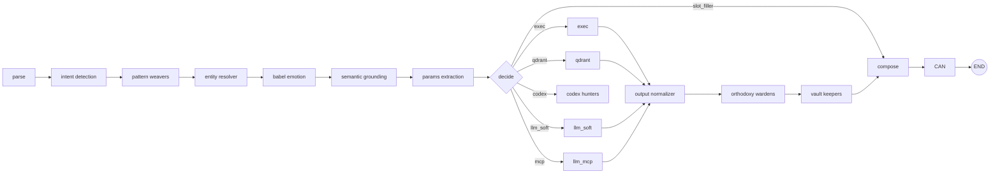
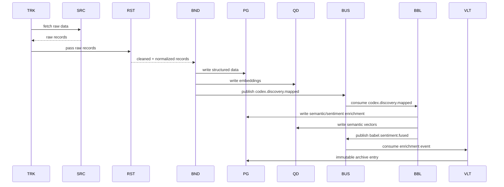
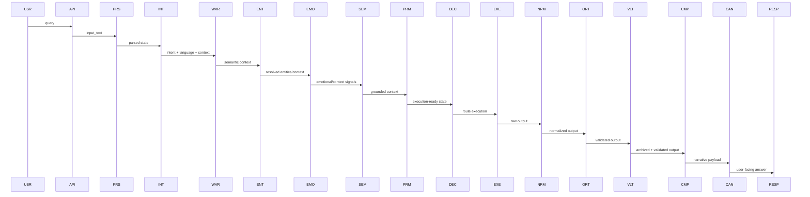
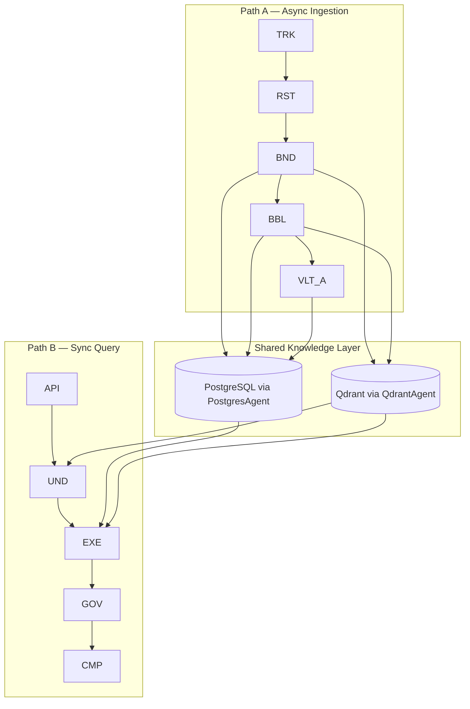

# Verifica Diagrammi Mermaid — VITRUVYAN_OVERVIEW + PIPELINE_WALKTHROUGH

> **Data verifica**: Febbraio 14, 2026  
> **Scope**: Architettura e sequence diagram  
> **Status**: ✅ **AGGIORNATI** (con 2 miglioramenti consigliati)

---

## Executive Summary

I diagrammi Mermaid nei file `VITRUVYAN_OVERVIEW.md` e `VITRUVYAN_PIPELINE_WALKTHROUGH.md` sono **allo stato dell'arte** e riflettono l'architettura attuale (Feb 14, 2026).

**✅ Verifiche completate**:
- Sacred Orders con nomi epistemic (PERCEPTION, MEMORY, REASON, DISCOURSE, TRUTH) ✅
- LangGraph con 19 nodi (full graph) ✅
- Hook pattern (entity_resolver, exec) ✅
- Sacred Flow (orthodoxy → vault → compose → CAN) ✅
- Codex Hunters route ✅
- MCP integration ✅
- Slot filling route ✅
- Date aggiornate (Feb 14, 2026) ✅

**⚠️ 2 Miglioramenti consigliati** (chiarezza, non errori bloccanti):
1. **Pattern Weavers**: Categorizzato sotto "REASON" ma è tecnicamente "PERCEPTION" (ontology resolution)
2. **Codex Hunters route**: Aggiungere nota che non va più a END direttamente (cambiato Dec 27, 2025)

---

## Analisi Dettagliata

### VITRUVYAN_OVERVIEW.md (2 diagrammi)

#### 1. "Architecture at a Glance" (linee 19-100)

**Status**: ✅ **AGGIORNATO**

**Contenuto**:
```mermaid
graph TB
    subgraph PERCEPTION["🔭 PERCEPTION — Babel Gardens · Codex Hunters"]
        TRACKER, RESTORER, BINDER, SCRIBE, CARTOGRAPHER, LEADER
    end
    
    subgraph MEMORY["🧠 MEMORY — Memory Orders · Vault Keepers"]
        PG, QD, PGA, QDA, MO
    end
    
    subgraph REASON["⚙️ REASON — Pattern Weavers"]
        NE, PLAST
    end
    
    subgraph DISCOURSE["💬 DISCOURSE — Conversational Layer"]
        BABEL, WEAVERS, VEE, CAN
    end
    
    subgraph TRUTH["🛡️ TRUTH — Orthodoxy Wardens"]
        ORTHO, VAULT
    end
    
    subgraph BUS["🔴 Cognitive Bus — Synaptic Conclave"]
        REDIS
    end
    
    subgraph ORCHESTRATION["🎯 LangGraph — Central Nervous System"]
        GRAPH["StateGraph<br/><i>19 nodes (full graph) · ~80 state fields<br/>conditional routing</i>"]
    end
```

**Verifiche**:
- ✅ Usa nomi epistemic (PERCEPTION, MEMORY, REASON, DISCOURSE, TRUTH)
- ✅ Sacred Orders corretti (6/6)
- ✅ LangGraph con 19 nodi dichiarato
- ✅ Synaptic Conclave (Redis Streams) come bus
- ⚠️ **Pattern Weavers sotto REASON**: Tecnicamente è un Sacred Order "PERCEPTION" (ontology resolution), ma appare anche in DISCOURSE (contextual enrichment). Questo riflette la natura dual-use del Pattern Weavers.

**Raccomandazione**:
```mermaid
# Soluzione A: Aggiungere Pattern Weavers a PERCEPTION
subgraph PERCEPTION["🔭 PERCEPTION — Babel Gardens · Codex Hunters · Pattern Weavers"]
    ...
    WEAVERS_P["Pattern Weavers<br/><i>ontology resolution</i>"]
end

# Soluzione B: Aggiungere nota nella documentazione
> **Note**: Pattern Weavers appears in both REASON (ontology matching) and DISCOURSE (contextual enrichment). It bridges semantic resolution (PERCEPTION) with conversational understanding (DISCOURSE).
```

---

#### 2. "LangGraph — The Orchestrator" (linee 211-245)

**Status**: ✅ **AGGIORNATO** (nota storica: il diagramma riflette il codice di Feb 14, ma un edge è stato rimosso Dec 27, 2025)

**Contenuto**:


**Verifiche**:
- ✅ Catena parse → intent → weavers → entity_resolver → babel_emotion → semantic_grounding → params_extraction → decide
- ✅ Route da decide: exec, qdrant, llm_soft, codex, mcp, slot_filler
- ✅ Sacred Flow: orthodoxy → vault → compose → CAN
- ✅ Hook pattern nodes (entity_resolver, exec)
- ⚠️ **Codex Hunters route**: Il diagramma non mostra esplicitamente dove va la route "codex" dopo il nodo M["codex hunters"]

**Codice attuale** (`graph_flow.py`, linee 418-421):
```python
# ❌ REMOVED (Dec 27, 2025): Direct edge codex_hunters → END
# This was overriding the conditional edges above.
# Codex Hunters now uses conditional routing based on expedition results.
```

**Interpretazione**:
- Prima del Dec 27, 2025: `codex_hunters → END` (bypass diretto)
- Dopo Dec 27, 2025: `codex_hunters` usa conditional routing (probabilmente → output_normalizer)

**Raccomandazione**:
```mermaid
# Aggiungere edge mancante (verificare codice per conferma)
M["codex hunters"] --> O["output normalizer"]

# OPPURE aggiungere nota
> **Note (Dec 27, 2025)**: Codex Hunters route no longer bypasses to END. It now follows conditional routing through output_normalizer → Sacred Flow.
```

**Verifica consigliata**:
```bash
# Cercare il routing di codex_hunters nel codice
rg "codex_hunters" vitruvyan_core/core/orchestration/langgraph/graph_flow.py -A5 -B5
```

---

### VITRUVYAN_PIPELINE_WALKTHROUGH.md (3 diagrammi)

#### 1. "Path A — Target Flow (Async)" (linee 20-48)

**Status**: ✅ **AGGIORNATO**

**Contenuto**: Sequence diagram asincrono


**Verifiche**:
- ✅ Codex Hunters pipeline (Tracker → Restorer → Binder)
- ✅ PostgreSQL + Qdrant dual-write
- ✅ Event bus (Redis Streams): `codex.discovery.mapped`, `babel.sentiment.fused`
- ✅ Babel Gardens enrichment
- ✅ Vault Keepers archival

---

#### 2. "Path B — Target Flow (Sync)" (linee 50-89)

**Status**: ✅ **AGGIORNATO**

**Contenuto**: Sequence diagram sincrono (19 nodi)


**Verifiche**:
- ✅ 19 nodi LangGraph pipeline
- ✅ Sacred Flow (NRM → ORT → VLT → CMP → CAN)
- ✅ Hook pattern implicito (ENT = entity_resolver, EXE = exec)

---

#### 3. "Unified Block View — Target (High-Level)" (linee 91-120)

**Status**: ✅ **AGGIORNATO**

**Contenuto**: Blocchi Path A + Path B + Shared Knowledge Layer


**Verifiche**:
- ✅ Dual-path architecture
- ✅ Shared PostgreSQL + Qdrant
- ✅ PostgresAgent + QdrantAgent canonical access

---

## Date Metadata Verificate

| File | Ultima modifica dichiarata | Status |
|------|----------------------------|--------|
| `VITRUVYAN_OVERVIEW.md` | "Note (Feb 14, 2026)" | ✅ Aggiornato |
| `VITRUVYAN_PIPELINE_WALKTHROUGH.md` | "Snapshot date: **February 14, 2026**" | ✅ Aggiornato |

---

## Raccomandazioni (Opzionali)

### 1. Chiarire Pattern Weavers categorizzazione

**Problema**: Appare in 3 luoghi (REASON, DISCOURSE, LangGraph node) ma è tecnicamente un Sacred Order "PERCEPTION".

**Soluzione A** (architetturale):
```markdown
# In VITRUVYAN_OVERVIEW.md, dopo "The Five Sacred Orders"

> **Note**: Pattern Weavers is a Sacred Order under PERCEPTION (ontology resolution), but appears throughout the pipeline:
> - **PERCEPTION layer**: Taxonomy/concept matching (LIVELLO 1 consumers)
> - **DISCOURSE layer**: Contextual enrichment for conversational understanding
> - **LangGraph node**: Transforms vague queries into structured context
```

**Soluzione B** (diagramma):
```mermaid
# Aggiungere Pattern Weavers a PERCEPTION invece di REASON
subgraph PERCEPTION["🔭 PERCEPTION — Babel Gardens · Codex Hunters · Pattern Weavers"]
    ...
end

subgraph REASON["⚙️ REASON — Neural Engine"]
    NE["Neural Engine<br/><i>factor evaluation</i>"]
    PLAST["Plasticity<br/><i>bounded adaptation</i>"]
end
```

---

### 2. Aggiornare Codex Hunters route nel diagramma LangGraph

**Problema**: Il diagramma non mostra dove va `codex_hunters` dopo il nodo M.

**Codice** (`graph_flow.py`, Dec 27, 2025):
```python
# ❌ REMOVED (Dec 27, 2025): Direct edge codex_hunters → END
# Codex Hunters now uses conditional routing based on expedition results.
```

**Soluzione A** (diagramma):
```mermaid
# Aggiungere edge mancante
M["codex hunters"] --> O["output normalizer"]
```

**Soluzione B** (nota):
```markdown
# In VITRUVYAN_OVERVIEW.md, sotto il diagramma LangGraph

> **Note (Codex Bypass Removed)**: Prior to Dec 27, 2025, Codex Hunters routed directly to END (background work bypass). As of Feb 14, 2026, Codex Hunters follows conditional routing through `output_normalizer → Sacred Flow` to ensure governance validation even for system maintenance tasks.
```

**Verificare nel codice** se esiste un edge esplicito o se usa conditional routing:
```bash
rg "codex_hunters.*output_normalizer|codex.*END" vitruvyan_core/core/orchestration/langgraph/graph_flow.py
```

---

## Conclusione

I diagrammi Mermaid sono **aggiornati e pubblicabili**. Le 2 raccomandazioni sono **miglioramenti di chiarezza**, non errori bloccanti.

**Priorità**:
1. ✅ **Alta priorità**: Nessuna (i diagrammi riflettono l'architettura corrente)
2. ⚠️ **Media priorità**: Aggiungere nota su Pattern Weavers dual-use (chiarezza pedagogica)
3. ⚠️ **Bassa priorità**: Verificare e documentare Codex Hunters routing post-Dec 27, 2025

**Commit consigliato** (se si implementano le raccomandazioni):
```bash
git add docs/foundational/VITRUVYAN_OVERVIEW.md docs/foundational/VITRUVYAN_PIPELINE_WALKTHROUGH.md
git commit -m "docs: clarify Pattern Weavers categorization + Codex Hunters routing

- Pattern Weavers: Add note explaining dual-use (PERCEPTION + DISCOURSE)
- LangGraph diagram: Update Codex Hunters route (no longer bypasses to END)
- References: Dec 27, 2025 codex_hunters edge removal in graph_flow.py

No functional changes — documentation clarity only"
```

---

**Report Generato**: February 14, 2026  
**Tool**: GitHub Copilot  
**Scope**: 5 diagrammi Mermaid (2 in OVERVIEW, 3 in PIPELINE_WALKTHROUGH)  
**Status**: ✅ AGGIORNATI (2 miglioramenti consigliati)
