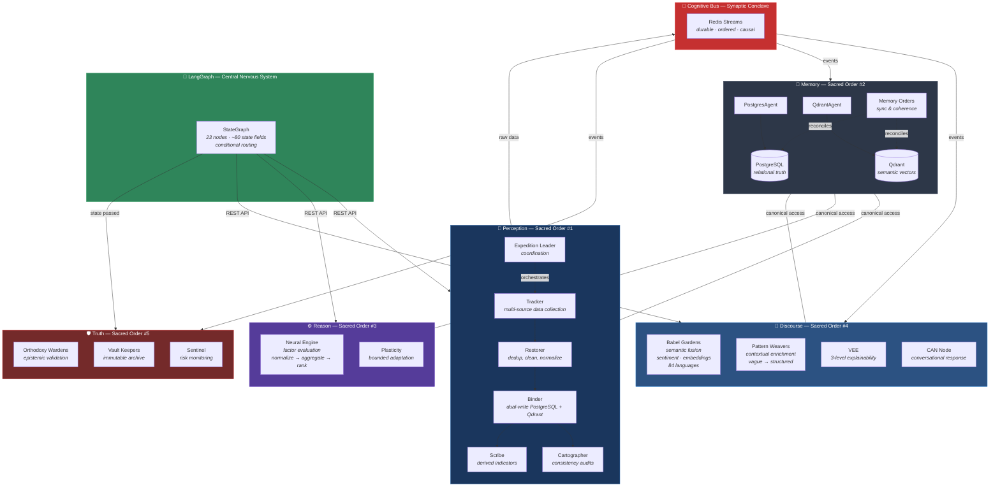
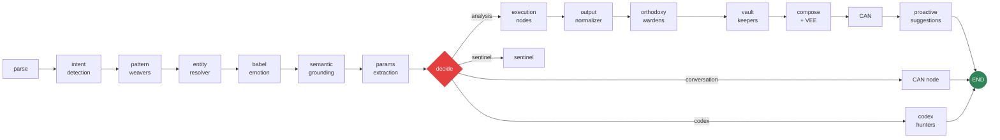

# Vitruvyan — Epistemic Operating System

## What Is Vitruvyan?

Vitruvyan is a **modular cognitive architecture** for building AI systems that can perceive, reason, remember, communicate, and self-govern. It is not an application — it is the substrate on which domain-specific intelligent agents are built.

Think of it this way:
- **Linux** is an operating system for hardware. It provides processes, memory management, filesystems, and IPC — but knows nothing about what applications you run on it.
- **Vitruvyan** is an operating system for cognition. It provides perception, memory, reasoning, discourse, and truth governance — but knows nothing about the domain you apply it to.

The first domain specialization (codename **Mercator**) is financial analysis. But the architecture is deliberately **domain-agnostic**: the same modules could power a medical diagnostic advisor, a legal research agent, or an industrial monitoring system.

---

## Architecture at a Glance



---

## The Five Sacred Orders

Vitruvyan organizes all components into five **epistemic orders** — each responsible for a distinct cognitive function. This is not just labeling; it is an **architectural constraint**: modules respect their order's boundaries, and cross-order communication follows strict protocols.

### 1. Perception — *"What is out there?"*

**Codex Hunters** are a team of specialized agents that collect, clean, and persist data:

| Agent | Role |
|-------|------|
| **Tracker** | Fetches raw data from external sources (APIs, feeds, scrapers) with rate limiting |
| **Restorer** | Deduplicates (hash-based), cleans (removes noise, normalizes text), and imputes missing fields |
| **Binder** | Dual-writes to PostgreSQL (structured) and Qdrant (vector embeddings via MiniLM-L6-v2) |
| **Scribe** | Computes derived indicators from raw data (e.g., moving averages, oscillators) |
| **Cartographer** | Builds consistency maps across databases, generates audit reports |
| **Expedition Planner** | Schedules data collection intelligently (5 priority levels, resource-aware) |
| **Expedition Leader** | Coordinates all agents with 5 command levels (ROUTINE → CRISIS) |
| **Event Hunter** | Bridges Codex Hunters to the Cognitive Bus — triggers Track→Restore→Bind cycles automatically on events |

### 2. Memory — *"What do I already know?"*

Two canonical storage systems with **mandatory access patterns**:

- **PostgreSQL** — Relational source of truth. Accessed **exclusively** through `PostgresAgent`. Direct `psycopg2.connect()` calls are forbidden.
- **Qdrant** — Vector semantic memory (384-dim embeddings). Accessed **exclusively** through `QdrantAgent`. Every point must carry a valid ISO 639-1 language tag — the agent rejects `null`, `unknown`, or `auto`.
- **Memory Orders** — A reconciliation service that keeps PostgreSQL and Qdrant in sync (drift monitoring, periodic sync).

### 3. Reason — *"What can I deduce?"*

- **Neural Engine** — A domain-agnostic evaluation substrate. Defines three abstract contracts:
  - `AbstractFactor`: computes a signal for an entity (e.g., momentum, risk, quality)
  - `NormalizerStrategy`: makes heterogeneous values comparable (z-score, rank, min-max)
  - `AggregationProfile`: weights factors into a composite score

  The `EvaluationOrchestrator` executes the pipeline: *compute → normalize (cross-entity) → aggregate → package*. The core knows nothing about what an "entity" or "factor" means in your domain — that knowledge lives in **verticals**.

- **Plasticity** — Bounded adaptive learning. System parameters (thresholds, weights) can evolve, but within structural limits with full audit trail. Not unsupervised ML — governed adaptation.

### 4. Discourse — *"How do I explain this?"*

- **Babel Gardens** — Multilingual semantic fusion engine (84 languages). Combines multiple AI models (FinBERT, Gemma, MiniLM) into unified semantic representations. Handles sentiment analysis, language detection, and embedding generation through a single API.

- **Pattern Weavers** — Contextual enrichment via vector search. Transforms vague human queries into structured context: *"analyze European banks"* becomes `{concepts: ["Banking"], regions: ["Europe"], countries: [IT, FR, DE...]}`. Reduces conversational friction by 50-66%.

- **VEE (Vitruvyan Explainability Engine)** — Three-level narrative generation:
  1. **Summary**: Plain language, zero jargon
  2. **Detailed**: Operational depth, strategy implications
  3. **Technical**: Raw scores, factor convergence, full transparency

- **CAN (Conversational Agent Node)** — Generates natural-language responses with anti-hallucination validation via MCP bridge.

### 5. Truth — *"Is this correct? Is it coherent?"*

- **Orthodoxy Wardens** — Every output is validated before reaching the user. Verdicts: `blessed` (clean), `purified` (corrected with warnings), `heretical` (rejected).
- **Vault Keepers** — Immutable versioned archive of all significant events. Connected to blockchain anchoring (Tron) for cryptographic proof.
- **Sentinel** — Continuous monitoring for anomalies and risk escalation.

---

## The Cognitive Bus (Synaptic Conclave)

The nervous system that connects all orders. Built on **Redis Streams** with durable, ordered, causally-linked delivery.

**Bio-inspired design**:
- Modeled after the **octopus nervous system**: 2/3 of neurons reside in the arms (local autonomy), only 1/3 in the brain (minimal governance)
- Modeled after **fungal mycelial networks**: no central processor, emergent routing, topological resilience

**Four sacred invariants** — the bus is *deliberately unintelligent*:
1. Never inspects payloads
2. Never correlates events
3. Never performs semantic routing
4. Never synthesizes or transforms data

Intelligence belongs in consumers, not the network.

**Communication pattern**:
```
Publisher → Herald.publish("channel.name", event_data)
               │
               ▼
         Redis Streams (durable, ordered)
               │
               ▼
Consumer ← StreamBus.consume("channel.name", group, consumer_id)
               │
               ▼
         bus.acknowledge(event)  ← mandatory
```

Events use dot notation (`codex.discovery.mapped`, `babel.sentiment.fused`) and carry: `event_id`, `event_type`, `causation_id` (optional, for causal chains), `timestamp`, `data`, `metadata`.

---

## LangGraph — The Orchestrator

A 23-node `StateGraph` manages the full cognitive pipeline. The state object carries ~80 typed fields that flow through every node.



Key design decisions:
- **Sacred Flow**: analysis results pass through `orthodoxy → vault → compose → CAN` before reaching the user — every output is validated and archived
- **Codex bypass**: data collection routes directly to END (it's background work, not part of the conversation)
- **`invoke_with_propagation()`**: ensures UX fields (emotion, language, cultural context) survive the entire pipeline
- **`USE_MCP` flag**: enables A/B testing between legacy execution nodes and the MCP bridge

---

## How Services Communicate

Services **never import each other's code**. Three communication channels:

| Channel | When | Example |
|---------|------|---------|
| **REST API** (httpx) | Synchronous request/response between Docker containers | LangGraph calls Neural Engine API at `:8003/screen` |
| **Redis Streams** | Asynchronous event propagation | Codex publishes `codex.discovery.mapped`, Babel Gardens consumes it |
| **LangGraph State** | Within the orchestration pipeline | `state["weaver_context"]` flows from Pattern Weavers node to Entity Resolver |

Each major service runs in its own Docker container on a shared network (`vitruvyan_omni_net`).

---

## Domain Specialization: Verticals

The core framework is domain-agnostic. **Verticals** inject domain knowledge:

```
┌──────────────────────────────────────────────────┐
│              VITRUVYAN CORE                       │
│  Perception · Memory · Reason · Discourse · Truth │
│  ──────────────────────────────────────────────── │
│  Domain-agnostic substrate                        │
└──────────────────────┬───────────────────────────┘
                       │
          ┌────────────┼────────────┐
          ▼            ▼            ▼
    ┌──────────┐ ┌──────────┐ ┌──────────┐
    │ Mercator │ │ (future) │ │ (future) │
    │ Finance  │ │ Medical  │ │ Legal    │
    │          │ │          │ │          │
    │ Factors: │ │ Factors: │ │ Factors: │
    │ momentum │ │ BP risk  │ │ citation │
    │ trend    │ │ biomark. │ │ preceden │
    │ volatilit│ │ family h.│ │ jurisdic │
    │ sentim.  │ │ symptoms │ │ relevance│
    └──────────┘ └──────────┘ └──────────┘
```

A vertical provides:
- **Factors** for the Neural Engine (what to compute)
- **Data sources** for Codex Hunters (where to look)
- **Weaving rules** for Pattern Weavers (domain concepts and taxonomies)
- **Narrative templates** for VEE (how to explain results)
- **Validation rules** for Orthodoxy Wardens (domain-specific correctness)

The core never changes. The vertical plugs in.

---

## Key Architectural Principles

| Principle | Implementation |
|-----------|---------------|
| **No single point of failure** | Autonomous services, event-driven, graceful degradation |
| **Canonical data access** | `PostgresAgent` and `QdrantAgent` are the only database interfaces |
| **Intelligence at the edges** | The bus is dumb, consumers are smart |
| **Epistemic governance** | Every output validated (Orthodoxy), every event archived (Vault) |
| **Bounded adaptation** | Plasticity allows evolution within structural limits |
| **Biological metaphors** | Octopus (local autonomy), mycelium (emergent routing), medieval scholars (knowledge orders) |
| **Explainability by design** | VEE produces 3 depth levels for every output |

---

## Quick Reference: Service Map

| Service | Port | Sacred Order | Purpose |
|---------|------|-------------|---------|
| `api_graph` | 8004 | Orchestration | LangGraph pipeline |
| `api_babel_gardens` | 8009 | Discourse | Sentiment, embeddings, language detection |
| `api_embedding` | 8010 | Memory | MiniLM-L6-v2 cooperative embeddings |
| `api_pattern_weavers` | 8011 | Discourse | Contextual enrichment |
| `api_memory_orders` | 8016 | Memory | PostgreSQL ↔ Qdrant sync |
| `api_orthodoxy_wardens` | — | Truth | Output validation |
| `api_codex_hunters` | — | Perception | Data acquisition |
| `api_mcp_server` | 8020 | Orchestration | LLM ↔ Sacred Orders bridge |
| `redis` (Streams) | 6379 | Bus | Event transport |
| `qdrant` | 6333 | Memory | Vector database |
| PostgreSQL | 5432 | Memory | Relational database (host, not Docker) |

---

## TL;DR

Vitruvyan is a **cognitive operating system** that separates *how to think* from *what to think about*. Five epistemic orders (Perception, Memory, Reason, Discourse, Truth) communicate through a deliberately unintelligent event bus. A domain-neutral LangGraph pipeline orchestrates 23 processing stages. Domain knowledge is injected through verticals, not hardcoded. Every output is validated, archived, and explainable at three depth levels.
