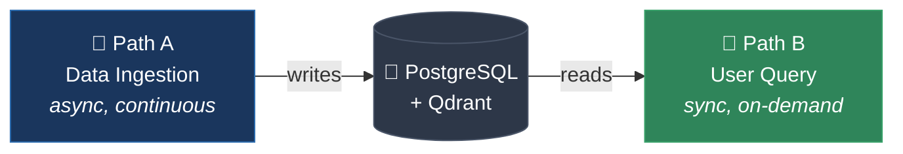
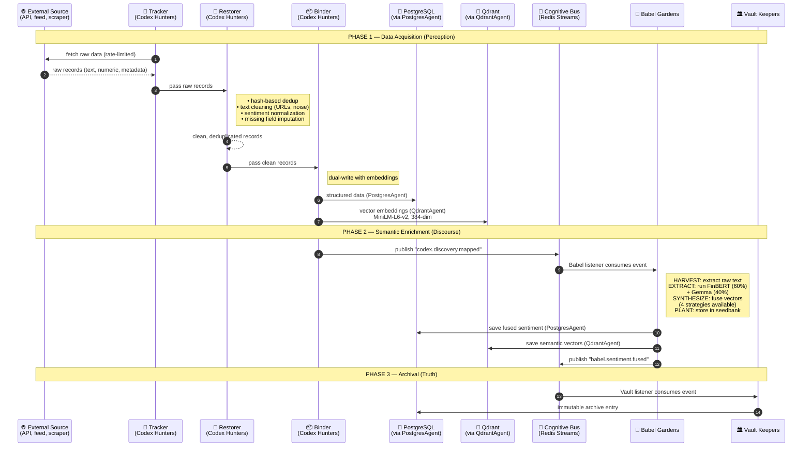
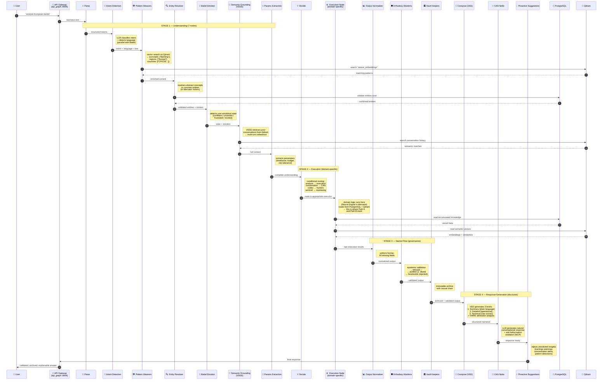
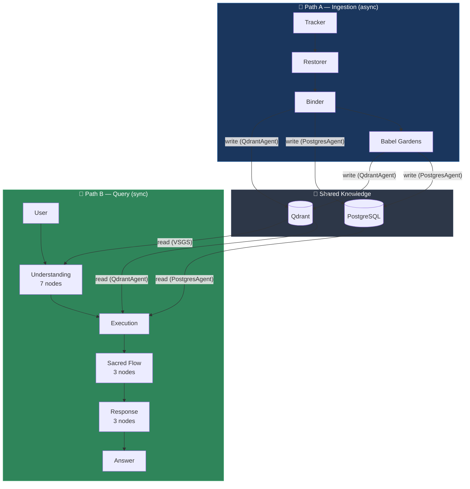

# Vitruvyan — Pipeline Walkthrough ("Il Giro del Fumo")

> **Audience**: Software engineer joining the project.  
> **Goal**: Understand exactly how data flows through Vitruvyan, end-to-end, step by step.

---

## Two Paths, One System

Vitruvyan has two concurrent data flows that run independently but feed each other:

| Path | Trigger | Nature | Purpose |
|------|---------|--------|---------|
| **Path A** — Data Ingestion | Scheduled / event-driven | Asynchronous (Cognitive Bus) | The system feeds itself — acquires, cleans, enriches, stores knowledge |
| **Path B** — User Query | User sends a message | Synchronous (LangGraph pipeline) | The system answers — uses accumulated knowledge to produce validated, explainable responses |

**The intersection**: Path B *reads* what Path A *wrote*. When a user asks a question, the answer comes from knowledge that the ingestion pipeline has been quietly accumulating in the background.



---

## Path A — Data Ingestion (Asynchronous)

*"The system feeds itself."*

No user involved. Codex Hunters discover data, clean it, store it. Babel Gardens enriches it semantically. Vault Keepers archive the event. Everything communicates through the Cognitive Bus (Redis Streams).



### What happens at each step:

| # | Who | What enters | What happens | What exits |
|---|-----|-------------|--------------|------------|
| 1 | **Tracker** | Nothing (scheduled or event-triggered) | Fetches from external sources with rate limiting | Raw records (text, numbers, metadata, timestamps) |
| 2-3 | **Restorer** | Raw records | Dedup by content hash, strips URLs/noise, normalizes sentiment scores (tanh clipping), fills missing fields | Clean, unique records |
| 4-5 | **Binder** | Clean records | Generates 384-dim embeddings (MiniLM-L6-v2), writes to PostgreSQL (structured) AND Qdrant (vectors) | Persisted knowledge with dual index |
| 6-7 | **Babel Gardens** | Bus event with record reference | Runs sentiment models (FinBERT 60% + Gemma 40%), applies linguistic fusion, synthesizes unified representation | Fused sentiment + semantic vectors in seedbank |
| 8 | **Vault Keepers** | Bus event chain | Archives immutably | Audit trail with causal chain |

### Resilience pattern
If Babel Gardens fails during enrichment, it **still publishes** `babel.sentiment.fused` with `score=None`. Downstream consumers handle the absence — the pipeline never blocks.

---

## Path B — User Query (Synchronous)

*"The system answers."*

A user sends a message. LangGraph orchestrates 23 nodes in sequence. Each node reads from or writes to the shared `state` dict (~80 typed fields). The final response is validated, archived, and explainable.



### What happens at each stage:

#### Stage 1 — Understanding (7 nodes)
The system builds a complete picture of *what the user wants*.

| Node | Input | Processing | Output |
|------|-------|------------|--------|
| **Parse** | Raw text | Tokenizes, extracts structure | Parsed tokens |
| **Intent Detection** | Tokens | LLM classifies intent (analysis, conversation, risk...) + language detection | `intent`, `language`, `confidence` |
| **Pattern Weavers** | Intent + text | Vector search → maps vague concepts to structured context | `weaver_context: {concepts, regions, sectors, risk_profile}` |
| **Entity Resolver** | Enriched context | Resolves abstract → concrete (validates existence in PostgreSQL) | `validated_entities[]` |
| **Babel Emotion** | Full state | Detects user emotional state | `emotion: "confident" / "uncertain" / "frustrated"` |
| **Semantic Grounding** | State + emotion | VSGS searches conversation history in Qdrant | `semantic_matches[]` (prior context) |
| **Params Extraction** | Full context | Extracts operational parameters | `horizon`, `budget`, `risk_tolerance` |

#### Stage 2 — Execution (1 node, domain-specific)
**This is where the vertical lives.** In Mercator, this is where the Neural Engine evaluates entities across multiple factors, normalizes cross-entity, and aggregates into composite scores. In a different vertical, this could be anything.

**This is also where Path A meets Path B**: the execution node reads knowledge that the ingestion pipeline accumulated asynchronously.

#### Stage 3 — Sacred Flow (3 nodes, governance)
Every output passes through governance before reaching the user. This is non-negotiable.

| Node | Role | Verdicts |
|------|------|----------|
| **Output Normalizer** | Uniform format, fill gaps | (passthrough) |
| **Orthodoxy Wardens** | Epistemic validation | `blessed` ✅ / `purified` ⚠️ / `heretical` ❌ |
| **Vault Keepers** | Immutable archival with causal chain | (passthrough, side-effect: archive) |

#### Stage 4 — Response Generation (3 nodes, discourse)

| Node | Role | Output |
|------|------|--------|
| **Compose (VEE)** | 3-level explainability engine | `summary` + `detailed` + `technical` narratives |
| **CAN** | Conversational response with anti-hallucination | Natural language answer |
| **Proactive Suggestions** | Inject unsolicited insights | Warnings, alerts, recommendations |

---

## Where the Two Paths Meet



**Key insight**: Path A and Path B never call each other. They share state exclusively through the canonical data stores (PostgreSQL and Qdrant), accessed only through `PostgresAgent` and `QdrantAgent`. This is what makes the two paths independently scalable and testable.

---

## Communication Channels Summary

| Between | Channel | Example |
|---------|---------|---------|
| Codex → Babel → Vault (Path A) | **Redis Streams** (async events) | `codex.discovery.mapped` → Babel consumes |
| LangGraph nodes (Path B) | **State dict** (in-process) | `state["weaver_context"]` flows node to node |
| LangGraph → external services | **REST API** (httpx) | LangGraph calls Neural Engine at `:8003` |
| Both paths → storage | **Canonical agents** (PostgresAgent, QdrantAgent) | Never direct connections |

---

## The Complete Picture

```
                    ┌─────────────────────────────────────────────┐
                    │              COGNITIVE BUS                   │
                    │         (Redis Streams, async)               │
                    │                                             │
                    │  codex.discovery.mapped ──────────────►     │
                    │  babel.sentiment.fused  ──────────────►     │
                    │  vault.archive.stored   ──────────────►     │
                    └────┬──────────┬──────────┬──────────────────┘
                         │          │          │
            ┌────────────┘     ┌────┘     ┌────┘
            ▼                  ▼          ▼
    ┌──────────────┐  ┌──────────────┐  ┌──────────────┐
    │ Codex Hunters│  │Babel Gardens │  │ Vault Keepers│
    │  (Perception)│  │  (Discourse) │  │   (Truth)    │
    └──────┬───────┘  └──────┬───────┘  └──────────────┘
           │                 │
           │    WRITE        │    WRITE
           ▼                 ▼
    ┌─────────────────────────────────┐
    │     PostgreSQL    +    Qdrant   │◄──── Canonical Access Only
    │  (PostgresAgent)  (QdrantAgent) │      (no direct connections)
    └──────────────┬──────────────────┘
                   │
                   │    READ
                   ▼
    ┌─────────────────────────────────────────────────────┐
    │                 LANGGRAPH PIPELINE                    │
    │                                                      │
    │  parse → intent → weavers → entities → emotion →     │
    │  grounding → params → decide → EXECUTE → normalize → │
    │  orthodoxy → vault → compose(VEE) → CAN → suggest    │
    │                                                      │
    │  (23 nodes, ~80 state fields, sync)                  │
    └──────────────────────────┬───────────────────────────┘
                               │
                               ▼
                        👤 User gets a
                     validated, archived,
                    explainable response
```

---

## FAQ for New Engineers

**Q: Where do I add domain logic?**  
A: In the execution node (Stage 2 of Path B) and in Codex Hunters data sources (Path A). The core pipeline stays untouched.

**Q: Can I query the database directly?**  
A: No. `PostgresAgent` and `QdrantAgent` are the only interfaces. This is a hard rule, not a suggestion.

**Q: What if my node fails?**  
A: Follow the graceful degradation pattern. Return empty/default state — never block the pipeline. See Pattern Weavers for a reference implementation.

**Q: How do I test my changes?**  
A: Path A and Path B are independently testable because they share state only through the data stores. Mock `PostgresAgent`/`QdrantAgent` for unit tests.

**Q: Where does my new service get its events?**  
A: Subscribe to a Redis Streams channel via `StreamBus.consume()`. Use consumer groups. Always acknowledge after processing. Never inspect other consumers' payloads.
