# Mappa Architetturale dei Moduli — Vitruvyan Core

> **Data**: 13 Febbraio 2026  
> **Autore**: Generato automaticamente da analisi codebase  
> **Codebase**: ~71.800 righe Python attive, 0 file legacy

---

## Indice

1. [Agenti Infrastrutturali](#1-agenti-infrastrutturali)
2. [Bus Cognitivo (Synaptic Conclave)](#2-bus-cognitivo-synaptic-conclave)
3. [Neural Engine (Ranking Quantitativo)](#3-neural-engine-ranking-quantitativo)
4. [Suite VPAR (Algoritmi Proprietari)](#4-suite-vpar-algoritmi-proprietari)
5. [Orchestrazione LangGraph](#5-orchestrazione-langgraph)
6. [Layer Cognitivo](#6-layer-cognitivo)
7. [Sacred Orders (Governance)](#7-sacred-orders-governance)
8. [LLM Infrastructure](#8-llm-infrastructure)
9. [Cache Layer](#9-cache-layer)
10. [Diagramma delle Dipendenze](#10-diagramma-delle-dipendenze)

---

## 1. Agenti Infrastrutturali

### 1.1 LLMAgent

| Campo | Dettaglio |
|-------|-----------|
| **Posizione** | `core/agents/llm_agent.py` (845 righe) |
| **Come viene ingaggiato** | `from core.agents.llm_agent import get_llm_agent`; singleton, si ottiene l'istanza con `get_llm_agent()` e si chiamano i metodi |
| **Da chi viene ingaggiato** | 11 consumatori: 6 nodi LangGraph (`parse_node`, `intent_detection_node`, `cached_llm_node`, `compose_node`, `can_node`, `llm_mcp_node`), `params_extraction_node`, `parser.py`, `confessor_agent.py`, `api_orthodoxy_wardens` |
| **Input** | `prompt: str`, `system_prompt: str`, `model: str` (opzionale), `temperature: float`, `max_tokens: int`, `json_mode: bool`, `cache_key: str` |
| **Funzionalità** | Gateway centralizzato verso OpenAI. Tutte le chiamate LLM del sistema passano da qui. Include rate limiter (token bucket), circuit breaker (auto-reset), caching Redis opzionale, metriche Prometheus |
| **Output** | `str` (completamento testo), `Dict` (JSON mode / function calling), metriche di utilizzo |
| **Parametri env** | `VITRUVYAN_LLM_MODEL` → `GRAPH_LLM_MODEL` → `OPENAI_MODEL` → `"gpt-4o-mini"` (catena di priorità); `OPENAI_API_KEY` |
| **Domini utili** | **Tutti** — qualsiasi dominio che necessiti di LLM (classificazione, generazione testo, estrazione parametri, narrativa conversazionale) |
| **Contiene prompt AI?** | No (gateway puro — i prompt vengono forniti dai chiamanti) |

---

### 1.2 PostgresAgent

| Campo | Dettaglio |
|-------|-----------|
| **Posizione** | `core/agents/postgres_agent.py` (244 righe) |
| **Come viene ingaggiato** | `from core.agents.postgres_agent import PostgresAgent`; istanziazione diretta `pg = PostgresAgent()`, poi `pg.fetch()`, `pg.execute()` |
| **Da chi viene ingaggiato** | 20+ consumatori: tutti i `adapters/persistence.py` dei Sacred Orders e servizi, `domains/finance/graph_plugin.py`, middleware MCP |
| **Input** | Query SQL parametrizzate (`sql: str`, `params: tuple`) |
| **Funzionalità** | Wrapper PostgreSQL con connection pooling, transazioni context-managed, query parametrizzate (anti SQL injection). Unico punto di accesso al database relazionale |
| **Output** | `List[Dict]` (fetch), `Dict|None` (fetch_one), `Any` (fetch_scalar), `bool` (execute) |
| **Parametri env** | `POSTGRES_HOST`, `POSTGRES_PORT` (5432), `POSTGRES_DB` (vitruvyan), `POSTGRES_USER`, `POSTGRES_PASSWORD` |
| **Domini utili** | **Tutti** — persistenza relazionale è trasversale a qualsiasi dominio |
| **Contiene prompt AI?** | No |

---

### 1.3 QdrantAgent

| Campo | Dettaglio |
|-------|-----------|
| **Posizione** | `core/agents/qdrant_agent.py` (385 righe) |
| **Come viene ingaggiato** | `from core.agents.qdrant_agent import QdrantAgent`; istanziazione `qa = QdrantAgent()`, poi `qa.search()`, `qa.upsert()` |
| **Da chi viene ingaggiato** | 12+ consumatori: tutti i `adapters/persistence.py`, `VSGSEngine`, `qdrant_node.py`, `CachedQdrantAgent` |
| **Input** | Vettori di embedding (384D o 1536D), nomi collezione, filtri opzionali (`source_filter: Optional[List[str]]`) |
| **Funzionalità** | Wrapper Qdrant per ricerca vettoriale semantica. Gestisce collezioni, upsert punti, ricerca per similarità coseno, filtraggio domain-agnostic |
| **Output** | `Dict[str, Any]` con risultati di ricerca (score, payload, ID), stato operazioni |
| **Parametri env** | `QDRANT_HOST`, `QDRANT_PORT`, `QDRANT_URL` (fallback `http://localhost:6333`), `QDRANT_API_KEY`, `QDRANT_TIMEOUT` (30s) |
| **Domini utili** | **Tutti** — ricerca semantica è fondamentale per RAG, matching entità, grounding contestuale |
| **Contiene prompt AI?** | No |

---

### 1.4 AlchemistAgent

| Campo | Dettaglio |
|-------|-----------|
| **Posizione** | `core/agents/alchemist_agent.py` (115 righe) |
| **Come viene ingaggiato** | `from core.agents.alchemist_agent import AlchemistAgent`; richiede `cognitive_bus` (StreamBus) nel costruttore |
| **Da chi viene ingaggiato** | Attualmente 0 consumatori attivi (1 legacy rimosso). Potenzialmente ri-attivabile per gestione migrazioni DB |
| **Input** | Nessun parametro diretto — legge lo stato di Alembic |
| **Funzionalità** | Gestisce migrazioni schema PostgreSQL via Alembic. Rileva inconsistenze di versione, applica upgrade, emette eventi sul bus cognitivo (`alchemy.inconsistency.detected`, `alchemy.transmutation.done`) |
| **Output** | `dict` con status (`up_to_date`, `inconsistent`, `success`, `failure`) |
| **Parametri env** | `ALEMBIC_CONFIG` (default `core/governance/memory_orders/migrations/alembic.ini`) |
| **Domini utili** | **Tutti** — le migrazioni schema sono necessarie in qualsiasi sistema con DB |
| **Contiene prompt AI?** | No |

---

## 2. Bus Cognitivo (Synaptic Conclave)

### 2.1 StreamBus

| Campo | Dettaglio |
|-------|-----------|
| **Posizione** | `core/synaptic_conclave/transport/streams.py` (642 righe) |
| **Come viene ingaggiato** | `from core.synaptic_conclave.transport.streams import StreamBus`; `bus = StreamBus()`, poi `bus.emit()`, `bus.consume()` |
| **Da chi viene ingaggiato** | 20+ consumatori: tutti i `adapters/bus_adapter.py`, tutti i `streams_listener.py`, `api_conclave`, `api_mcp`, `api_embedding`, `api_orthodoxy_wardens` |
| **Input** | `channel: str` (notazione dot: `vault.archive.completed`), `payload: dict`, `emitter: str`, `correlation_id: str` |
| **Funzionalità** | Trasporto eventi su Redis Streams. Il bus è **payload-blind**: non ispeziona, non correla, non sintetizza contenuti. I consumatori creano gruppi autonomi, consumano via generator pattern, confermano (ack) dopo elaborazione |
| **Output** | `str` (event_id su emit), `Generator[TransportEvent]` (consume) |
| **Parametri env** | `REDIS_HOST` (localhost), `REDIS_PORT` (6379), `REDIS_PASSWORD` |
| **Domini utili** | **Tutti** — event-driven architecture è pattern universale per microservizi disaccoppiati |
| **Contiene prompt AI?** | No |

---

## 3. Neural Engine (Ranking Quantitativo)

### 3.1 NeuralEngine (Orchestratore)

| Campo | Dettaglio |
|-------|-----------|
| **Posizione** | `core/neural_engine/engine.py` (304 righe) |
| **Come viene ingaggiato** | `from core.neural_engine import NeuralEngine`; richiede `IDataProvider` e `IScoringStrategy` (dependency injection via contratti) |
| **Da chi viene ingaggiato** | `services/api_neural_engine/modules/engine_orchestrator.py`, test di integrazione |
| **Input** | `profile: str` (es. "balanced", "aggressive"), `top_k: int`, `stratification_mode: str`, `entity_ids: Optional[List]` |
| **Funzionalità** | Pipeline di ranking quantitativo a 8 step: (1) Carica universo entità, (2) Carica feature, (3) Calcola z-score, (4) Applica time decay, (5) Calcola score composito, (6) Aggiusta per rischio, (7) Classifica con ranking, (8) Restituisce risultati |
| **Output** | DataFrame Pandas con `composite_score`, `rank`, `percentile`, `bucket` (top/middle/bottom) per ogni entità |
| **Parametri env** | Nessuno (configurazione via contratti e parametri costruttore) |
| **Domini utili** | **Finanza** (screening titoli), **Sanità** (prioritizzazione pazienti), **HR** (ranking candidati), **Cybersecurity** (prioritizzazione minacce), **Logistica** (ottimizzazione rotte) — qualsiasi dominio con entità misurabili su fattori multipli |
| **Contiene prompt AI?** | No |

### 3.2 ZScoreCalculator

| Campo | Dettaglio |
|-------|-----------|
| **Posizione** | `core/neural_engine/scoring.py` (204 righe) |
| **Come viene ingaggiato** | Internamente da `NeuralEngine` |
| **Da chi viene ingaggiato** | Solo `NeuralEngine` |
| **Input** | DataFrame con colonne feature, modalità stratificazione (`global`/`stratified`/`composite`) |
| **Funzionalità** | Normalizza feature eterogenee su scala comparabile. Supporta stratificazione per gruppi (es. settori) per evitare bias cross-group |
| **Output** | DataFrame con colonne `*_z` aggiunte |
| **Contiene prompt AI?** | No |

### 3.3 CompositeScorer

| Campo | Dettaglio |
|-------|-----------|
| **Posizione** | `core/neural_engine/composite.py` (180 righe) |
| **Come viene ingaggiato** | Internamente da `NeuralEngine` |
| **Input** | DataFrame con z-score, profilo pesi, mapping feature→z-column |
| **Funzionalità** | Calcola score composito pesato applicando i pesi del profilo (es. momentum 33%, trend 33%, volatilità 34%). Ogni profilo rappresenta una strategia di valutazione diversa |
| **Output** | DataFrame con `composite_score` e `weights_used` |
| **Contiene prompt AI?** | No |

### 3.4 RankingEngine

| Campo | Dettaglio |
|-------|-----------|
| **Posizione** | `core/neural_engine/ranking.py` (205 righe) |
| **Come viene ingaggiato** | Internamente da `NeuralEngine` |
| **Input** | DataFrame con score composito, soglie per bucket |
| **Funzionalità** | Ordina entità per score, assegna percentile, classifica in bucket (top/middle/bottom) |
| **Output** | DataFrame con `rank`, `percentile`, `bucket` |
| **Contiene prompt AI?** | No |

---

## 4. Suite VPAR (Algoritmi Proprietari)

### 4.1 VARE — Vitruvyan Adaptive Risk Engine

| Campo | Dettaglio |
|-------|-----------|
| **Posizione** | `core/vpar/vare/vare_engine.py` (329 righe) |
| **Come viene ingaggiato** | `from core.vpar.vare import VAREEngine`; richiede un `RiskProvider` (contratto domain-specific) |
| **Da chi viene ingaggiato** | Test unitari e di integrazione VPAR, `MockScoringStrategy` (esempio di integrazione) |
| **Input** | `entity_id: str`, `raw_data: dict`, `config: RiskConfig` (dimensioni di rischio da valutare, pesi per profilo) |
| **Funzionalità** | Valutazione rischio multi-dimensionale adattiva. Il provider fornisce le dimensioni di rischio specifiche del dominio (es. volatilità per finanza, complicazioni per sanità). L'engine calcola score, aggrega con pesi del profilo, categorizza (low/medium/high/critical), genera spiegazioni |
| **Output** | `RiskResult` con score per dimensione, rischio composito, categoria, spiegazioni |
| **Parametri env** | Nessuno |
| **Domini utili** | **Finanza** (rischio investimento), **Assicurazioni** (rischio polizza), **Sanità** (rischio paziente), **Cybersecurity** (rischio minaccia), **Edilizia** (rischio strutturale) |
| **Contiene prompt AI?** | No |

### 4.2 VEE — Vitruvyan Explainability Engine

| Campo | Dettaglio |
|-------|-----------|
| **Posizione** | `core/vpar/vee/vee_engine.py` (204 righe) |
| **Come viene ingaggiato** | `from core.vpar.vee import VEEEngine`; `engine = VEEEngine(domain_tag="finance")` |
| **Da chi viene ingaggiato** | Test unitari e di integrazione VPAR |
| **Input** | `entity_id: str`, `metrics: dict`, `provider: ExplanationProvider`, `profile: str`, `semantic_context: dict` |
| **Funzionalità** | Genera spiegazioni multi-livello per i risultati degli altri motori. Pipeline: Analizza metriche → Genera narrativa (template-based, non LLM) → Arricchisci con contesto storico → Salva in memoria → Formatta output |
| **Output** | `Dict[str, str]` con spiegazioni a diversi livelli di dettaglio (executive_summary, detailed_analysis, technical_breakdown) |
| **Parametri env** | Nessuno |
| **Domini utili** | **Tutti** — la spiegabilità è requisito in qualsiasi sistema decisionale (compliance, audit, UX). Particolarmente critico in **Finanza** (MiFID II) e **Sanità** (diagnosi assistita) |
| **Contiene prompt AI?** | No (genera narrativa via template, non LLM) |

### 4.3 VWRE — Vitruvyan Weighted Reverse Engineering

| Campo | Dettaglio |
|-------|-----------|
| **Posizione** | `core/vpar/vwre/vwre_engine.py` (387 righe) |
| **Come viene ingaggiato** | `from core.vpar.vwre import VWREEngine`; richiede `AggregationProvider` |
| **Da chi viene ingaggiato** | Test unitari e di integrazione VPAR |
| **Input** | `entity_id: str`, `composite_score: float`, `factors: dict`, `config: AttributionConfig` |
| **Funzionalità** | Decompone score compositi in contributi dei singoli fattori. Risponde a "Perché l'entità X ha ottenuto questo score?" calcolando `contributo = z_score × peso`, verifica che la somma ≈ composito, identifica driver primari e secondari |
| **Output** | `AttributionResult` con attribuzioni per fattore, driver primari/secondari, verifica di riconciliazione |
| **Parametri env** | Nessuno |
| **Domini utili** | **Finanza** (attribuzione performance), **Marketing** (attribuzione conversioni), **Risorse Umane** (fattori di valutazione), **Ricerca scientifica** (weight analysis) |
| **Contiene prompt AI?** | No |

### 4.4 VSGS — Vitruvyan Semantic Grounding System

| Campo | Dettaglio |
|-------|-----------|
| **Posizione** | `core/vpar/vsgs/vsgs_engine.py` (184 righe) |
| **Come viene ingaggiato** | `from core.vpar.vsgs import VSGSEngine, GroundingConfig`; usato nel nodo LangGraph `semantic_grounding_node` |
| **Da chi viene ingaggiato** | `semantic_grounding_node.py` (nodo del grafo), test |
| **Input** | `text: str`, `user_id: str`, `intent: str`, `language: str` |
| **Funzionalità** | Àncora il testo utente al knowledge base vettoriale. Pipeline: Genera embedding del testo → Cerca top-k in Qdrant → Classifica qualità match → Restituisce risultato strutturato. Fornisce "grounding" al sistema: il contesto semantico recuperato impedisce al LLM di allucinare |
| **Output** | `GroundingResult` con `matches: List[SemanticMatch]`, `status`, `timing` |
| **Parametri env** | Nessuno direttamente (url embedding e config passati dall'esterno) |
| **Domini utili** | **Tutti** — il grounding semantico è necessario ovunque si usi RAG (Retrieval Augmented Generation) per ridurre allucinazioni LLM |
| **Contiene prompt AI?** | No |

---

## 5. Orchestrazione LangGraph

### 5.1 GraphFlow (Costruttore del Grafo)

| Campo | Dettaglio |
|-------|-----------|
| **Posizione** | `core/orchestration/langgraph/graph_flow.py` (407 righe) |
| **Come viene ingaggiato** | `from core.orchestration.langgraph.graph_flow import build_graph`; chiamato al boot di `graph_runner.py` |
| **Da chi viene ingaggiato** | `graph_runner.py` (unico consumatore) |
| **Input** | Nessuno (legge env vars per configurazione) |
| **Funzionalità** | Definisce `GraphState` (TypedDict ~90 campi) e costruisce il `StateGraph` LangGraph. Pipeline: `parse → intent_detection → weaver → entity_resolver → babel_emotion → semantic_grounding → params_extraction → decide → [route branches] → output_normalizer → orthodoxy → vault → compose → can → [advisor] → END` |
| **Output** | `StateGraph` compilato, pronto per esecuzione |
| **Parametri env** | `INTENT_DOMAIN` (default `"generic"`), `USE_MCP` (default `"0"`) |
| **Contiene prompt AI?** | No (orchestra nodi che contengono prompt) |

### 5.2 GraphRunner (Punto di Ingresso)

| Campo | Dettaglio |
|-------|-----------|
| **Posizione** | `core/orchestration/langgraph/graph_runner.py` (287 righe) |
| **Come viene ingaggiato** | `from core.orchestration.langgraph.graph_runner import run_graph`; chiamato da `api_graph/main.py` |
| **Da chi viene ingaggiato** | `services/api_graph/main.py` (endpoint HTTP) |
| **Input** | `payload: dict` con `input_text`, `user_id`, `validated_entities`, `intent` (opzionale), `conversation_id` |
| **Funzionalità** | Compila il grafo al caricamento del modulo, gestisce stato sessione in-memory, rileva lingua, unifica slot da turni precedenti, esegue il grafo, propaga metadati (Babel, Sacred Orders, VSGS, CAN) |
| **Output** | `Dict[str, Any]` — risposta strutturata con `action`, `questions`, `human`, `json`, `intent`, `entities`, `audit_monitored`, timestamp |
| **Parametri env** | `ENABLE_MINIMAL_GRAPH` (default `"false"`) |
| **Contiene prompt AI?** | No |

### 5.3 IntentRegistry (Classificazione Intent)

| Campo | Dettaglio |
|-------|-----------|
| **Posizione** | `core/orchestration/intent_registry.py` (370 righe) |
| **Come viene ingaggiato** | `from core.orchestration.intent_registry import IntentRegistry`; registrato in `graph_flow.py`, usato da `intent_detection_node.py` |
| **Da chi viene ingaggiato** | `graph_flow.py` (configurazione), `intent_detection_node.py` (runtime), `domains/finance/intent_config.py` (registrazione intents finanziari) |
| **Input** | Definizioni di intent (nome, keyword, nodi da eseguire, slot richiesti, esempi) e testo utente per classificazione |
| **Funzionalità** | Registry pattern per la classificazione di intenti. Genera dinamicamente prompt GPT per la classificazione, normalizza risposte LLM in intent canonici, gestisce filtri di screening. I domini registrano i propri intents come plugin |
| **Output** | Prompt per classificazione (stringa), intent normalizzato (stringa), filtri estratti |
| **Parametri env** | Nessuno direttamente (il dominio è selezionato via `INTENT_DOMAIN` in graph_flow) |
| **Contiene prompt AI?** | **Sì** — `build_classification_prompt()` genera prompt GPT per la classificazione degli intenti |

### 5.4 SlotFiller (Raccolta Parametri Multi-turno)

| Campo | Dettaglio |
|-------|-----------|
| **Posizione** | `core/orchestration/compose/slot_filler.py` (252 righe) |
| **Come viene ingaggiato** | ABC importata dai plugin di dominio; `compose_node.py` usa l'interfaccia |
| **Da chi viene ingaggiato** | `domains/finance/slot_filler.py`, `compose_node.py` |
| **Input** | Configurazione dominio (definizioni slot, mapping intent → slot richiesti) |
| **Funzionalità** | Gestisce dialogo multi-turno per raccogliere parametri mancanti. I domini definiscono i propri slot e come generare domande di chiarimento. Supporta domande singole e bundle multi-slot |
| **Output** | `SlotQuestion` / `SlotBundle` con testo domanda, opzioni, contesto |
| **Contiene prompt AI?** | No (genera domande da template, non da LLM) |

### 5.5 Nodi LangGraph Principali

| Nodo | Posizione | Funzionalità | Input → Output | Prompt AI? |
|------|-----------|-------------|----------------|------------|
| `parse_node` | `node/parse_node.py` | Parsing input utente, estrazione iniziale | testo → entità, lingua, struttura | Sì (LLM) |
| `intent_detection_node` | `node/intent_detection_node.py` | Classifica intent via IntentRegistry + LLM | testo → intent classificato | Sì (LLM) |
| `entity_resolver_node` | `node/entity_resolver_node.py` | Match entità verso database PostgreSQL | nomi entità → ID risolti | No |
| `emotion_detector_node` | `node/emotion_detector.py` | Adapter HTTP → Babel Gardens `/v1/emotion/detect` | testo → emozione, confidenza | No (delega a servizio esterno) |
| `babel_gardens_node` | `node/babel_gardens_node.py` | Adapter HTTP → servizio Babel Gardens | testo → segnali semantici | No (adapter) |
| `pattern_weavers_node` | `node/pattern_weavers_node.py` | Adapter HTTP → servizio Pattern Weavers | testo → contesto ontologico | No (adapter) |
| `semantic_grounding_node` | `node/semantic_grounding_node.py` | Invoca VSGSEngine per grounding | testo → match semantici Qdrant | No |
| `params_extraction_node` | `node/params_extraction_node.py` | Estrae parametri strutturati dal testo | testo + intent → parametri tipizzati | Sì (LLM) |
| `route_node` | `node/route_node.py` | Decide il branch di esecuzione | intent + state → route | No (regole) |
| `cached_llm_node` | `node/cached_llm_node.py` | Completamento LLM con caching | state → risposta LLM | Sì (LLM) |
| `can_node` | `node/can_node.py` | Conversational Advisor — genera narrativa | state completo → narrativa, follow-up | Sì (LLM) |
| `qdrant_node` | `node/qdrant_node.py` | Ricerca semantica fallback | testo → hit Qdrant | No |
| `compose_node` | `node/compose_node.py` | Formatta risposta finale | state → risposta formattata | Sì (LLM) |
| `orthodoxy_node` | `node/orthodoxy_node.py` | Validazione output (Truth layer) | output → verdict | No (adapter HTTP) |
| `vault_node` | `node/vault_node.py` | Persistenza in memoria | state → salva su Vault Keepers | No (adapter HTTP) |
| `exec_node` | `node/exec_node.py` | Esecuzione diretta (dispatcher) | state → risultato esecuzione | Dipende dal comando |
| `codex_hunters_node` | `node/codex_hunters_node.py` | Manutenzione sistema (Codex) | state → report manutenzione | No (adapter HTTP) |
| `llm_mcp_node` | `node/llm_mcp_node.py` | LLM con MCP tools (function calling) | state + tools → tool calls | Sì (LLM + tools) |

---

## 6. Layer Cognitivo

### 6.1 Babel Gardens (Estrazione Segnali Semantici)

| Campo | Dettaglio |
|-------|-----------|
| **Posizione** | `core/cognitive/babel_gardens/` — LIVELLO 1: `domain/signal_schema.py` (454 righe) |
| **Come viene ingaggiato** | `from core.cognitive.babel_gardens.domain import SignalSchema, SignalConfig, load_config_from_yaml` |
| **Da chi viene ingaggiato** | `services/api_babel_gardens/plugins/` (plugin per estrazione segnali), adapter Neural Engine, Vault Keepers (archiviazione timeseries) |
| **Input** | Testo non strutturato + configurazione YAML del verticale (definisce quali segnali estrarre) |
| **Funzionalità** | Estrae segnali semantici domain-agnostic da testo. Configurazione YAML-driven: definisci segnali per verticale senza cambiare codice. Plugin architecture per wrappare modelli (FinBERT, SecBERT, BioClinicalBERT). Ogni segnale include trace di estrazione per compliance |
| **Output** | `List[SignalExtractionResult]` — segnali con nome, valore, confidenza, trace di estrazione |
| **Parametri env** | Nessuno (LIVELLO 1 puro) |
| **Domini utili** | **Finanza** (sentiment, fear index), **Cybersecurity** (threat severity), **Sanità** (diagnostic confidence), **Legale** (liability exposure), **Marittimo** (delay severity) — qualsiasi dominio tramite YAML |
| **Contiene prompt AI?** | No (usa modelli HuggingFace, non prompt LLM) |

**Agenti interni (consumers/):**

| Agente | Ruolo | LLM? |
|--------|-------|------|
| `SynthesisConsumer` | **Fusione vettoriale** — fonde embeddings semantici e sentimentali in vettori unificati (concatenazione, media pesata, attention fusion, semantic garden fusion). Pure numpy | No |
| `TopicClassifierConsumer` | **Classificatore topic** — classifica testo in categorie via keyword matching contro tassonomia configurabile (YAML domain-agnostic) | No |
| `LanguageDetectorConsumer` | **Rilevamento lingua** — rilevamento euristico della lingua del testo input | No |

### 6.2 Pattern Weavers (Risoluzione Ontologica)

| Campo | Dettaglio |
|-------|-----------|
| **Posizione** | `core/cognitive/pattern_weavers/consumers/weaver.py` (205 righe) |
| **Come viene ingaggiato** | `from core.cognitive.pattern_weavers.consumers import WeaverConsumer` |
| **Da chi viene ingaggiato** | `services/api_pattern_weavers/adapters/` (servizio HTTP), nodo `pattern_weavers_node` (via HTTP adapter) |
| **Input** | `query_text: str`, `top_k: int`, `similarity_threshold: float`, `categories: List[str]` (filtro opzionale) |
| **Funzionalità** | Mappa testo non strutturato a categorie tassonomiche. Due stage: (1) Ricerca per similarità embedding via Qdrant, (2) Fallback keyword matching. Configurazione YAML-driven: aggiungi domini senza cambiare codice. Output puramente ontologico — non interpreta significato, solo struttura |
| **Output** | `WeaveResult` con `matches: List[PatternMatch]`, `extracted_concepts`, `latency_ms` |
| **Parametri env** | Nessuno (LIVELLO 1 puro) |
| **Domini utili** | **Finanza** (settori GICS, regioni), **Sanità** (ICD-10, procedure), **Cybersecurity** (MITRE ATT&CK), **Legale** (precedenti), **Marittimo** (tipi nave) |
| **Contiene prompt AI?** | No |

**Agenti interni (consumers/):**

| Agente | Ruolo | LLM? |
|--------|-------|------|
| `WeaverConsumer` | **Contestualizzatore semantico** — valida richieste weave, preprocessa query, processa risultati similarità in `PatternMatch`, aggrega profili rischio ed estrae concetti | No |
| `KeywordMatcherConsumer` | **Fallback keyword** — matching query contro keyword tassonomiche con scoring basato su frequenza; fallback veloce quando embedding/semantic search non disponibile | No |

### 6.3 SemanticEngine (Stub)

| Campo | Dettaglio |
|-------|-----------|
| **Posizione** | `core/cognitive/semantic_engine.py` (110 righe) |
| **Come viene ingaggiato** | `from core.cognitive.semantic_engine import parse_user_input` |
| **Da chi viene ingaggiato** | `parse_node.py` (unico consumatore) |
| **Input** | Testo utente |
| **Funzionalità** | **Stub passthrough** — restituisce struttura minima con `_stub: True`. Le implementazioni reali vengono dai plugin di dominio. Punto di estensione per parsing domain-specific |
| **Output** | `Dict` con `input_text`, `language`, `intent: None`, `entity_ids: []` |
| **Contiene prompt AI?** | No |

---

## 7. Sacred Orders (Governance)

### 7.1 Memory Orders (Coerenza)

| Campo | Dettaglio |
|-------|-----------|
| **Posizione** | `core/governance/memory_orders/consumers/` — 3 consumatori principali |
| **Come viene ingaggiato** | `from core.governance.memory_orders.consumers import CoherenceAnalyzer, HealthAggregator, SyncPlanner` |
| **Da chi viene ingaggiato** | `services/api_memory_orders/adapters/bus_adapter.py` |
| **Moduli** | |
| — `CoherenceAnalyzer` | **Input**: conteggi PG e Qdrant, soglie. **Funzionalità**: calcola drift assoluto/percentuale tra i due sistemi di memoria. **Output**: `CoherenceReport` (status, drift %, raccomandazione) |
| — `HealthAggregator` | **Input**: stati componenti. **Funzionalità**: aggrega salute componenti → unhealthy > degraded > healthy. **Output**: `SystemHealth` |
| — `SyncPlanner` | **Input**: dati PG e Qdrant. **Funzionalità**: compara dataset, genera piano sincronizzazione (insert/update/delete). **Output**: `SyncPlan` |
| **Domini utili** | **Tutti** — monitoraggio coerenza dati è fondamentale in sistemi con storage duplicato (relazionale + vettoriale) |
| **Contiene prompt AI?** | No |

### 7.2 Vault Keepers (Archiviazione)

| Campo | Dettaglio |
|-------|-----------|
| **Posizione** | `core/governance/vault_keepers/consumers/` — 5 consumatori principali |
| **Come viene ingaggiato** | `from core.governance.vault_keepers.consumers import Guardian, Sentinel, Archivist, Chamberlain, SignalArchivist` |
| **Da chi viene ingaggiato** | `services/api_vault_keepers/adapters/bus_adapter.py` |
| **Moduli** | |
| — `Guardian` | **Funzionalità**: orchestratore — determina quali ruoli invocare e in che ordine. **Output**: piano di orchestrazione |
| — `Sentinel` | **Funzionalità**: validazione integrità dati PG/Qdrant/cross-system. **Output**: `IntegrityReport` |
| — `Archivist` | **Funzionalità**: pianifica operazioni backup/archivio (non le esegue). **Output**: `VaultSnapshot` |
| — `Chamberlain` | **Funzionalità**: crea audit trail immutabili per operazioni vault. **Output**: `AuditRecord` |
| — `SignalArchivist` | **Funzionalità**: converte segnali Babel Gardens in timeseries archiviabili. Domain-agnostic. **Output**: `SignalTimeseries` |
| **Domini utili** | **Tutti** — archiviazione, audit trail, backup sono requisiti universali |
| **Contiene prompt AI?** | No |

### 7.3 Orthodoxy Wardens (Verità e Governance)

| Campo | Dettaglio |
|-------|-----------|
| **Posizione** | `core/governance/orthodoxy_wardens/` — `domain/` (4 dataclass) + `consumers/` (8 agenti) |
| **Come viene ingaggiato** | Domain: `from core.governance.orthodoxy_wardens.domain import Confession, Verdict, Finding, LogDecision`. Consumers: invocati dal servizio via adapters |
| **Da chi viene ingaggiato** | `services/api_orthodoxy_wardens/adapters/`, nodo `orthodoxy_node` (via HTTP) |
| **Input** | `Confession` (richiesta di audit con trigger_type, scope, urgency) |
| **Funzionalità** | Tribunale epistemico. Riceve confessioni (richieste di audit), esamina evidenze, rende verdetti. **Mai** esegue correzioni direttamente. Pipeline: Confessor (intake) → Inquisitor (esame) → Verdict → Penitent (piano correzione) + Chronicler (audit log) |
| **Output** | `Verdict` — uno tra: `blessed` (valido), `purified` (corretto), `heretical` (rigettato), `non_liquet` (incerto), `clarification_needed` |
| **Domini utili** | **Tutti** — validazione output è necessaria in qualsiasi sistema AI (anti-allucinazione, compliance). Critico in **Finanza** (normativa), **Sanità** (sicurezza paziente), **Legale** (accuratezza) |

**Agenti interni — Ruoli Sacri puri (consumers/, esportati da `__init__.py`):**

| Agente | Ruolo | LLM? |
|--------|-------|------|
| `Confessor` | **Ufficiale d'ingresso** — riceve eventi/richieste raw, li valida, produce una `Confession` strutturata. NON giudica | No |
| `Inquisitor` | **Esaminatore** — prende `Confession` + testo/codice, applica `LLMClassifier` (primario) + `ASTClassifier`, produce tuple `Finding`. Raccoglie evidenze, NON giudica. PatternClassifier DEPRECATO | Sì (via LLMClassifier) |
| `Penitent` | **Consigliere correzione** — riceve un `Verdict` eretico/purificato, decide quali correzioni richiedere. Produce `CorrectionPlan` frozen. NON esegue | No |
| `Chronicler` | **Stratega logging** — riceve un `Verdict`, decide come loggarlo e archiviarlo (destinazione, retention, priorità). Produce `ChronicleDecision` | No |

**Agenti legacy con I/O (consumers/, NON esportati da `__init__.py`):**

| Agente | Ruolo | LLM? |
|--------|-------|------|
| `AutonomousAuditAgent` (confessor_agent.py) | **Orchestratore audit** — pipeline LangGraph a 9 step che coordina analisi codice, salute sistema, compliance, auto-correzione, notifiche, learning | **Sì** (LLMAgent) |
| `ComplianceValidator` (inquisitor_agent.py) | **Validatore compliance a 2 stadi** — scan regex pattern (veloce) + check semantico LLM (riduce falsi positivi ~80%). Score violazioni per severità | **Sì** (LLM) |
| `AutoCorrector` (penitent_agent.py) | **Motore correzione autonomo** — applica fix automatici (restart container, cleanup disco, riscrittura testi compliance) con rollback e audit log | No |
| `CodeAnalyzer` (code_analyzer.py) | **Analizzatore statico** — analisi AST + regex di file Python per violazioni compliance, problemi sicurezza (segreti hardcoded, SQL injection), performance, qualità codice | No |

### 7.4 Codex Hunters (Scoperta Entità)

| Campo | Dettaglio |
|-------|-----------|
| **Posizione** | `core/governance/codex_hunters/consumers/` — pipeline a 3 stadi |
| **Come viene ingaggiato** | `from core.governance.codex_hunters.consumers import TrackerConsumer, RestorerConsumer, BinderConsumer` |
| **Da chi viene ingaggiato** | `services/api_codex_hunters/adapters/bus_adapter.py` |
| **Pipeline** | |
| — `TrackerConsumer` | **Funzionalità**: scoperta e validazione. Valida ID entità, prepara config per fonte, genera chiavi deduplica. **Output**: `DiscoveredEntity` |
| — `RestorerConsumer` | **Funzionalità**: normalizzazione. Trasforma entità scoperte in strutture normalizzate, calcola score qualità. **Output**: `RestoredEntity` |
| — `BinderConsumer` | **Funzionalità**: preparazione storage. Genera riferimenti PG/Qdrant, chiavi deduplica, payload embedding. **Output**: `BoundEntity` |
| **Pipeline completa** | Tracker (scopri) → Restorer (normalizza) → Binder (prepara per storage) |
| **Domini utili** | **Tutti** — ingestione e normalizzazione entità da fonti eterogenee è comune in data integration, master data management, knowledge graph construction |
| **Contiene prompt AI?** | No |

---

## 8. LLM Infrastructure

### 8.1 PromptRegistry

| Campo | Dettaglio |
|-------|-----------|
| **Posizione** | `core/llm/prompts/registry.py` (331 righe) |
| **Come viene ingaggiato** | `from core.llm.prompts.registry import PromptRegistry`; pattern classmethod |
| **Da chi viene ingaggiato** | `core/llm/prompts/__init__.py` (auto-registrazione dominio "generic"), `domains/finance/prompts/` (registra prompt finanziari), test |
| **Input** | Nome dominio, template identità, scenari, traduzioni, variabili template |
| **Funzionalità** | Gestione prompt domain-aware. I domini registrano i propri template di prompt. Supporta multilingua (traduzioni), scenari multipli (analysis, recommendation, comparison), variabili template (`{assistant_name}`, `{domain_description}`) |
| **Output** | Stringhe prompt formattate (identità, scenario, combinato) |
| **Parametri env** | Nessuno |
| **Contiene prompt AI?** | **Sì** — contiene template prompt `GENERIC_IDENTITY` e `GENERIC_SCENARIOS` (analysis, recommendation, comparison, overview, education) |

### 8.2 LLMCacheManager

| Campo | Dettaglio |
|-------|-----------|
| **Posizione** | `core/llm/cache_manager.py` (445 righe) |
| **Come viene ingaggiato** | `from core.llm.cache_manager import get_cache_manager`; singleton, usato come proprietà lazy di `LLMAgent` |
| **Da chi viene ingaggiato** | `LLMAgent.cache` (proprietà lazy), `cached_llm_node.py` |
| **Input** | Stato grafo + tipo prompt → chiave cache (hash), risposta LLM da cachare |
| **Funzionalità** | Caching Redis per risposte LLM. Genera chiavi hash basate su stato+prompt, cerca risposte cachate, invalida cache per entità specifiche. Riduce costi OpenAI e latenza |
| **Output** | `CacheEntry|None` (lettura), `bool` (scrittura), `Dict` (statistiche) |
| **Parametri env** | `REDIS_HOST`, `REDIS_PORT`, `LLM_CACHE_TTL_HOURS` (24), `LLM_CACHE_MAX_SIZE` (10000), `LLM_CACHE_SIMILARITY_THRESHOLD` (0.85) |
| **Contiene prompt AI?** | No |

---

## 9. Cache Layer

### 9.1 MnemosyneCache

| Campo | Dettaglio |
|-------|-----------|
| **Posizione** | `core/cache/mnemosyne_cache.py` (378 righe) |
| **Come viene ingaggiato** | `from core.cache.mnemosyne_cache import MnemosyneCacheManager` |
| **Da chi viene ingaggiato** | `CachedQdrantAgent` |
| **Input** | Vettore query, nome collezione, top_k |
| **Funzionalità** | Cache Redis specializzata per ricerche vettoriali Qdrant. Chiavi cache vector-aware (hash query + top_k + collection), TTL configurabile, metriche hit/miss, awareness di soglia similarità |
| **Output** | `SemanticCacheEntry` (risultati cachati, hit count, similarità media) |
| **Contiene prompt AI?** | No |

### 9.2 CachedQdrantAgent

| Campo | Dettaglio |
|-------|-----------|
| **Posizione** | `core/cache/cached_qdrant_agent.py` (187 righe) |
| **Come viene ingaggiato** | Drop-in replacement per `QdrantAgent` — stessa interfaccia |
| **Da chi viene ingaggiato** | Potenzialmente ogni consumatore di `QdrantAgent` (configurazione a runtime) |
| **Input** | Stessi parametri di `QdrantAgent.search()` |
| **Funzionalità** | Wrapper trasparente: controlla cache prima della ricerca, cacha risultati dopo la ricerca, fallback trasparente su errori cache |
| **Output** | Stesso output di `QdrantAgent` ma cachato |
| **Contiene prompt AI?** | No |

---

## 10. Diagramma delle Dipendenze

```mermaid
graph TB
    subgraph "🖥️ Servizi API (LIVELLO 2)"
        API_GRAPH["api_graph<br/>(porta 8000)"]
        API_NE["api_neural_engine<br/>(porta 8003)"]
        API_BG["api_babel_gardens<br/>(porta 8009)"]
        API_PW["api_pattern_weavers<br/>(porta 9017)"]
        API_OW["api_orthodoxy_wardens<br/>(porta 8002)"]
        API_VK["api_vault_keepers"]
        API_MO["api_memory_orders"]
        API_CH["api_codex_hunters"]
        API_MCP["api_mcp<br/>(porta 8020)"]
        API_EMB["api_embedding"]
        API_CON["api_conclave"]
    end

    subgraph "🧠 Orchestrazione LangGraph"
        RUNNER["GraphRunner"]
        FLOW["GraphFlow<br/>(StateGraph)"]
        INTENT["IntentRegistry"]
        
        subgraph "Nodi del Grafo"
            N_PARSE["parse_node"]
            N_INT["intent_detection"]
            N_ENT["entity_resolver"]
            N_EMO["emotion_detector"]
            N_BG["babel_gardens_node"]
            N_PW["pattern_weavers_node"]
            N_SG["semantic_grounding"]
            N_PAR["params_extraction"]
            N_ROUTE["route_node"]
            N_LLM["cached_llm_node"]
            N_CAN["can_node"]
            N_QDRANT["qdrant_node"]
            N_COMP["compose_node"]
            N_ORTH["orthodoxy_node"]
            N_VAULT["vault_node"]
            N_MCP_L["llm_mcp_node"]
            N_EXEC["exec_node"]
        end
    end

    subgraph "⚙️ Agenti Infrastrutturali"
        LLM["LLMAgent<br/>(OpenAI gateway)"]
        PG["PostgresAgent<br/>(PostgreSQL)"]
        QA["QdrantAgent<br/>(Qdrant)"]
        CACHE_LLM["LLMCacheManager<br/>(Redis)"]
        CACHE_QD["CachedQdrantAgent"]
        MNEMOSYNE["MnemosyneCache<br/>(Redis)"]
    end

    subgraph "🔬 Neural Engine"
        NE["NeuralEngine"]
        ZS["ZScoreCalculator"]
        CS["CompositeScorer"]
        RE["RankingEngine"]
    end

    subgraph "🧮 Suite VPAR"
        VARE["VAREEngine<br/>(Rischio)"]
        VEE["VEEEngine<br/>(Spiegabilità)"]
        VWRE["VWREEngine<br/>(Attribuzione)"]
        VSGS["VSGSEngine<br/>(Grounding)"]
    end

    subgraph BG_ORDER["🌱 Babel Gardens — Percezione Linguistica"]
        BG_SYN["SynthesisConsumer<br/>Fusione vettoriale"]
        BG_TOPIC["TopicClassifier<br/>Classificazione topic"]
        BG_LANG["LanguageDetector<br/>Rilevamento lingua"]
        BG_SCHEMA["SignalSchema<br/>Schema segnali"]
    end

    subgraph PW_ORDER["🕸️ Pattern Weavers — Ontologia"]
        PW_WEAV["WeaverConsumer<br/>Contestualizzazione"]
        PW_KW["KeywordMatcher<br/>Fallback keyword"]
    end

    subgraph MEM_ORDER["🧠 Memory Orders — Coerenza"]
        MEM_COH["CoherenceAnalyzer<br/>Drift PG-Qdrant"]
        MEM_HEALTH["HealthAggregator<br/>Salute componenti"]
        MEM_SYNC["SyncPlanner<br/>Piano sincronizzazione"]
    end

    subgraph VK_ORDER["🏦 Vault Keepers — Archiviazione"]
        VK_GUARD["Guardian<br/>Orchestratore ruoli"]
        VK_SENT["Sentinel<br/>Validazione integrità"]
        VK_ARCH["Archivist<br/>Piano backup"]
        VK_CHAMB["Chamberlain<br/>Audit trail"]
        VK_SIG["SignalArchivist<br/>Timeseries segnali"]
    end

    subgraph OW_ORDER["⚖️ Orthodoxy Wardens — Verità"]
        OW_CONF["Confessor<br/>Intake confessioni"]
        OW_INQ["Inquisitor<br/>Esame evidenze"]
        OW_PEN["Penitent<br/>Piano correzioni"]
        OW_CHR["Chronicler<br/>Strategia logging"]
        OW_CODE["CodeAnalyzer<br/>Analisi AST"]
        OW_AGENT["ConfessorAgent ★<br/>Audit LLM"]
    end

    subgraph CH_ORDER["🔍 Codex Hunters — Scoperta"]
        CH_TRACK["Tracker<br/>Scoperta + validazione"]
        CH_REST["Restorer<br/>Normalizzazione"]
        CH_BIND["Binder<br/>Prep. storage"]
    end

    subgraph "📡 Bus Cognitivo"
        BUS["StreamBus<br/>(Redis Streams)"]
    end

    subgraph "📝 Prompt"
        PR["PromptRegistry"]
    end

    %% API → Orchestrazione
    API_GRAPH -->|"HTTP POST /graph"| RUNNER
    RUNNER --> FLOW
    FLOW --> INTENT

    %% Nodi → Agenti
    N_PARSE -->|"prompt"| LLM
    N_INT -->|"prompt classifica"| LLM
    N_LLM -->|"completamento"| LLM
    N_CAN -->|"narrativa"| LLM
    N_COMP -->|"formattazione"| LLM
    N_PAR -->|"estrazione"| LLM
    N_MCP_L -->|"function calling"| LLM
    N_ENT -->|"query entità"| PG
    N_QDRANT -->|"ricerca vettoriale"| QA
    N_SG -->|"grounding"| VSGS

    %% Nodi HTTP adapter → Servizi
    N_EMO -.->|"HTTP"| API_BG
    N_BG -.->|"HTTP"| API_BG
    N_PW -.->|"HTTP"| API_PW
    N_ORTH -.->|"HTTP"| API_OW
    N_VAULT -.->|"HTTP"| API_VK

    %% Neural Engine internals
    API_NE --> NE
    NE --> ZS
    NE --> CS
    NE --> RE

    %% VSGS → QdrantAgent
    VSGS -->|"similarità"| QA

    %% Cache chains
    LLM -->|"cache check"| CACHE_LLM
    CACHE_QD --> QA
    CACHE_QD --> MNEMOSYNE

    %% Servizi → Agenti
    API_BG --> PG
    API_PW --> PG
    API_PW --> QA
    API_OW --> PG
    API_VK --> PG
    API_VK --> QA
    API_MO --> PG
    API_MO --> QA
    API_CH --> PG
    API_MCP --> PG

    %% Servizi → Bus
    API_BG -.->|"eventi"| BUS
    API_PW -.->|"eventi"| BUS
    API_OW -.->|"eventi"| BUS
    API_VK -.->|"eventi"| BUS
    API_MO -.->|"eventi"| BUS
    API_CH -.->|"eventi"| BUS
    API_MCP -.->|"eventi"| BUS
    API_EMB -.->|"eventi"| BUS

    %% Servizi → Sacred Orders (composizione interna)
    API_BG --> BG_ORDER
    API_PW --> PW_ORDER
    API_OW --> OW_ORDER
    API_VK --> VK_ORDER
    API_MO --> MEM_ORDER
    API_CH --> CH_ORDER

    %% Pipeline interne Sacred Orders
    CH_TRACK -->|"pipeline"| CH_REST -->|"pipeline"| CH_BIND
    OW_CONF -->|"intake"| OW_INQ
    OW_AGENT -->|"LLM"| LLM

    %% Babel → Vault (timeseries segnali)
    BG_SYN -.->|"segnali"| VK_SIG

    %% Prompt
    N_INT --> PR
```



### Legenda del Diagramma

| Simbolo | Significato |
|---------|-------------|
| → (freccia solida) | Dipendenza diretta (import Python, chiamata metodo) |
| -.-> (freccia tratteggiata) | Comunicazione indiretta (HTTP, Redis Streams, eventi) |
| ★ | Agente che usa LLM (prompt AI) |
| Colori box | 🖥️ Servizi, 🧠 Orchestrazione, ⚙️ Infrastruttura, 🔬 Engine, 🧮 Algoritmi, 🏛️ Sacred Orders (6 sotto-grafi), 📡 Trasporto |

### Flusso Dati Principale (Input → Output)

```
Utente → api_graph → GraphRunner → [parse → intent → weaver → entity →
  emotion → grounding → params → route] → [llm/qdrant/exec/mcp] →
  normalize → orthodoxy → vault → compose → can → Risposta Utente
```

**Flusso laterale dei dati:**
- PostgreSQL ← tutti i servizi (persistenza, audit, query)
- Qdrant ← Pattern Weavers, VSGS, qdrant_node (ricerca vettoriale)
- Redis ← StreamBus (eventi), LLMCache (risposte), MnemosyneCache (vettori)
- OpenAI ← LLMAgent (6 nodi usa prompt, confessor_agent)

---

## Riepilogo Moduli con Prompt AI

| Modulo | Tipo di Prompt |
|--------|---------------|
| `intent_detection_node.py` | Classificazione intent (generato da IntentRegistry) |
| `parse_node.py` | Estrazione struttura dal testo utente |
| `params_extraction_node.py` | Estrazione parametri tipizzati |
| `cached_llm_node.py` | Completamento conversazionale generico |
| `can_node.py` | Generazione narrativa conversazionale |
| `compose_node.py` | Formattazione risposta finale |
| `llm_mcp_node.py` | Function calling con tool MCP |
| `PromptRegistry` | Template prompt per identità e scenari (5 scenari built-in) |
| `confessor_agent.py` | Analisi compliance output (Orthodoxy Wardens) |
