---
tags:
  - architecture
  - pipeline
  - e2e
  - aicomsec
  - mermaid
---

# Pipeline E2E — Guida Tecnico-Funzionale

> **Last updated**: Mar 1, 2026 16:00 UTC

Come un dato entra nel sistema, viene processato e genera un risultato
— con garanzia deterministica di rispetto dei contratti di processo.

**Vitruvyan OS · Verticale AiComSec · 01 March 2026 · Release v1.6.1**

---

## Schema E2E — Diagramma Interattivo

Il diagramma seguente mostra l'intero flusso end-to-end: dai due punti di ingresso indipendenti
(ingestion dati + richiesta utente) fino alla risposta contrattualmente sigillata.

!!! info "Legenda colori"
    - 🟠 **Bordo arancione** — enforcement / punto di validazione (guard)
    - 🔴 **Bordo rosso con tratto spesso** — nodo MANDATORY (strutturalmente non aggirabile)
    - 🟢 **Verde** — sorgente dati esterna
    - 🔵 **Blu** — branch di routing dal nodo `decide`
    - 🟡 **Ambra** — canale Redis Streams
    - 🟦 **Teal** — database persistente
    - ⬛ **Scuro** — marcatori START / END

```mermaid
flowchart TD
    %% ========================================================================
    %% Visual legend
    %%   guard     → orange border  — enforcement / validation point
    %%   mandatory → red border     — MANDATORY node (structurally unbypassable)
    %%   database  → teal           — persistent storage
    %%   stream    → amber          — Redis Streams channel
    %%   branch    → blue           — route branch from decide
    %%   source    → green          — external data source
    %%   startend  → dark           — START / END markers
    %% ========================================================================
    classDef guard     fill:#FFF3E0,stroke:#E65100,stroke-width:2px,color:#BF360C
    classDef mandatory fill:#FCE4EC,stroke:#C62828,stroke-width:3px,color:#B71C1C
    classDef database  fill:#E0F2F1,stroke:#00695C,stroke-width:2px,color:#004D40
    classDef stream    fill:#FFF8E1,stroke:#F9A825,stroke-width:1.5px,color:#7B5800
    classDef branch    fill:#E3F2FD,stroke:#1565C0,stroke-width:1px,color:#0D47A1
    classDef source    fill:#E8F5E9,stroke:#2E7D32,stroke-width:1px,color:#1B5E20
    classDef startend  fill:#263238,stroke:#546E7A,stroke-width:2px,color:#ECEFF1

    %% ========================================================================
    %% TWO INDEPENDENT ENTRY POINTS
    %% ========================================================================

    START_DATA(["▶ START · Flow A\nExternal data arrives\n(documents, images, audio, APIs, geo)"])
    START_USER(["▶ START · Flow B\nUser sends a request\nvia chat / API"])

    class START_DATA,START_USER startend

    %% ========================================================================
    %% FLOW A — DATA INGESTION  (async / background — runs continuously)
    %% External data → normalise → validate → bus → chunk → embed → index
    %% ========================================================================

    subgraph EDGE["🔭 EDGE — Oculus Prime  ·  infrastructure/edge/oculus_prime/"]
        direction TB
        SRC["9 source adapters  (FRED escluso — legacy finance)\n📄 Documenti normativi   🖼️ Immagini   🎙️ Audio\n🎥 Video stream (CCTV / sorveglianza)\n🏗️ CAD/BIM (planimetrie, IFC facility)\n🌐 API (GNews · Reddit — threat intel)   📍 Geo   🌿 Landscape"]

        GUARDRAIL["🔒 ① IntakeGuardrails\nContract: ACCORDO-FONDATIVO-INTAKE-V1.1\n---------------------------------------\nRule 1 · text must be factual only\n          no evaluative / semantic language\nRule 2 · source_hash SHA-256 required\nRule 3 · no cross-boundary module imports\n---------------------------------------\n⛔ NoSemanticsViolation → data BLOCKED\n✅ pass → EventEmitter publishes to bus"]

        SRC --> GUARDRAIL
    end

    class GUARDRAIL guard
    class SRC source

    STREAM_INTAKE["⚡ Bus stream\nintake.normalized"]:::stream

    subgraph INGESTION["📚 INGESTION PIPELINE  ·  async / background"]
        direction TB
        CODEX["Codex Hunters  ·  services/api_codex_hunters\n------------------------------\nInspector: chunk semantici + NER + dedup\nRestorer: repair chunk incompleti\n           coerenza tra run successivi"]
        EMBED["Embedding Service  ·  services/api_embedding\n------------------------------\ntext → dense vector\nRAGPayload validated before write"]
        MEM_ORD["Memory Orders  ·  services/api_memory_orders\nmonitors KB coherence\nauto-reconcile on drift"]
    end

    QDRANT[("Qdrant\nVector Store\nRAG_GOVERNANCE_CONTRACT_V1\nonly declared collections")]:::database
    PG_DB[("PostgreSQL\nconversations · events\ndse_runs")]:::database
    OPENMD[("OpenMetadata\nLineage graph\nEntity catalog")]:::database

    START_DATA --> SRC
    GUARDRAIL  -->|"✅ compliant data only"| STREAM_INTAKE
    STREAM_INTAKE -->|"consumer group + ACK"| CODEX
    CODEX         -->|"chunks + entities"| EMBED
    EMBED         -->|"upsert vector\nRAGPayload validated"| QDRANT
    EMBED         -->|"notify"| MEM_ORD
    MEM_ORD       -.->|"reconcile if drift"| QDRANT
    CODEX         -->|"persist"| PG_DB
    EMBED         -->|"persist metadata"| OPENMD

    %% ========================================================================
    %% STARTUP — SERVICE BOOT SEQUENCE
    %% ========================================================================

    subgraph STARTUP["🔧 AVVIO SERVIZIO  ·  api_graph boot  (una sola volta — prima di ricevere richieste)"]
        direction TB
        N_COMPILE["🔒 ③ Contratti compile-time\n----------------------------------\nGraphPlugin ABC\n  7 @abstractmethod obbligatori\n  → TypeError Python se mancante\n  → servizio NON parte\n----------------------------------\nBaseGraphState TypedDict\n  ~35 campi agnostici\n  mypy / pyright verificano a build time\n----------------------------------\nNodeContract per ogni nodo\n  required_fields + produced_fields\n  metadati dichiarativi delle dipendenze"]
    end

    class N_COMPILE guard
    N_COMPILE -.->|"grafo compilato\nservizio pronto"| GUARD

    %% ========================================================================
    %% FLOW B — USER REQUEST  (synchronous — per request)
    %% ========================================================================

    subgraph UIPATH["👤 HTTP ENTRY  ·  services/api_graph  :7010"]
        direction TB
        UI["Next.js UI  :3000\nor direct API caller"]
        AUTH["AuthMiddleware\nKeycloak JWT  (opt-in)"]
        SCHEMA_IN["② GraphInputSchema — Pydantic\n------------------------------\nRequired: input_text · user_id\nOptional: validated_entities · language\n------------------------------\n⛔ HTTP 422 if invalid\n   pipeline never starts with bad data"]
        LOCK["Per-user asyncio.Lock\nSerialises concurrent calls per user\n(different users run in parallel)"]
        TO_THREAD["asyncio.to_thread()\nBlocking pipeline offloaded\nEvent loop stays free"]
    end

    class SCHEMA_IN guard

    subgraph RUNNER["⚙️ GRAPH RUNNER  ·  graph_runner.py"]
        direction TB
        SESSION["Session Recovery\n1st: LRU cache  (TTL 1h · 1000 users)\n2nd: PostgreSQL fallback on miss\n→ restores previous intent + entities\n→ enables multi-turn conversation"]
        STATE["State Init\ntrace_id = UUID4  (audit key)\nvalidated_entities: Golden Rule\n  caller list is never overridden\nlanguage: auto-detected"]
        GUARD["🔒 ④ NodeExecutionGuard\nThreadPoolExecutor hard timeout\nGRAPH timeout = 120s\nNODE  timeout = 30s\n⛔ OS-thread kill + audit event on breach"]
    end

    class GUARD guard

    START_USER --> UI
    UI --> AUTH --> SCHEMA_IN --> LOCK --> TO_THREAD
    TO_THREAD --> SESSION --> STATE --> GUARD

    %% ========================================================================
    %% CORE PIPELINE  ·  LangGraph fixed compiled topology
    %% ========================================================================

    subgraph LG["🧠 LANGGRAPH PIPELINE  ·  fixed compiled topology  (③ contracts enforced at startup)"]
        direction TB

        N_PARSE["[1] parse\nnormalise + clean input text"]
        N_INTENT["[2] intent_detection\nLLM classifies intent\nusing domain registry\ncreate_aicomsec_registry()"]
        N_WEAVER["[3] weaver  (Pattern Weavers)\nLLM extracts semantic context\nbuilds weaver_context for search"]
        N_ENTITY["[4] entity_resolver\nmaps entities to canonical IDs"]
        N_EMOTION["[5] babel_emotion  (Babel Gardens)\nlanguage · culture · emotion\ncalibrates response tone"]
        N_VSGS["[6] semantic_grounding\nQdrant similarity search\nDECLARED collections only"]
        N_PARAMS["[7] params_extraction\nhorizon · topk · filters"]
        N_DECIDE["[8] decide\nroutes to one of 8 branches"]

        subgraph BRANCHES["Branch execution  ·  ALL paths converge on output_normalizer — no branch can skip to END"]
            direction LR
            BR_EXEC["exec\ndirect tool call"]
            BR_QDRANT["qdrant\nsemantic fallback"]
            BR_LLM["llm_soft\nconversational LLM"]
            BR_SLOT["slot_filler\nmulti-turn: asks\nfor missing params"]
            BR_CODEX["codex_hunters\ntrigger re-indexing"]
            BR_MCP["llm_mcp\nMCP tool calls"]
            BR_DSE["dse_node\ndesign space\nexploration"]
            BR_EARLY["early-exit\ngreetings / trivial"]
        end

        class BR_EXEC,BR_QDRANT,BR_LLM,BR_SLOT,BR_CODEX,BR_MCP,BR_DSE,BR_EARLY branch

        N_OUT["output_normalizer\nunifies all branch outputs\ninto common schema"]
        N_COMPOSE["compose\nnarrative synthesis"]

        N_ORTHO["🔒 ⑤ Topology Lock · parte A: orthodoxy  —  MANDATORY\nOrthodoxy Wardens  (Sacred Order: TRUTH)\n-------------------------------------------------\nValidates output vs domain constraints\northodoxy_status  (5-value enum):\n  blessed · purified · heretical\n  non_liquet · clarification_needed\n-------------------------------------------------\nNessun arco nel grafo compilato bypassa questo nodo"]
        N_VAULT["🔒 ⑤ Topology Lock · parte B: vault  —  MANDATORY\nVault Keepers  (Sacred Order: MEMORY)\n-------------------------------------------------\nArchives state + response securely\nvault_blessing required before END\nRaggiungibile SOLO dall'output di orthodoxy"]
        N_CAN["can  (Cognitive Articulation Node)\nOpenAI Function Calling\nfinal narrative + follow_up questions"]
        N_ADVISOR["advisor  (optional)\naction recommendations\nif user_requests_action = true"]

        class N_ORTHO,N_VAULT mandatory

        N_PARSE --> N_INTENT --> N_WEAVER --> N_ENTITY --> N_EMOTION --> N_VSGS --> N_PARAMS --> N_DECIDE
        N_DECIDE --> BR_EXEC
        N_DECIDE --> BR_QDRANT
        N_DECIDE --> BR_LLM
        N_DECIDE --> BR_SLOT
        N_DECIDE --> BR_CODEX
        N_DECIDE --> BR_MCP
        N_DECIDE --> BR_DSE
        N_DECIDE --> BR_EARLY
        BR_EXEC --> N_OUT
        BR_QDRANT --> N_OUT
        BR_LLM --> N_OUT
        BR_SLOT --> N_OUT
        BR_CODEX --> N_OUT
        BR_MCP --> N_OUT
        BR_DSE --> N_OUT
        BR_EARLY --> N_OUT
        N_OUT --> N_COMPOSE --> N_ORTHO --> N_VAULT --> N_CAN --> N_ADVISOR --> LGEND(["END\ngraph topology\ncomplete"])
    end

    class LGEND startend

    GUARD -->|"graph.invoke(state)\ntrace_id propagated"| N_PARSE

    N_VSGS  -->|"similarity query\ndeclared collections only"| QDRANT
    QDRANT  -.->|"matching chunks\nback into graph state"| N_VSGS

    %% ========================================================================
    %% DSE SIDE-SERVICE
    %% ========================================================================

    subgraph DSE["🎯 DSE EDGE  ·  api_edge_dse  :8021"]
        direction LR
        DSE_PREP["prepare()\nDesignPoint + RunContext\n(frozen — immutable)"]
        DSE_STRAT["SamplingStrategySelector\nautoseleziona la strategia\nin base alle dimensioni del problema\n----------------------\nLHS · Cartesian · Sobol\ninjection point per strategie ML custom"]
        DSE_SAMPLE["consumers/sampling.py\nLHS · Cartesian · Sobol\npure domain · zero I/O\n26 unit test"]
        DSE_PARETO["consumers/pareto.py\nPareto frontier\ndominance ranking"]
        DSE_PERSIST["DSEPersistenceAdapter\ndse_runs + dse_rejections\ntabelle PostgreSQL"]
        DSE_PREP --> DSE_STRAT --> DSE_SAMPLE --> DSE_PARETO --> DSE_PERSIST
    end

    STREAM_DSE["⚡ Bus stream\ndse.run.completed\n(consumatori downstream)"]:::stream

    BR_DSE -->|"POST /dse/run_from_context\nsync HTTP"| DSE_PREP
    DSE_PERSIST -->|"PostgreSQL"| PG_DB
    DSE_PERSIST -->|"emit event"| STREAM_DSE

    %% ========================================================================
    %% AICOMSEC COMPLIANCE SERVICE
    %% ========================================================================

    subgraph AICOMSEC["🛡️ AICOMSEC COMPLIANCE  ·  api_aicomsec  :7080"]
        direction LR
        EV_REQ["POST /v1/evidence/chain\nnorm · article · tenant_id"]
        EV_FQN["Build FQN\naicomsec.<tenant>.normative.<slug>\nnorm + articolo → canonical identifier"]
        EV_META["MetadataLineageAgent\ninterroga OpenMetadata\nupstream edges · downstream edges\n(doc sorgente, chunk, embeddings)\n📌 se non raggiungibile:\nlineage_available=false  (degraded-graceful)"]
        EV_CHAIN["_build_evidence_chain()\nordina catena in passi logici:\nentità normativa → doc → chunk → embedding"]
        EV_HASH["chain_hash SHA-256\nhash(norma+articolo+tenant_id+len(catena))\nintegrità deterministica"]
        EV_RESP["EvidenceChainResponse\nchain_hash · lineage_graph\nevidence_chain steps"]
        EV_REQ --> EV_FQN --> EV_META --> EV_CHAIN --> EV_HASH --> EV_RESP
    end

    OPENMD -->|"lineage graph"| EV_META

    %% ========================================================================
    %% OUTPUT
    %% ========================================================================

    subgraph OUTPUT["📤 OUTPUT CONTRACT  ·  contracts/graph_response.py"]
        direction TB
        RESP["⑥ GraphResponseMin — Pydantic\n----------------------------------\nhuman           narrative for user\northodoxy_status 5-value canonical enum\ncorrelation_id  deterministic hash\nsession_min     trace_id · intent · emotion\nfollow_ups      suggested next questions\n----------------------------------\n⛔ serialisation fails if non-conformant\nlegacy values remapped to canonical 5"]
        PERSIST_OUT["persist session\nLRU cache  +  PostgreSQL\nINSERT conversations"]
    end

    class RESP guard

    LGEND        --> RESP
    RESP         --> PERSIST_OUT
    RESP         -->|"JSON response"| UI

    END_USER(["✅ END · Flow B\nUser receives\ncontract-sealed response"]):::startend
    PERSIST_OUT --> END_USER
```

---

## 0. Cos'è questo sistema — orientamento prima di tutto

Vitruvyan è un **sistema operativo epistemico**: una piattaforma software che riceve dati e richieste da sorgenti eterogenee, li elabora con un motore di intelligenza artificiale, e restituisce risposte strutturate, tracciate e validate. Non è un singolo servizio ma un insieme di microservizi orchestrati, ciascuno con una responsabilità precisa e ben delimitata.

**AiComSec** è la verticale di dominio che specializza la piattaforma per il settore della sicurezza informatica e fisica: normative di compliance (NIS2, ISO 27001…), analisi di incidenti, interrogazione di knowledge base specializzate, produzione di catene di evidenze normative. Tutto questo però gira su un core completamente generico — cambiando la configurazione di dominio si potrebbe usare la stessa infrastruttura per sanità, logistica, energia.

!!! note "Convenzione di lettura"
    Nelle sezioni seguenti i nomi dei componenti interni (Orthodoxy Wardens, Babel Gardens, ecc.) vengono sempre introdotti con una spiegazione funzionale prima di usare il nome tecnico.

---

## 1. Visione d'insieme — i due macro-flussi

Il sistema opera con **due flussi indipendenti** che convergono sullo stesso strato di conoscenza:

- **Flusso di Ingestion** (asincrono): documenti, immagini, audio, feed di notizie e dati strutturati vengono acquisiti, normalizzati, indicizzati e resi disponibili per la ricerca semantica. Questo flusso gira continuamente in background, indipendente dalle richieste utente.

- **Flusso di User Request** (sincrono): una richiesta dell'utente in linguaggio naturale percorre una pipeline di elaborazione LangGraph e riceve una risposta strutturata entro pochi secondi.

Lo strato di conoscenza condiviso è composto da tre database:

| Database | Funzione |
|----------|----------|
| **Qdrant** (vector store) | Ricerca semantica per similarità |
| **PostgreSQL** | Stato conversazionale, audit, DSE runs |
| **OpenMetadata** | Catalogo entità, grafo di lineage |

---

## 2. Flusso di Ingestion — come i dati entrano nel sistema

Prima che qualsiasi dato possa essere usato dalla pipeline di elaborazione, deve essere acquisito, normalizzato e indicizzato.

### 2.1 Il cancello d'ingresso: Oculus Prime

Oculus Prime è il layer di acquisizione dati al "bordo" del sistema (edge layer). Si trova in `infrastructure/edge/oculus_prime/` e contiene un agente specializzato per ogni tipo di sorgente:

| Sorgente | Dettaglio |
|----------|-----------|
| 📄 Documenti testuali | PDF, DOCX, PPTX, XLSX → estrazione testo con OCR se necessario |
| 🖼️ Immagini e video | Frame CAD, immagini tecniche → caption generica (non interpretativa) |
| 🎙️ Audio | Trascrizione speech-to-text |
| 🌐 API esterne | GNews (notizie di sicurezza), Reddit (community threat intel) |
| 📍 Coordinate geografiche | Georeferenziazione asset |
| 🎥 Video stream | CCTV / sorveglianza — ingestione di flussi video |
| 🏗️ CAD/BIM | Planimetrie (DWG, DXF), modelli BIM (IFC, RVT) per sicurezza fisica |
| 🌿 Landscape | Analisi del perimetro fisico, valutazione esposizione |

Il compito di Oculus Prime è esclusivamente **acquisire e normalizzare** i dati: trasformare input eterogenei in un formato uniforme composto da `normalized_text`, `source_hash` (SHA-256), `media_type` e `payload_schema`. Non interpreta, non classifica semanticamente, non fa inferenze.

### 2.2 Il contratto di ingresso: IntakeGuardrails

Prima che i dati normalizzati vengano inviati al resto del sistema, vengono validati da **IntakeGuardrails** — un validatore runtime che applica il contratto `ACCORDO-FONDATIVO-INTAKE-V1.1`. Questo contratto esiste per separare nettamente la fase di "acquisizione di fatti" dalla fase di "interpretazione".

Il validatore controlla tre regole:

!!! danger "Regole IntakeGuardrails"
    1. **Nessuna semantica nel testo normalizzato**: il testo non può contenere aggettivi valutativi, frasi inferenziali, dichiarazioni causali o classificazioni domain-specific. *Eccezione*: per i documenti di testo il controllo non si applica (testo estratto è letterale per definizione).
        - ✅ `"oggetto blu rettangolare 640×480px"`
        - ❌ `"automobile parcheggiata, probabilmente di proprietà aziendale"` → **BLOCCATO**
    2. **`source_hash` obbligatorio**: ogni evento deve portare una firma SHA-256 nel formato `sha256:<64 caratteri hex>`.
    3. **Isolamento dai moduli di analisi semantica**: gli agenti di acquisizione non possono importare moduli del layer di analisi (Codex). Comunicazione solo tramite bus.

!!! warning "Effetto pratico"
    Un dato con semantica contaminata **non raggiunge mai** il database vettoriale e non potrà mai influenzare le risposte della pipeline. La violazione viene loggata e il dato viene scartato.

### 2.3 Il bus di messaggi: Synaptic Conclave (Redis Streams)

Una volta validati, i dati vengono pubblicati su **Redis Streams** — il bus di messaggi che collega tutti i microservizi. Internamente chiamato "Synaptic Conclave", funziona come un message broker: i produttori pubblicano eventi su stream nominati (es. `intake.normalized`), i consumatori leggono da consumer group e confermano ogni messaggio con `ACK` dopo l'elaborazione.

!!! info "Principio architetturale"
    Il bus è **"payload-blind"** — non legge il contenuto dei messaggi, non fa routing semantico, non correla eventi. È pura infrastruttura di trasporto.

### 2.4 Analisi e indicizzazione: Codex Hunters + Embedding Service

Il microservizio **Codex Hunters** (`services/api_codex_hunters`) consuma i messaggi da `intake.normalized` e svolge:

- **Inspector**: divide il testo in chunk semantici, estrae entità (NER), deduplica.
- **Restorer**: ripara chunk incompleti, gestisce la coerenza tra run successivi.

I chunk vengono inviati all'**Embedding Service** (`services/api_embedding`), che li trasforma in vettori tramite un modello linguistico e li salva in **Qdrant** nel rispetto del `RAG_GOVERNANCE_CONTRACT_V1` (solo collection dichiarate e autorizzate).

Il servizio **Memory Orders** (`services/api_memory_orders`) monitora lo stato delle collection e, se rileva drift, attiva riconciliazione automatica.

---

## 3. Flusso di User Request — dalla domanda alla risposta

Quando un utente invia una richiesta in linguaggio naturale, viene avviata una pipeline sincrona che restituisce una risposta strutturata entro il timeout configurato (default 120 secondi).

### 3.1 Interfaccia utente — Next.js

L'interfaccia è una Single Page Application in **Next.js** (porta 3000). Invia la richiesta via HTTP POST al servizio `api_graph`.

### 3.2 Il servizio di orchestrazione: api_graph

`api_graph` (porta 7010) è il microservizio FastAPI che riceve la richiesta HTTP, la valida e gestisce la concorrenza:

1. **Autenticazione** (opzionale): middleware Keycloak JWT, attivato con `VITRUVYAN_AUTH_ENABLED=true`.
2. **Validazione input**: `GraphInputSchema` (Pydantic) verifica `input_text` e `user_id`. HTTP 422 se invalido — la pipeline non viene mai avviata con dati malformati.
3. **Gestione concorrenza**: `asyncio.Lock` per utente. Le richieste dello stesso utente vengono serializzate; utenti diversi procedono in parallelo via `asyncio.to_thread()`.

### 3.3 Preparazione della pipeline: Graph Runner

Il **Graph Runner** (`core/orchestration/langgraph/graph_runner.py`) prepara lo stato iniziale:

- **Recupero contesto conversazionale**: LRU cache (1000 utenti, TTL 1h) → PostgreSQL fallback → intent, entità, sommario recuperati per continuità multi-turno.
- **Inizializzazione stato**: `input_text`, `user_id`, `trace_id` UUID4 per audit trail. Se il chiamante ha validato le entità (`validated_entities`), queste sono **autoritative** e non vengono sovrascritte (*Golden Rule*).
- **Avvio protetto**: `NodeExecutionGuard` con `ThreadPoolExecutor.result(timeout=120s)`. Se scade, il thread viene killato forzatamente + evento audit emesso.

---

## 4. La pipeline LangGraph — elaborazione passo per passo

Il cuore del sistema è una **pipeline LangGraph**: un grafo orientato e compilato in cui ogni nodo è una funzione di trasformazione dello stato. Topologia fissa — non è possibile saltare nodi o aggiungere archi a runtime.

!!! info "Come funziona LangGraph"
    Ogni nodo riceve un dizionario di stato, lo trasforma (aggiungendo o modificando campi) e lo passa al nodo successivo. Gli archi sono fissi e definiti a tempo di compilazione.

### 4.1 Contratti a compile-time

All'avvio del servizio, LangGraph compila il grafo applicando tre livelli di vincoli:

| Vincolo | Meccanismo | Effetto |
|---------|-----------|---------|
| **GraphPlugin** (ABC) | 7 `@abstractmethod` obbligatori | `TypeError` Python → servizio non parte |
| **BaseGraphState** (TypedDict) | ~35 campi agnostici | mypy/pyright verificano a build time |
| **NodeContract** (dataclass) | `required_fields` + `produced_fields` | Metadati dichiarativi delle dipendenze |

### 4.2 La sequenza di elaborazione — 15 nodi in ordine fisso

| # | Nodo | Funzione |
|---|------|----------|
| 1 | `parse` | Normalizza e pulisce il testo di input |
| 2 | `intent_detection` | LLM classifica l'intent via domain registry |
| 3 | `weaver` (Pattern Weavers) | LLM estrae contesto semantico per la ricerca |
| 4 | `entity_resolver` | Mappa entità su ID canonici |
| 5 | `babel_emotion` (Babel Gardens) | Lingua, cultura, emozione — calibra tono risposta |
| 6 | `semantic_grounding` | Ricerca similarità Qdrant (solo collection dichiarate) |
| 7 | `params_extraction` | Estrae parametri (horizon, topk, filtri) |
| 8 | `decide` | Route verso uno degli 8 branch |

#### Branch di esecuzione (da `decide`)

Tutti i branch convergono su `output_normalizer` — **nessuno può saltare la parte finale**:

| Branch | Funzione |
|--------|----------|
| `exec` | Chiamata diretta a tool |
| `qdrant` | Fallback semantico |
| `llm_soft` | LLM conversazionale |
| `slot_filler` | Multi-turno per parametri mancanti |
| `codex_hunters` | Trigger re-indicizzazione |
| `llm_mcp` | MCP tool calls |
| `dse_node` | Design Space Exploration |
| `early-exit` | Saluti / richieste triviali |

#### Nodi finali obbligatori — la garanzia di processo

Dopo il branch, tutti i percorsi convergono su questa sequenza **MANDATORY**:

| Nodo | Ordine Sacro | Funzione |
|------|-------------|----------|
| `output_normalizer` | — | Unifica output dei branch in schema comune |
| `compose` | — | Sintesi narrativa |
| **`orthodoxy`** 🔒 | TRUTH | Valida output vs vincoli di dominio. `orthodoxy_status`: blessed / purified / heretical / non_liquet / clarification_needed |
| **`vault`** 🔒 | MEMORY | Archivia stato + risposta. `vault_blessing` richiesto prima di END |
| `can` | — | Cognitive Articulation Node: narrativa finale + follow-up |
| `advisor` | — | Raccomandazioni di azione (opzionale) |

!!! danger "Garanzia strutturale"
    Nel grafo compilato da LangGraph **non esiste nessun arco** che porta da un qualunque branch direttamente a END bypassando orthodoxy e vault. Non è una regola scritta nel codice di business: è una proprietà del grafo. Aggiungere un bypass richiederebbe modificare `graph_flow.py` e ricompilare — non può avvenire a runtime.

---

## 5. Il modulo DSE — Design Space Exploration

Quando la pipeline decide che la richiesta richiede un'analisi quantitativa su uno spazio di configurazioni possibili, viene attivato il **branch DSE**.

Il nodo `dse_node` chiama sincronamente `POST /dse/run_from_context` sul microservizio `api_edge_dse` (porta 8021):

1. **`prepare()`**: costruisce `DesignPoint` + `RunContext` come oggetti frozen (immutabili).
2. **`SamplingStrategySelector`**: seleziona la strategia (LHS, Cartesian, Sobol) in base alle dimensioni del problema. Injection point per strategie ML custom.
3. **`consumers/sampling.py`**: campionamento puro, zero I/O, 26 unit test.
4. **`consumers/pareto.py`**: frontiera di Pareto, ranking per dominanza.
5. **`DSEPersistenceAdapter`**: salva su PostgreSQL (`dse_runs`, `dse_rejections`) + emette `dse.run.completed` sul bus.

In caso di timeout, `dse_node` restituisce fallback pulito (`dse_artifact=None`) senza bloccare la pipeline.

---

## 6. Il servizio AiComSec — Evidence Chain Constructor

Il microservizio `api_aicomsec` (porta 7080) espone `POST /v1/evidence/chain` per costruire la **catena di provenienza completa** di un riferimento normativo.

*"Come siamo arrivati da questo articolo di legge ai chunk in Qdrant che il sistema usa per rispondere?"*

| Step | Funzione |
|------|----------|
| **Build FQN** | `aicomsec.<tenant>.normative.<slug>` — identificatore canonico |
| **OpenMetadata** | `MetadataLineageAgent` interroga il grafo di lineage (upstream/downstream edges) |
| **Evidence chain** | Ordina: entità normativa → doc sorgente → chunk → embedding |
| **chain_hash** | SHA-256 deterministico per integrità |
| **Response** | `EvidenceChainResponse` con `chain_hash`, `lineage_graph`, `evidence_chain` steps |

!!! info "Degraded-graceful"
    Se OpenMetadata non è raggiungibile, il servizio restituisce catena vuota con `lineage_available=false` senza eccezione.

---

## 7. L'output — il contratto di risposta

Dopo che il grafo raggiunge END, il risultato viene trasformato nel formato contrattuale **`GraphResponseMin`** (`contracts/graph_response.py`):

| Campo | Significato |
|-------|-------------|
| `human` | Narrativa per l'utente |
| `orthodoxy_status` | Enum canonico a 5 valori |
| `correlation_id` | Hash deterministico |
| `session_min` | `trace_id`, intent, emozione |
| `follow_ups` | Domande suggerite successive |

Dopo la costruzione, il sistema persiste:

- **LRU cache** in-memoria (richieste successive stesso utente, stessa ora)
- **PostgreSQL** (persistenza tra sessioni e restart)

---

## 8. Garanzia deterministica dei contratti — i 6 livelli di enforcement

Non esiste un singolo punto di controllo, ma **sei livelli indipendenti** in difesa profonda:

### ① Edge Runtime

| | |
|---|---|
| **Dove** | `infrastructure/edge/oculus_prime/core/guardrails.py` |
| **Quando** | Prima che il dato raggiunga il bus |
| **Meccanismo** | `IntakeGuardrails.validate_no_semantics()` — eccezione Python sincrona |
| **Bypassabile?** | **No** — chiamata sincrona, il dato non entra se l'eccezione viene lanciata |

### ② Validazione HTTP

| | |
|---|---|
| **Dove** | `services/api_graph/models/schemas.py` |
| **Quando** | All'arrivo della richiesta HTTP |
| **Meccanismo** | Pydantic `GraphInputSchema` — validazione automatica dei tipi |
| **Bypassabile?** | **No** — HTTP 422, pipeline mai avviata |

### ③ Contratto compile-time

| | |
|---|---|
| **Dove** | `vitruvyan_core/core/orchestration/graph_engine.py` |
| **Quando** | All'avvio del servizio |
| **Meccanismo** | `GraphPlugin` ABC con `@abstractmethod` → `TypeError` Python |
| **Bypassabile?** | **No** — `TypeError` dal runtime Python |

### ④ Execution Guard

| | |
|---|---|
| **Dove** | `vitruvyan_core/core/orchestration/execution_guard.py` |
| **Quando** | Durante l'esecuzione di ogni nodo |
| **Meccanismo** | `ThreadPoolExecutor.result(timeout=N)` — interruzione thread OS |
| **Bypassabile?** | **No** — timeout a livello di thread OS |

### ⑤ Topology Lock

| | |
|---|---|
| **Dove** | `vitruvyan_core/core/orchestration/langgraph/graph_flow.py` |
| **Quando** | A compile-time (una volta all'avvio) |
| **Meccanismo** | Topologia LangGraph compilata — nessun arco bypassa orthodoxy e vault |
| **Bypassabile?** | **No** — richiederebbe modifica di `graph_flow.py` e ricompilazione |

### ⑥ Output Contract

| | |
|---|---|
| **Dove** | `vitruvyan_core/contracts/graph_response.py` |
| **Quando** | Dopo END del grafo, prima della risposta |
| **Meccanismo** | `GraphResponseMin` Pydantic + mapping canonico `orthodoxy_status` |
| **Bypassabile?** | **No** — `.model_dump()` fallisce se i tipi non sono conformi |

!!! success "Conclusione"
    I sei livelli sono **indipendenti** e operano a stadi diversi. Il bypass totale richiederebbe disabilitare deliberatamente tutti e sei — non può avvenire accidentalmente.

---

## 9. Glossario dei termini interni

| Termine interno | Funzione tecnica |
|----------------|-----------------|
| **Babel Gardens** | Analisi linguistica, culturale ed emotiva |
| **Codex Hunters** | Chunking semantico, NER, deduplicazione |
| **Memory Orders** | Monitoraggio coerenza knowledge base |
| **Orthodoxy Wardens** | Validazione output vs vincoli di dominio |
| **Pattern Weavers** | Estrazione contesto semantico per ricerca |
| **Vault Keepers** | Archiviazione sicura stato + risposte |
| **Synaptic Conclave** | Bus di messaggi Redis Streams |
| **Oculus Prime** | Layer di acquisizione dati edge |
| **CAN** | Cognitive Articulation Node — narrativa finale |
| **DSE** | Design Space Exploration — analisi combinatoria |
| **VARE** | Vitruvyan Adaptive Risk Engine |
| **IntakeGuardrails** | Validatore contrattuale dati in ingresso |
| **GraphPlugin** | Interfaccia di estensione per verticali di dominio |

---

*Vitruvyan OS — AiComSec · Release v1.6.1 · 01 March 2026*

*Sorgente Mermaid: `docs/architecture/pipeline_e2e_schema.mmd`*
