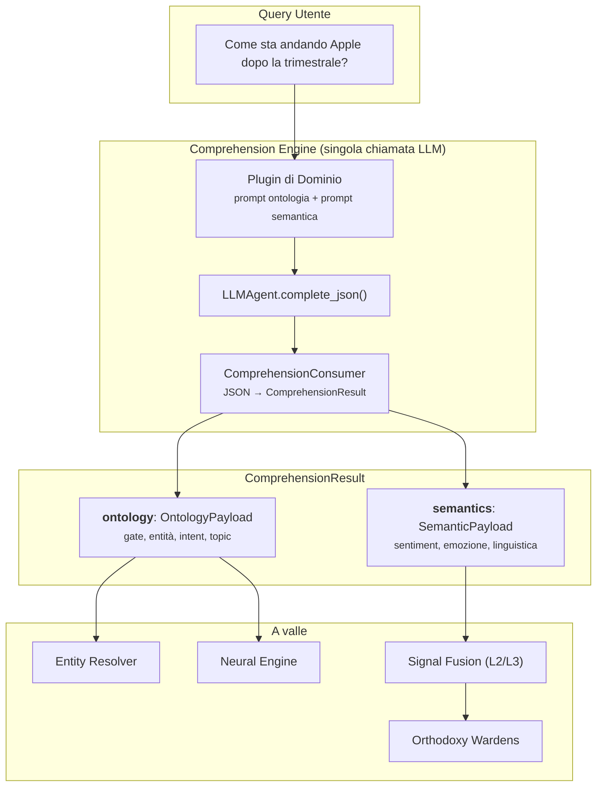

---
tags:
  - architecture
  - ontology
  - semantics
  - comprehension
  - pattern-weavers
  - babel-gardens
---

# Architettura Semantica & Ontologica

> **Ultimo aggiornamento**: 25 Febbraio 2026 18:00 UTC

## Come il sistema comprende — il Comprehension Engine

La pipeline cognitiva di Vitruvyan deve rispondere a due domande fondamentali su ogni query dell'utente:

1. **Di cosa si parla?** — Ontologia (struttura, entità, intent, classificazione di dominio)
2. **Come viene detto?** — Semantica (sentiment, emozione, registro linguistico, ironia)

Queste due dimensioni sono **architetturalmente separate** ma **computazionalmente unificate**.

---

## Il principio di design

```
Separazione dove conta:
  - Contratti    →  OntologyPayload ≠ SemanticPayload  (schemi diversi)
  - Proprietà    →  Pattern Weavers possiede l'ontologia, Babel Gardens la semantica
  - Evoluzione   →  Ogni schema evolve indipendentemente per dominio
  - Fusione      →  Solo la semantica partecipa alla signal fusion (L2/L3)

Unificazione dove conta:
  - Elaborazione →  Una singola chiamata LLM produce entrambe le sezioni
  - Contesto     →  Contesto condiviso (sapere che "AAPL" è un ticker influenza l'analisi del sentiment)
  - Latenza      →  Una chiamata invece di due = ~50% in meno di latenza e costo
  - Output       →  ComprehensionResult = un contenitore, due sezioni distinte
```

Non è un compromesso — è il riconoscimento che **ontologia e semantica sono lenti diverse sullo stesso testo**. Separando le lenti (contratti) e unificando l'osservazione (chiamata LLM) otteniamo il meglio da entrambi i mondi.

---

## Panoramica dell'architettura



---

## I tre livelli

Il Comprehension Engine opera su un'architettura a tre livelli, ognuno con una responsabilità distinta:

### Livello 1 — Comprensione LLM (core, domain-agnostic)

Una singola chiamata LLM produce il `ComprehensionResult` completo. Il prompt è assemblato da due sezioni indipendenti fornite dal plugin di dominio attivo:

| Sezione | Responsabile | Produce | Esempio |
|---------|-------------|---------|---------|
| Prompt ontologia | Pattern Weavers | `OntologyPayload` — gate, entità, intent, topic | Tipi di entità, vocabolario degli intent, regole di gate |
| Prompt semantica | Babel Gardens | `SemanticPayload` — sentiment, emozione, linguistica | Etichette sentiment, tassonomia emozioni, rilevamento registro |

Perché una singola chiamata? Perché il contesto fluisce tra le sezioni. Sapere che "Apple" è un ticker (ontologia) informa che "è crollata" si riferisce ad un calo azionario, non ad un crollo fisico (semantica). Due chiamate separate perderebbero questa consapevolezza cross-dominio.

### Livello 2 — Modelli specifici di dominio (responsabilità verticale)

Modelli specializzati aggiungono segnali calibrati sul dominio che complementano la comprensione generale del LLM. Sono esterni al core — ogni verticale fornisce i propri:

| Verticale | Modello | Segnali | Interfaccia |
|-----------|---------|---------|-------------|
| Finanza | FinBERT | `sentiment_valence`, `market_fear_index`, `volatility_perception` | `ISignalContributor` |
| Sicurezza | SecBERT | *(da definire)* | `ISignalContributor` |
| Sanità | BioBERT | *(da definire)* | `ISignalContributor` |

I modelli L2 sono registrati tramite `SignalContributorRegistry` e producono oggetti `SignalEvidence` — tipizzati, con punteggio di confidenza e tracce di estrazione complete.

### Livello 3 — Fusione dei segnali (core, configurabile per dominio)

Tutti i segnali dal Livello 1 (LLM) e Livello 2 (modelli di dominio) vengono fusi in una valutazione unificata:

| Strategia | Quando usarla | Come funziona |
|-----------|---------------|---------------|
| **Weighted** | Default; stabile, interpretabile | Media pesata per confidenza con override pesi per sorgente |
| **Bayesian** | Segnali ad alto conflitto | Aggiornamento posteriore log-odds; sorgenti ad alta confidenza dominano |
| **LLM Arbitrated** | Disaccordi complessi | LLM risolve segnali conflittuali con ragionamento |

I pesi di fusione sono configurabili per dominio. Esempio finanza: `LLM: 0.45, FinBERT: 0.35, multilingual: 0.20`.

---

## Perché due Sacred Orders separati, non uno

Una domanda naturale: se ontologia e semantica vengono prodotte insieme, perché mantenere Pattern Weavers e Babel Gardens come Sacred Orders separati?

### Mandati diversi

| | Pattern Weavers | Babel Gardens |
|-|-----------------|---------------|
| **Domanda** | "Di cosa si parla?" | "Come viene espresso?" |
| **Livello epistemico** | Ragione | Percezione |
| **Output** | Struttura (entità, tipi, intent) | Segnali (sentiment, emozione, registro) |
| **A valle** | Risoluzione entità, routing intent | Fusione segnali, scoring rischio |
| **Fusione** | Non partecipa | Partecipante core (L2/L3) |
| **Evoluzione** | Nuovi tipi di entità, nuovi intent | Nuove emozioni, nuovi modelli di segnale |

### Evoluzione indipendente per dominio

Un verticale di sicurezza necessita di tipi di entità diversi (CVE, indirizzo IP, famiglia malware) ma la stessa tassonomia emotiva. Un verticale sanitario necessita di calibrazione del sentiment diversa (clinico vs. emotivo) ma lo stesso pattern di risoluzione entità. Separare i contratti permette ai domini di evolvere ciascuna dimensione indipendentemente.

### La metafora delle "lenti"

L'ontologia è una **lente strutturale**: vede categorie, tipi, relazioni.
La semantica è una **lente affettiva**: vede tono, intensità, l'intenzione dietro le parole.

Entrambe le lenti osservano lo stesso testo simultaneamente (singola chiamata LLM), ma producono tipi di conoscenza fondamentalmente diversi. Mescolarle in un unico schema significherebbe confondere struttura con affetto — un errore categoriale in senso epistemico.

---

## Architettura dei contratti

### OntologyPayload (Pattern Weavers)

Definito in `contracts/pattern_weavers.py`. Schema strict (`extra="forbid"`).

```python
OntologyPayload:
  gate: DomainGate          # verdict (in_domain/out_of_domain/ambiguous), domain, confidence, reasoning
  entities: [OntologyEntity] # raw, canonical, entity_type, confidence
  intent_hint: str           # intent specifico di dominio
  topics: [str]              # tag tematici
  sentiment_hint: str        # sentiment grezzo (positive/negative/neutral/mixed)
  temporal_context: str      # real_time/historical/forward_looking
  language: str              # ISO 639-1
  complexity: str            # simple/compound/multi_intent
```

### SemanticPayload (Babel Gardens)

Definito in `contracts/comprehension.py`. Schema strict (`extra="forbid"`).

```python
SemanticPayload:
  sentiment: SentimentPayload   # label, score, confidence, magnitude, aspects, reasoning
  emotion: EmotionPayload       # primary, secondary, intensity, confidence, cultural_context, reasoning
  linguistic: LinguisticPayload # text_register, irony_detected, ambiguity_score, code_switching
```

### ComprehensionResult (contenitore unificato)

```python
ComprehensionResult:
  ontology: OntologyPayload       # ← schema Pattern Weavers
  semantics: SemanticPayload      # ← schema Babel Gardens
  raw_query: str
  language: str
  comprehension_metadata: dict    # timing, modello, plugin di dominio usato
```

I due payload convivono ma non si fondono mai. Ciascuno può essere consumato indipendentemente dai componenti a valle.

---

## Sistema di plugin

### IComprehensionPlugin (a livello di dominio)

Ogni dominio registra un plugin che modella sia la sezione ontologia che semantica del prompt:

```python
class IComprehensionPlugin(ABC):
    def get_domain_name(self) -> str: ...
    def get_ontology_prompt_section(self) -> str: ...      # → modella OntologyPayload
    def get_semantics_prompt_section(self) -> str: ...     # → modella SemanticPayload
    def get_entity_types(self) -> List[str]: ...
    def get_gate_keywords(self) -> List[str]: ...
    def get_signal_schemas(self) -> Dict[str, Dict]: ...   # → definizioni segnali L2
    def validate_result(self, result) -> ComprehensionResult: ...
```

Built-in: `GenericComprehensionPlugin` (domain-agnostic, sempre disponibile).
Finanza: `FinanceComprehensionPlugin` (11 tipi entità, keyword multilingua, normalizzazione ticker, schema segnali FinBERT).

### ISignalContributor (modelli L2)

I modelli specifici di dominio implementano questa interfaccia per contribuire segnali alla pipeline di fusione:

```python
class ISignalContributor(ABC):
    def get_contributor_name(self) -> str: ...
    def get_signal_names(self) -> List[str]: ...
    def contribute(self, text: str, context: dict) -> List[SignalEvidence]: ...
    def is_available(self) -> bool: ...
```

I contributor sono caricati lazily e la disponibilità verificata a runtime. Se `transformers` di FinBERT non è installato, il contributor degrada gracefully — il sistema funziona solo con segnali LLM.

---

## Feature flag

| Flag | Default | Effetto |
|------|---------|---------|
| `BABEL_COMPREHENSION_V3` | `0` | Abilita endpoint `/v2/comprehend` + `/v2/fuse` |
| `PATTERN_WEAVERS_V3` | `0` | Abilita endpoint `/compile` (solo ontologia, pre-Comprehension) |
| `BABEL_DOMAIN` | `generic` | Quali plugin di dominio auto-registrare all'avvio |

Quando `BABEL_COMPREHENSION_V3=1`, il Comprehension Engine sostituisce sia `PATTERN_WEAVERS_V3` che l'endpoint separato di rilevamento emozioni. Il nodo grafo (`comprehension_node`) rimpiazza `pattern_weavers_node` e `emotion_detector_node` con piena retrocompatibilità.

---

## Mappa del codice

| Livello | Componente | Posizione |
|---------|-----------|-----------|
| **Contratti** | `ComprehensionResult`, `IComprehensionPlugin`, `ISignalContributor` | `contracts/comprehension.py` |
| **Contratti** | `OntologyPayload`, `ISemanticPlugin` | `contracts/pattern_weavers.py` |
| **LIVELLO 1** | `ComprehensionConsumer` (JSON→result parser) | `core/cognitive/babel_gardens/consumers/comprehension_consumer.py` |
| **LIVELLO 1** | `SignalFusionConsumer` (weighted/bayesian) | `core/cognitive/babel_gardens/consumers/signal_fusion_consumer.py` |
| **LIVELLO 1** | `ComprehensionPluginRegistry` + `SignalContributorRegistry` | `core/cognitive/babel_gardens/governance/signal_registry.py` |
| **LIVELLO 2** | `ComprehensionAdapter` (orchestrazione LLM) | `services/api_babel_gardens/adapters/comprehension_adapter.py` |
| **LIVELLO 2** | `SignalFusionAdapter` (fusione + arbitraggio LLM) | `services/api_babel_gardens/adapters/signal_fusion_adapter.py` |
| **LIVELLO 2** | `/v2/comprehend`, `/v2/fuse` route | `services/api_babel_gardens/api/routes_comprehension.py` |
| **Grafo** | `comprehension_node` (rimpiazza PW + emotion node) | `core/orchestration/langgraph/node/comprehension_node.py` |
| **Finanza** | `FinanceComprehensionPlugin` | `domains/finance/babel_gardens/finance_comprehension_plugin.py` |
| **Finanza** | `FinBERTContributor` | `services/api_babel_gardens/plugins/finbert_contributor.py` |

---

## Test

| Suite | Conteggio | Cosa copre |
|-------|-----------|-----------|
| Core comprehension | 49 | Contratti, consumer, registry, scenari cross-dominio |
| Finance comprehension | 29 | Plugin finanza, FinBERT contributor, fusione con segnali finanza |
| PW v3 (solo ontologia) | 25 | Compilazione ontologia pre-Comprehension |
| Finance PW v3 | 12 | Plugin semantico finanza |
| **Totale** | **115** | |

---

## Percorso evolutivo

Il Comprehension Engine è progettato per crescere col sistema:

1. **Nuovi domini** aggiungono plugin (`IComprehensionPlugin`) — nessuna modifica al core
2. **Nuovi modelli** si registrano come contributor (`ISignalContributor`) — plug-and-play
3. **Nuovi segnali** estendono `SemanticPayload` o il return di `get_signal_schemas()` — retrocompatibile
4. **Nuove strategie di fusione** estendono l'enum `FusionStrategy` — il consumer gestisce il dispatch

L'architettura garantisce che aggiungere un dominio di sicurezza (SecBERT, entità CVE, emozioni di minaccia) richiede **zero modifiche** al core del comprehension engine — solo nuovi file di dominio.
