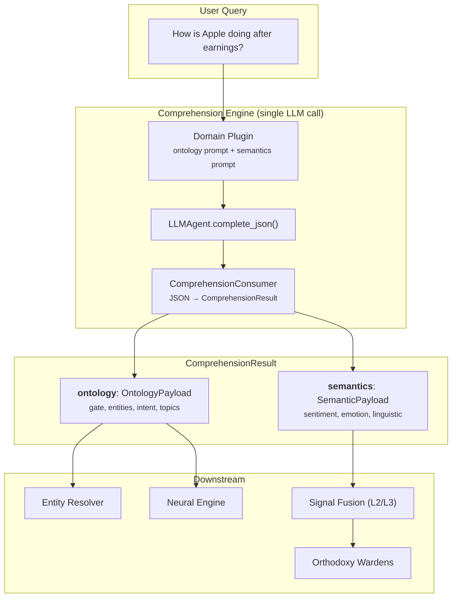

---
tags:
  - architecture
  - ontology
  - semantics
  - comprehension
  - pattern-weavers
  - babel-gardens
---

# Semantic & Ontology Architecture

> **Last updated**: February 25, 2026 18:00 UTC

## How the system understands — the Comprehension Engine

Vitruvyan's cognitive pipeline must answer two fundamental questions about every user query:

1. **What is this about?** — Ontology (structure, entities, intent, domain classification)
2. **How is it said?** — Semantics (sentiment, emotion, linguistic register, irony)

These two dimensions are **architecturally separated** but **computationally unified**.

---

## The design principle

```
Separation where it matters:
  - Contracts    →  OntologyPayload ≠ SemanticPayload  (different schemas)
  - Ownership    →  Pattern Weavers owns ontology, Babel Gardens owns semantics
  - Evolution    →  Each schema evolves independently per-domain
  - Fusion       →  Only semantics participates in signal fusion (L2/L3)

Unification where it matters:
  - Processing   →  Single LLM call produces both sections
  - Context      →  Shared context (knowing "AAPL" is a ticker affects sentiment analysis)
  - Latency      →  One call instead of two = ~50% less latency and cost
  - Output       →  ComprehensionResult = single container, two distinct sections
```

This is not a compromise — it's the recognition that **ontology and semantics are different lenses on the same text**. Separating the lenses (contracts) while unifying the observation (LLM call) gives us the best of both worlds.

---

## Architecture overview



---

## The three layers

The Comprehension Engine operates on a three-layer architecture where each layer has a distinct responsibility:

### Layer 1 — LLM Comprehension (core, domain-agnostic)

A single LLM call produces the full `ComprehensionResult`. The prompt is assembled from two independent sections provided by the active domain plugin:

| Section | Owner | Produces | Example |
|---------|-------|----------|---------|
| Ontology prompt | Pattern Weavers | `OntologyPayload` — gate, entities, intent, topics | Entity types, intent vocabulary, gate rules |
| Semantics prompt | Babel Gardens | `SemanticPayload` — sentiment, emotion, linguistic | Sentiment labels, emotion taxonomy, register detection |

Why a single call? Because context flows between sections. Knowing that "Apple" is a ticker (ontology) informs that "crashed" means a stock decline, not a physical impact (semantics). Two separate calls would lose this cross-domain awareness.

### Layer 2 — Domain-Specific Models (vertical responsibility)

Specialized models add domain-calibrated signals that complement the LLM's general comprehension. These are external to the core — each vertical provides its own:

| Vertical | Model | Signals | Interface |
|----------|-------|---------|-----------|
| Finance | FinBERT | `sentiment_valence`, `market_fear_index`, `volatility_perception` | `ISignalContributor` |
| Security | SecBERT | *(to be defined)* | `ISignalContributor` |
| Healthcare | BioBERT | *(to be defined)* | `ISignalContributor` |

Layer 2 models are registered via `SignalContributorRegistry` and produce `SignalEvidence` objects — typed, confidence-scored, with full extraction traces.

### Layer 3 — Signal Fusion (core, domain-configurable)

All signals from Layer 1 (LLM) and Layer 2 (domain models) are fused into a unified assessment:

| Strategy | When to use | How it works |
|----------|-------------|--------------|
| **Weighted** | Default; stable, interpretable | Confidence-weighted average with per-source weight overrides |
| **Bayesian** | High-conflicting signals | Log-odds posterior update; high-confidence sources dominate |
| **LLM Arbitrated** | Complex disagreements | LLM resolves conflicting signals with reasoning |

Fusion weights are domain-configurable. Finance example: `LLM: 0.45, FinBERT: 0.35, multilingual: 0.20`.

---

## Why two Sacred Orders, not one

A natural question: if ontology and semantics are produced together, why keep Pattern Weavers and Babel Gardens as separate Sacred Orders?

### Different mandates

| | Pattern Weavers | Babel Gardens |
|-|-----------------|---------------|
| **Question** | "What is this about?" | "How is it expressed?" |
| **Epistemic layer** | Reason | Perception |
| **Output** | Structure (entities, types, intent) | Signals (sentiment, emotion, register) |
| **Downstream** | Entity resolution, intent routing | Signal fusion, risk scoring |
| **Fusion** | Does not participate | Core participant (L2/L3) |
| **Evolution** | New entity types, new intents | New emotions, new signal models |

### Independent evolution per domain

A security vertical needs different entity types (CVE, IP address, malware family) but the same emotion taxonomy. A healthcare vertical needs different sentiment calibration (clinical vs. emotional) but the same entity resolution pattern. Separating the contracts lets domains evolve each dimension independently.

### The "lenses" metaphor

Ontology is a **structural lens**: it sees categories, types, relationships.
Semantics is an **affective lens**: it sees tone, intensity, intent behind the words.

Both lenses observe the same text simultaneously (single LLM call), but they produce fundamentally different kinds of knowledge. Mixing them into one schema would conflate structure with affect — a category error in the epistemic sense.

---

## Contract architecture

### OntologyPayload (Pattern Weavers)

Defined in `contracts/pattern_weavers.py`. Strict schema (`extra="forbid"`).

```python
OntologyPayload:
  gate: DomainGate          # verdict (in_domain/out_of_domain/ambiguous), domain, confidence, reasoning
  entities: [OntologyEntity] # raw, canonical, entity_type, confidence
  intent_hint: str           # domain-specific intent
  topics: [str]              # topic tags
  sentiment_hint: str        # coarse sentiment (positive/negative/neutral/mixed)
  temporal_context: str      # real_time/historical/forward_looking
  language: str              # ISO 639-1
  complexity: str            # simple/compound/multi_intent
```

### SemanticPayload (Babel Gardens)

Defined in `contracts/comprehension.py`. Strict schema (`extra="forbid"`).

```python
SemanticPayload:
  sentiment: SentimentPayload   # label, score, confidence, magnitude, aspects, reasoning
  emotion: EmotionPayload       # primary, secondary, intensity, confidence, cultural_context, reasoning
  linguistic: LinguisticPayload # text_register, irony_detected, ambiguity_score, code_switching
```

### ComprehensionResult (unified container)

```python
ComprehensionResult:
  ontology: OntologyPayload       # ← Pattern Weavers schema
  semantics: SemanticPayload      # ← Babel Gardens schema
  raw_query: str
  language: str
  comprehension_metadata: dict    # timing, model, domain plugin used
```

The two payloads live side by side but never merge. Each can be consumed independently by downstream components.

---

## Plugin system

### IComprehensionPlugin (domain-wide)

Each domain registers one plugin that shapes both the ontology and semantics sections of the prompt:

```python
class IComprehensionPlugin(ABC):
    def get_domain_name(self) -> str: ...
    def get_ontology_prompt_section(self) -> str: ...      # → shapes OntologyPayload
    def get_semantics_prompt_section(self) -> str: ...     # → shapes SemanticPayload
    def get_entity_types(self) -> List[str]: ...
    def get_gate_keywords(self) -> List[str]: ...
    def get_signal_schemas(self) -> Dict[str, Dict]: ...   # → Layer 2 signal definitions
    def validate_result(self, result) -> ComprehensionResult: ...
```

Built-in: `GenericComprehensionPlugin` (domain-agnostic, always available).
Finance: `FinanceComprehensionPlugin` (11 entity types, multilingual keywords, ticker normalization, FinBERT signal schemas).

### ISignalContributor (Layer 2 models)

Domain-specific models implement this interface to contribute signals to the fusion pipeline:

```python
class ISignalContributor(ABC):
    def get_contributor_name(self) -> str: ...
    def get_signal_names(self) -> List[str]: ...
    def contribute(self, text: str, context: dict) -> List[SignalEvidence]: ...
    def is_available(self) -> bool: ...
```

Contributors are lazy-loaded and availability-checked at runtime. If FinBERT's `transformers` is not installed, the contributor gracefully degrades — the system runs on LLM-only signals.

---

## Feature flags

| Flag | Default | Effect |
|------|---------|--------|
| `BABEL_COMPREHENSION_V3` | `0` | Enables `/v2/comprehend` + `/v2/fuse` endpoints |
| `PATTERN_WEAVERS_V3` | `0` | Enables `/compile` endpoint (ontology-only, pre-Comprehension) |
| `BABEL_DOMAIN` | `generic` | Which domain plugins to auto-register at startup |

When `BABEL_COMPREHENSION_V3=1`, the Comprehension Engine supersedes both `PATTERN_WEAVERS_V3` and the separate emotion detection endpoint. The graph node (`comprehension_node`) replaces both `pattern_weavers_node` and `emotion_detector_node` with full backward compatibility.

---

## Code map

| Layer | Component | Location |
|-------|-----------|----------|
| **Contracts** | `ComprehensionResult`, `IComprehensionPlugin`, `ISignalContributor` | `contracts/comprehension.py` |
| **Contracts** | `OntologyPayload`, `ISemanticPlugin` | `contracts/pattern_weavers.py` |
| **LIVELLO 1** | `ComprehensionConsumer` (JSON→result parser) | `core/cognitive/babel_gardens/consumers/comprehension_consumer.py` |
| **LIVELLO 1** | `SignalFusionConsumer` (weighted/bayesian) | `core/cognitive/babel_gardens/consumers/signal_fusion_consumer.py` |
| **LIVELLO 1** | `ComprehensionPluginRegistry` + `SignalContributorRegistry` | `core/cognitive/babel_gardens/governance/signal_registry.py` |
| **LIVELLO 2** | `ComprehensionAdapter` (LLM orchestration) | `services/api_babel_gardens/adapters/comprehension_adapter.py` |
| **LIVELLO 2** | `SignalFusionAdapter` (fusion + LLM arbitration) | `services/api_babel_gardens/adapters/signal_fusion_adapter.py` |
| **LIVELLO 2** | `/v2/comprehend`, `/v2/fuse` routes | `services/api_babel_gardens/api/routes_comprehension.py` |
| **Graph** | `comprehension_node` (replaces PW + emotion nodes) | `core/orchestration/langgraph/node/comprehension_node.py` |
| **Finance** | `FinanceComprehensionPlugin` | `domains/finance/babel_gardens/finance_comprehension_plugin.py` |
| **Finance** | `FinBERTContributor` | `services/api_babel_gardens/plugins/finbert_contributor.py` |

---

## Tests

| Suite | Count | What it covers |
|-------|-------|----------------|
| Core comprehension | 49 | Contracts, consumers, registries, cross-domain scenarios |
| Finance comprehension | 29 | Finance plugin, FinBERT contributor, fusion with finance signals |
| PW v3 (ontology-only) | 25 | Pre-Comprehension ontology compilation |
| Finance PW v3 | 12 | Finance semantic plugin |
| **Total** | **115** | |

---

## Evolution path

The Comprehension Engine is designed to grow with the system:

1. **New domains** add plugins (`IComprehensionPlugin`) — no core changes needed
2. **New models** register as contributors (`ISignalContributor`) — plug-and-play
3. **New signals** extend `SemanticPayload` or `get_signal_schemas()` return — backward compatible
4. **New fusion strategies** extend `FusionStrategy` enum — consumer handles dispatch

The architecture guarantees that adding a security domain (SecBERT, CVE entities, threat emotions) requires **zero changes** to the core comprehension engine — only new domain files.
