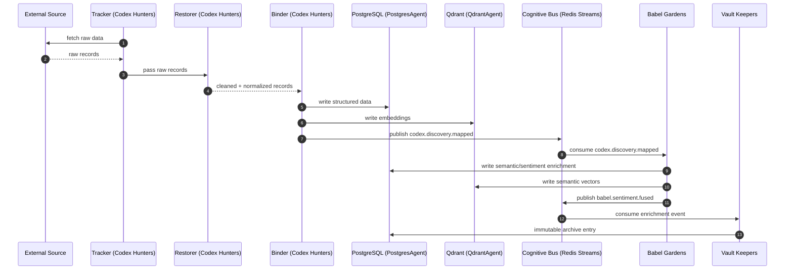
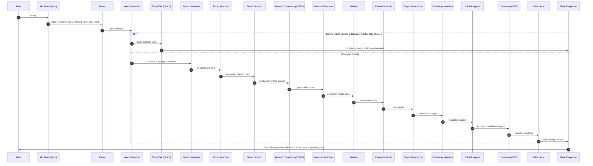
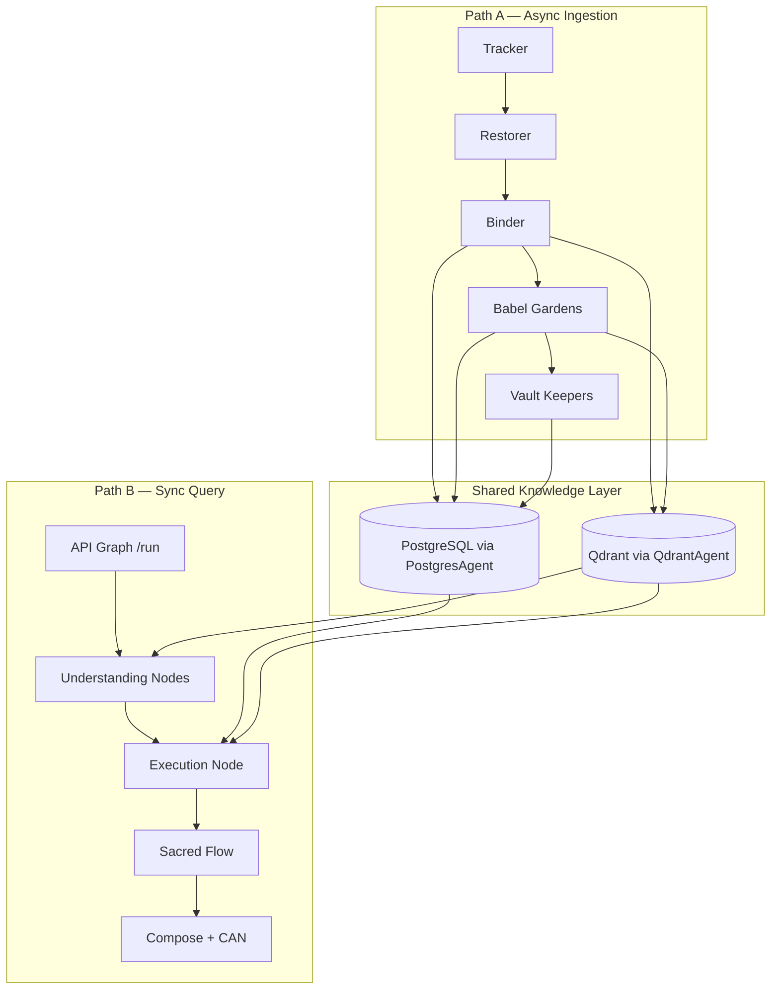

# Vitruvyan Pipeline Walkthrough (Target + Runtime)

> This page intentionally shows both:
> 1) the **target architecture** (design intent), and  
> 2) the **current runtime snapshot** (what is active today).

> Snapshot date: **February 23, 2026** (updated post-v1.4.0: early-exit, GraphResponseMin, concurrency)

---

## 1) Target Architecture (Design Intent)

Vitruvyan is designed around two intersecting paths:

- **Path A (async ingestion):** Codex Hunters → Babel Gardens → Vault Keepers
- **Path B (sync query):** LangGraph orchestration with Sacred Flow governance

### Path A — Target Flow (Async)



### Path B — Target Flow (Sync)



### Unified Block View — Target (High-Level)



---

## 2) Current Runtime Snapshot (as of 2026-02-14)

### Path A — Runtime Status

| Item | Status | Note |
|---|---|---|
| Codex stream listeners + dispatch | IMPLEMENTED | `codex.*.requested` consumed and dispatched |
| Tracker/Restorer/Binder domain consumers | IMPLEMENTED | Present in core |
| Full auto chain from listener to discover/restore/bind | PARTIAL | Listener path focuses on expedition dispatch |
| Babel listener on `codex.discovery.mapped` | IMPLEMENTED | Consume/ACK path present |
| Babel full enrich + dual-write triggered from stream | PARTIAL | Not fully guaranteed end-to-end in current listener wiring |
| Vault archive via dedicated channels | IMPLEMENTED | Vault listener active on configured sacred channels |

### Path B — Runtime Status

| Item | Status | Note |
|---|---|---|
| Parse → Intent → Weavers → Resolver → Emotion → Grounding → Params → Decide | IMPLEMENTED | Present in compiled graph |
| **Early-exit node** (v1.4.0) | **IMPLEMENTED** | Conditional edge after `intent_detection`; fast path for greeting/farewell/thanks/chit_chat/smalltalk/goodbye/gratitude → `END` (bypasses 14 nodes) |
| Execution node domain logic | IMPLEMENTED (HOOK) | `exec_node` uses `ExecutionRegistry` (domain-configurable via `EXEC_DOMAIN`) |
| Entity resolver validation | IMPLEMENTED (HOOK) | `entity_resolver_node` uses `EntityResolverRegistry` (domain-configurable via `ENTITY_DOMAIN`) |
| Params extraction domain-agnostic | IMPLEMENTED | Finance terms removed (Feb 14, 2026), domain-neutral temporal patterns |
| Sacred Flow (`output_normalizer -> orthodoxy -> vault -> compose -> can`) | IMPLEMENTED | Wired and active |
| **GraphResponseMin contract** (v1.4.0) | **IMPLEMENTED** | Channel-agnostic response envelope: `human` + `follow_ups` + `session_min` + `orthodoxy_status` + `route_taken` |
| **asyncio.to_thread concurrency** (v1.4.0) | **IMPLEMENTED** | Graph executes in worker thread; FastAPI event loop stays responsive for N concurrent users |
| **Per-user asyncio.Lock** (v1.4.0) | **IMPLEMENTED** | One graph run per user at a time; subsequent requests queued (no race on shared state) |
| **LRU session cache** (v1.4.0) | **IMPLEMENTED** | Thread-safe `_session_get`/`_session_put` with max 1000 entries, 1h TTL, lazy eviction |
| **PG session persistence** (v1.3.1) | **IMPLEMENTED** | Write-through to `conversations` table; RAM recovery on miss (restored after accidental removal) |
| Proactive Suggestions node | REMOVED | Removed from active graph |
| Hook pattern (intent/entity/exec) | IMPLEMENTED | Registry-based domain plugin architecture (3/3 nodes migrated) |

---

## 3) Interpretation Rule

Use this page as follows:

- **Target sections** = intended end-state architecture (kept explicit on purpose).
- **Runtime status tables** = operational truth for current deployment.

This keeps vision and implementation aligned without losing roadmap context.

---

## 4) Technical-Functional Walkthrough (Code-Oriented)

This section is written for engineers: it maps the diagrams above to **concrete modules, processes, and interfaces** in the repository. It is intentionally **technical-functional** (runtime behavior, boundaries, extension points) rather than epistemic framing.

### 4.1 Why this pipeline exists (engineering drivers)

- **Two execution modalities, one system**: a synchronous request/response graph for user queries (Path B) plus an asynchronous event bus for ingestion and background work (Path A).
- **Strict separation of concerns**: pure logic lives in `vitruvyan_core/` (LIVELLO 1, no I/O); deployment/runtime concerns live in `services/` (LIVELLO 2, FastAPI, Redis, Postgres, Qdrant).
- **Durability + replay**: Redis Streams + consumer groups provide at-least-once delivery; events survive process downtime.
- **Observability by construction**: listeners explicitly `ACK` only on success; failures remain in the pending entries list (PEL) and are retryable.
- **Plug-in model**: intent routing and domain behavior are configured by environment variables (e.g. `INTENT_DOMAIN`) and domain packages under `vitruvyan_core/domains/`.

### 4.2 Code map: “named blocks” → implementation

| Block in diagrams | What it is in code | Where |
|---|---|---|
| **API Graph (/run)** | FastAPI service that executes LangGraph via `asyncio.to_thread` (non-blocking) with per-user `asyncio.Lock` | `services/api_graph/` (see `services/api_graph/api/routes.py` and `services/api_graph/adapters/graph_adapter.py`) |
| **LangGraph orchestration** | `StateGraph` definition + compiled graph runner | `vitruvyan_core/core/orchestration/langgraph/` (see `vitruvyan_core/core/orchestration/langgraph/graph_flow.py` and `vitruvyan_core/core/orchestration/langgraph/graph_runner.py`) |
| **Cognitive Bus (Redis Streams)** | Transport layer (`StreamBus`) + canonical event envelope (`TransportEvent`) | `vitruvyan_core/core/synaptic_conclave/transport/streams.py` and `vitruvyan_core/core/synaptic_conclave/events/event_envelope.py` |
| **Codex Hunters (Tracker/Restorer/Binder)** | Pure consumers (LIVELLO 1) + service adapter + optional listener | `vitruvyan_core/core/governance/codex_hunters/consumers/` and `services/api_codex_hunters/` (listener: `services/api_codex_hunters/streams_listener.py`) |
| **Babel Gardens** | Service + listener (currently ACK/log) + HTTP adapters used by graph nodes | `services/api_babel_gardens/` (listener: `services/api_babel_gardens/streams_listener.py`) and LangGraph node `vitruvyan_core/core/orchestration/langgraph/node/emotion_detector.py` |
| **Pattern Weavers** | HTTP adapter node that calls the Pattern Weavers service | `vitruvyan_core/core/orchestration/langgraph/node/pattern_weavers_node.py` and `services/api_pattern_weavers/` |
| **VSGS semantic grounding** | Thin node delegating to `VSGSEngine` (feature-flagged) | `vitruvyan_core/core/orchestration/langgraph/node/semantic_grounding_node.py` |
| **Orthodoxy / Vault in Sacred Flow** | LangGraph nodes + dedicated services/listeners for streams-based processing | LangGraph nodes: `vitruvyan_core/core/orchestration/langgraph/node/orthodoxy_node.py`, `vitruvyan_core/core/orchestration/langgraph/node/vault_node.py`; services: `services/api_orthodoxy_wardens/streams_listener.py`, `services/api_vault_keepers/streams_listener.py` |
| **Synaptic Conclave API** | Thin Streams emitter + “observatory” listener | `services/api_conclave/api/routes.py` and `services/api_conclave/streams_listener.py` || **Early Exit** (v1.4.0) | Lightweight governance for simple intents: LLM-first response + `orthodoxy=blessed` → `END` | `vitruvyan_core/core/orchestration/langgraph/node/early_exit_node.py` |
| **GraphResponseMin Contract** (v1.4.0) | Channel-agnostic response envelope (`SessionMin`, `GraphResponseMin`, `OrthodoxyStatusType`, `build_correlation_id`) | `vitruvyan_core/contracts/graph_response.py` |
| **Intent Registry** | Domain-configurable intent detection (hook pattern) | `vitruvyan_core/core/orchestration/intent_registry.py` + `vitruvyan_core/domains/finance/intent_config.py` (env: `INTENT_DOMAIN`) |
| **Entity Resolver Registry** | Domain-configurable entity resolution (hook pattern) | `vitruvyan_core/core/orchestration/entity_resolver_registry.py` + `vitruvyan_core/domains/finance/entity_resolver_config.py` (env: `ENTITY_DOMAIN`) |
| **Execution Registry** | Domain-configurable execution handlers (hook pattern) | `vitruvyan_core/core/orchestration/execution_registry.py` + `vitruvyan_core/domains/finance/execution_config.py` (env: `EXEC_DOMAIN`) |
### 4.3 Path A (async) — execution model in code

**Transport semantics (Redis Streams)**:
- Stream name is derived by prefixing the channel with `vitruvyan:` (see `StreamBus._stream_name()` in `vitruvyan_core/core/synaptic_conclave/transport/streams.py`).
- Consumers run under a **consumer group**; most listeners enforce the convention `group:<name>` via `_ensure_group_prefix()` in each `services/*/streams_listener.py`.
- Delivery is **at-least-once**: a message is removed from the group only after `ACK`; unacked messages remain pending (PEL) and are retried.
- Correlation is **optional metadata** (`correlation_id`) carried in the envelope (`TransportEvent`); the bus does not interpret it.

**Runtime listeners (what actually runs as a worker process)**:
- `services/api_codex_hunters/streams_listener.py` consumes `codex.*.requested` streams and dispatches to the Codex Hunters HTTP API (`/expedition/run`); on success it emits `codex.expedition.completed`.
- `services/api_babel_gardens/streams_listener.py` currently **ACKs + logs** key streams (including `codex.discovery.mapped`) but does not guarantee end-to-end enrichment from streams yet (see runtime table above).
- `services/api_vault_keepers/streams_listener.py` consumes vault/archival requests (e.g. `vault.archive.requested`) and cross-order completion events (e.g. `orthodoxy.audit.completed`), then delegates to `VaultBusAdapter` for persistence + bus emission.
- `services/api_orthodoxy_wardens/streams_listener.py` consumes `orthodoxy.audit.requested` (and other configured sacred channels) and emits completion events such as `orthodoxy.audit.completed`.
- `services/api_conclave/streams_listener.py` is an “observatory”: it consumes configured streams and logs/ACKs for monitoring, without dispatch.

### 4.4 Path B (sync) — how the LangGraph pipeline executes

**Call stack** (updated v1.4.0):
1. HTTP request hits `POST /run` (`services/api_graph/api/routes.py`).
2. `GraphOrchestrationAdapter.execute_graph()` acquires **per-user `asyncio.Lock`** via `_get_user_lock(user_id)` (bounded dict, max 2000 entries).
3. Under the lock, runs **`asyncio.to_thread(run_graph_once, ...)`** — offloads blocking graph to a worker thread so the FastAPI event loop stays responsive.
4. `run_graph_once()` checks the **LRU session cache** (`_session_get(user_id)`) with 1h TTL; on miss, recovers from **PG `conversations` table** (v1.3.1 persistence).
5. Invokes the compiled graph from `build_graph()` (`vitruvyan_core/core/orchestration/langgraph/graph_flow.py`).
6. After execution, persists session via `_session_put()` (RAM with LRU eviction) and PG write-through.
7. Response is transformed into **`GraphResponseMin`** schema: `human` + `follow_ups` + `session_min` + `orthodoxy_status` + `route_taken` + `correlation_id`.

**Graph structure (as wired today — v1.4.0)**:
- **Conditional edge after `intent_detection`** (v1.4.0): if `is_early_exit(state)` returns True, routes to `early_exit` → `END` (bypasses 14 nodes). Otherwise continues to `weaver`.
- Node chain (full path): `parse` → `intent_detection` → `weaver` → `entity_resolver` → `babel_emotion` → `semantic_grounding` → `params_extraction` → `decide` → `exec|qdrant|compose|llm_soft|codex_hunters|llm_mcp` → `output_normalizer` → `orthodoxy` → `vault` → `compose` → `can` → `[advisor]` → `END`.
- **Early-exit path**: `parse` → `intent_detection` → `early_exit` → `END` (greeting, farewell, thanks, chit_chat, smalltalk, goodbye, gratitude).
- Routing is implemented as a conditional edge out of `decide` based on `state["route"]` (see `route_from_decide()` in `vitruvyan_core/core/orchestration/langgraph/graph_flow.py`).

**Feature flags / configuration knobs that change behavior**:
- `INTENT_DOMAIN` selects which intent registry is configured at import time in `vitruvyan_core/core/orchestration/langgraph/graph_flow.py` (default: `generic`).
- `ENTITY_DOMAIN` selects which entity resolver is used by `entity_resolver_node` (hook pattern, default: stub passthrough).
- `EXEC_DOMAIN` selects which execution handler is used by `exec_node` (hook pattern, default: fake success stub).
- `ENABLE_MINIMAL_GRAPH=true` swaps `build_graph()` for a reduced `build_minimal_graph()` in `vitruvyan_core/core/orchestration/langgraph/graph_runner.py`.
- `USE_MCP=1` can reroute `dispatcher_exec` to `llm_mcp` in `route_from_decide()` (MCP tool-calling gateway).
- `VSGS_ENABLED=1` enables semantic grounding inside `semantic_grounding_node` (`vitruvyan_core/core/orchestration/langgraph/node/semantic_grounding_node.py`).
- `EARLY_EXIT_INTENTS` (v1.4.0) overrides default early-exit intents (comma-separated, default: `greeting,farewell,thanks,chit_chat,smalltalk,goodbye,gratitude`).
- `SESSION_CACHE_MAX` (v1.4.0) maximum entries in the in-memory LRU session cache (default: `1000`).
- `SESSION_CACHE_TTL` (v1.4.0) session TTL in seconds (default: `3600` = 1 hour).

### 4.5 What this pipeline can offer (in practical engineering terms)

- **A stable integration surface**: HTTP (`/run`) for interactive work; Streams for background ingestion and governance/archival.
- **Composable extension points**:
  - add/replace LangGraph nodes under `vitruvyan_core/core/orchestration/langgraph/node/`;
  - add new listeners under `services/<service>/streams_listener.py`;
  - implement domain plugins under `vitruvyan_core/domains/<vertical>/` and select via env vars.
- **Governance hooks**: orthodoxy/vault processing can run as stream-driven services (replayable) even if the LangGraph nodes fall back locally.

### 4.6 Hook Pattern Architecture (Domain Plugin System)

**Implemented as of February 14, 2026** (Priority 2B completion)

Vitruvyan uses a **registry-based hook pattern** for domain-specific extension points. This architecture mirrors the proven `IntentRegistry` design and provides graceful degradation when domain plugins are absent.

**Three hook points**:

1. **Intent Detection** (`intent_detection_node.py`)
   - Registry: `IntentRegistry` (`core/orchestration/intent_registry.py`)
   - Domain config: `domains/finance/intent_config.py` (`create_finance_registry()`)
   - Env var: `INTENT_DOMAIN=generic` (default; set to `finance` to load finance intents)
   - Behavior: Finance intents (trend, momentum, risk, etc.) vs. core-only (soft, unknown)
   - Status: **ACTIVE** (generic by default; domain plugins loaded via `INTENT_DOMAIN`)

2. **Entity Resolution** (`entity_resolver_node.py`)
   - Registry: `EntityResolverRegistry` (`core/orchestration/entity_resolver_registry.py`)
   - Domain config: `domains/finance/entity_resolver_config.py` (`register_finance_entity_resolver()`)
   - Env var: `ENTITY_DOMAIN=finance` (optional)
   - Default behavior: Passthrough stub (preserves `entity_ids`, sets `flow='direct'`)
   - Finance behavior (if registered): Ticker symbol → company entity resolution
   - Status: **STUB** (no domain registered, graceful passthrough)

3. **Execution Handler** (`exec_node.py`)
   - Registry: `ExecutionRegistry` (`core/orchestration/execution_registry.py`)
   - Domain config: `domains/finance/execution_config.py` (`register_finance_execution_handler()`)
   - Env var: `EXEC_DOMAIN=finance` (optional)
   - Default behavior: Fake success stub (empty results, `route='exec_valid'`, `ok=True`)
   - Finance behavior (if registered): Neural Engine ranking for finance entities
   - Status: **STUB** (no domain registered, graceful fake success)

**Guarantees**:
- ✅ Zero breaking changes (stub behavior matches previous domain-neutral behavior)
- ✅ Type-safe via dataclasses (`IntentDefinition`, `EntityResolverDefinition`, `ExecutionHandlerDefinition`)
- ✅ Singleton registry pattern (`get_entity_resolver_registry()`, `get_execution_registry()`)
- ✅ Graceful degradation if domain plugin missing
- ✅ Testable in isolation (LIVELLO 1 pure, no I/O)

**Migration path** (to enable finance domain):
```python
# In services/api_graph/main.py (startup)
if os.getenv("ENTITY_DOMAIN") == "finance":
    from domains.finance.entity_resolver_config import register_finance_entity_resolver
    register_finance_entity_resolver()

if os.getenv("EXEC_DOMAIN") == "finance":
    from domains.finance.execution_config import register_finance_execution_handler
    register_finance_execution_handler()
```

See `vitruvyan_core/domains/finance/README_HOOK_PATTERN.md` for complete usage examples.

### 4.7 Early-Exit Node (v1.4.0)

**Problem**: Simple conversational intents (greeting, farewell, thanks) traversed the full 19-node pipeline (3-8 s), wasting latency and LLM tokens.

**Solution**: A conditional edge after `intent_detection` checks `is_early_exit(state)`. If the intent is in the early-exit set, the graph routes to `early_exit` → `END`, bypassing 14 downstream nodes.

**Guarantees (per COO Guardrail B)**:
1. Orthodoxy verdict is **always set** (`blessed` — lightweight governance).
2. A PG `conversations` record is **always written** (audit trail maintained in `graph_runner`).
3. Language and emotion from `parse` are preserved.

**Response strategy**: LLM-first (single-turn prompt via `LLMAgent.complete()`), with regex fallback if LLM is unavailable (per Golden Rules: "LLM-first, never heuristics-first").

**Default early-exit intents**: `greeting`, `farewell`, `thanks`, `chit_chat`, `smalltalk`, `goodbye`, `gratitude`. Override with env var `EARLY_EXIT_INTENTS`.

**Code**: `vitruvyan_core/core/orchestration/langgraph/node/early_exit_node.py`

### 4.8 GraphResponseMin Contract (v1.4.0)

**Problem**: Each channel adapter (Telegram, webchat, app) extracted different fields from the raw graph output, leading to fragile rendering logic and inconsistent orthodoxy reporting.

**Solution**: A Pydantic contract (`GraphResponseMin`) that is the ONE response every adapter receives.

**Contract fields**:

| Field | Type | Description |
|---|---|---|
| `human` | `str` | Human-readable narrative (the ONLY field to render) |
| `follow_ups` | `List[str]` | Suggested follow-up prompts |
| `orthodoxy_status` | `OrthodoxyStatusType` | Canonical verdict: `blessed\|purified\|heretical\|non_liquet\|clarification_needed` |
| `route_taken` | `str` | Graph route (e.g., `llm_soft`, `dispatcher_exec`, `early_exit`) |
| `correlation_id` | `str` | Deterministic dedup key: `sha256(user_id\|intent\|entities\|timebucket)[:16]` |
| `as_of` | `datetime` | When facts were computed |
| `session_min` | `SessionMin` | Per-turn session snapshot (user_id, session_id, turn_id, turn_count, language, last_intent, entities, emotion, context_ref) |
| `full_payload` | `Optional[Dict]` | Full graph output (debug/admin only) |

**Orthodoxy statuses** (`OrthodoxyStatusType`): sourced from canonical `Verdict._VALID_STATUSES` in `core/governance/orthodoxy_wardens/domain/verdict.py`:
- `blessed` — fully validated
- `purified` — corrected and revalidated
- `heretical` — failed validation
- `non_liquet` — insufficient evidence to validate
- `clarification_needed` — requires additional user input

**Code**: `vitruvyan_core/contracts/graph_response.py`

### 4.9 Concurrency & Session Management (v1.3.1 + v1.4.0)

**Concurrency model** (v1.4.0):
- `graph_adapter.py` uses **`asyncio.to_thread(run_graph_once, ...)`** to offload blocking graph execution to a worker thread. The FastAPI event loop is never blocked.
- A **per-user `asyncio.Lock`** ensures only one graph run per user at a time. Concurrent requests from the same user are queued (not dropped).
- Lock registry is bounded (max 2000 entries, evicts oldest on overflow).

**Session cache** (v1.4.0):
- In-memory **LRU cache** (`_SESSION_STATE`) with thread-safe access via `threading.Lock`.
- `_session_get(user_id)`: reads with TTL check. Returns `{}` on miss or expired.
- `_session_put(user_id, state)`: writes with LRU eviction when over capacity.
- Configurable via `SESSION_CACHE_MAX` (default 1000) and `SESSION_CACHE_TTL` (default 3600s = 1h).

**PG persistence** (v1.3.1):
- **Write-through**: every `run_graph_once()` writes a `conversations` record to PostgreSQL.
- **Recovery on RAM miss**: if `_session_get()` returns empty, `graph_runner` queries PG for the latest session by `user_id`.
- This ensures session continuity across container restarts.

### 4.10 Notes on remaining runtime gaps (important for engineers)

- `entity_resolver_node` and `exec_node` use **hook pattern with stub defaults** (domain registration required for domain-specific behavior).
- `params_extraction_node` is now **fully domain-agnostic** (finance terms removed Feb 14, 2026; uses generic temporal patterns).
- `orthodoxy_node` / `vault_node` still depend on a legacy “Herald compatibility shim” (`vitruvyan_core/core/synaptic_conclave/transport/redis_client.py`) and may degrade to local fallbacks; the Streams-native integration path is via the dedicated services/listeners listed in section 4.3.
- Babel Gardens streams listener is currently ACK/log oriented; enrichment is primarily reached via HTTP adapters from LangGraph nodes (emotion/pattern weaving), and full stream-driven enrichment is still being consolidated.

---

## 5) Quick Verification Commands

```bash
# Path B check
curl -sS -X POST http://127.0.0.1:9004/run \
  -H "Content-Type: application/json" \
  -d '{"input_text":"analyze european banks","user_id":"audit_user"}'

# Path A example event
docker exec core_redis redis-cli XADD vitruvyan:codex.discovery.mapped '*' payload '{"entity_id":"E_AUDIT_1"}'

# Logs
docker logs --since 2m core_graph
docker logs --since 2m core_babel_listener
docker logs --since 2m core_vault_listener
```
