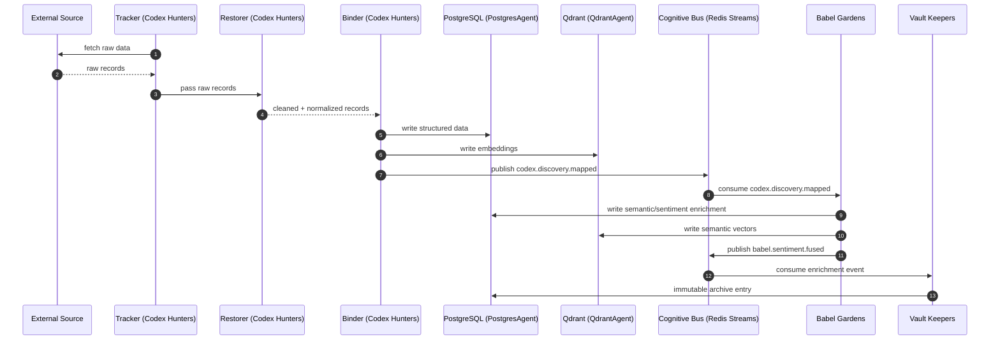
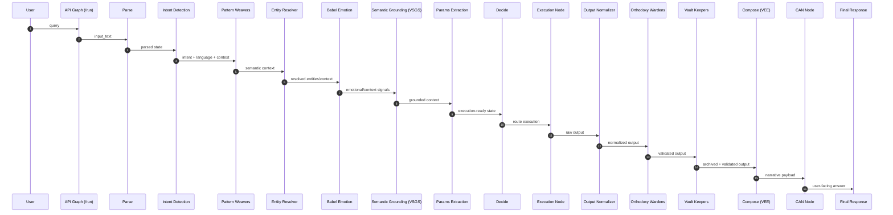
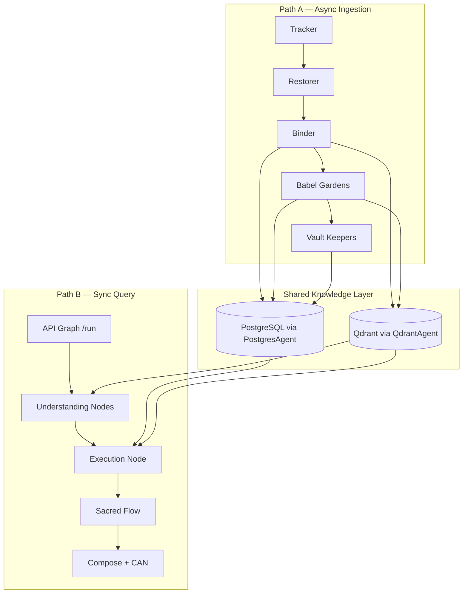

# Vitruvyan Pipeline Walkthrough (Target + Runtime)

> This page intentionally shows both:
> 1) the **target architecture** (design intent), and  
> 2) the **current runtime snapshot** (what is active today).

> Snapshot date: **February 14, 2026**

---

## 1) Target Architecture (Design Intent)

Vitruvyan is designed around two intersecting paths:

- **Path A (async ingestion):** Codex Hunters → Babel Gardens → Vault Keepers
- **Path B (sync query):** LangGraph orchestration with Sacred Flow governance

### Path A — Target Flow (Async)



### Path B — Target Flow (Sync)



### Unified Block View — Target (High-Level)



---

## 2) Current Runtime Snapshot (as of 2026-02-14)

### Path A — Runtime Status

| Item | Status | Note |
|---|---|---|
| Codex stream listeners + dispatch | IMPLEMENTED | `codex.*.requested` consumed and dispatched |
| Tracker/Restorer/Binder domain consumers | IMPLEMENTED | Present in core |
| Full auto chain from listener to discover/restore/bind | PARTIAL | Listener path focuses on expedition dispatch |
| Babel listener on `codex.discovery.mapped` | IMPLEMENTED | Consume/ACK path present |
| Babel full enrich + dual-write triggered from stream | PARTIAL | Not fully guaranteed end-to-end in current listener wiring |
| Vault archive via dedicated channels | IMPLEMENTED | Vault listener active on configured sacred channels |

### Path B — Runtime Status

| Item | Status | Note |
|---|---|---|
| Parse → Intent → Weavers → Resolver → Emotion → Grounding → Params → Decide | IMPLEMENTED | Present in compiled graph |
| Execution node domain logic | PARTIAL | `exec_node` currently domain-neutral stub |
| Entity resolver full validation | PARTIAL | Current resolver is stub passthrough |
| Sacred Flow (`output_normalizer -> orthodoxy -> vault -> compose -> can`) | IMPLEMENTED | Wired and active |
| Proactive Suggestions node | REMOVED | Removed from active graph |

---

## 3) Interpretation Rule

Use this page as follows:

- **Target sections** = intended end-state architecture (kept explicit on purpose).
- **Runtime status tables** = operational truth for current deployment.

This keeps vision and implementation aligned without losing roadmap context.

---

## 4) Quick Verification Commands

```bash
# Path B check
curl -sS -X POST http://127.0.0.1:9004/run \
  -H "Content-Type: application/json" \
  -d '{"input_text":"analyze european banks","user_id":"audit_user"}'

# Path A example event
docker exec core_redis redis-cli XADD vitruvyan:codex.discovery.mapped '*' payload '{"entity_id":"E_AUDIT_1"}'

# Logs
docker logs --since 2m core_graph
docker logs --since 2m core_babel_listener
docker logs --since 2m core_vault_listener
```
