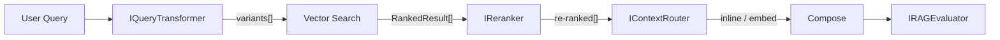
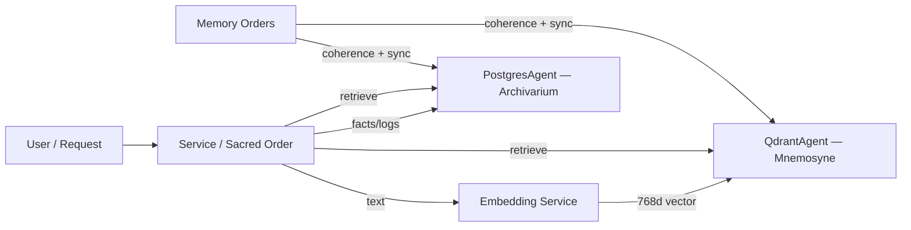

---
tags:
  - rag
  - memory
  - architecture
  - system-core
  - long-context
---

# Dual Memory Layer & RAG

> **Last updated**: Mar 11, 2026 11:30 UTC

How Vitruvyan composes RAG from two storages: Archivarium (PostgreSQL) + Mnemosyne (Qdrant), with retrieval quality contracts, tenant isolation, context routing, and embedding governance.

## What it does

- Provides **two complementary memories**:
  - **Archivarium (PostgreSQL)**: structured, queryable records (facts, logs, audits, rows with lifecycle).
  - **Mnemosyne (Qdrant)**: semantic vector memory (embeddings, similarity search, retrieval).
- Defines the **domain-agnostic access primitives** used by services:
  - `PostgresAgent` for SQL read/write (no schema assumptions).
  - `QdrantAgent` for collections, upsert, and similarity search.
  - `AlchemistAgent` for **schema migrations** via Alembic (where enabled).
- Separates core infrastructure from vertical-specific policy:
  - **Core provides**: agents, collection governance, retrieval interfaces, metrics, tenant filtering.
  - **Verticals provide**: schemas, re-rankers, query transformers, evaluators, domain collections.

## Semantic responsibility split (verified)

- There is **no active `api_semantic` service** in the current stack (legacy service removed).
- **Intent interpretation and routing** are handled in LangGraph orchestration:
  - `intent_detection_node.py` classifies intent (LLM) and enriches language metadata.
  - `route_node.py` decides the execution branch (`dispatcher_exec`, `llm_soft`, `semantic_fallback`, etc.).
- **Babel Gardens** handles linguistic/semantic signals (language detection, embeddings, sentiment, emotion), but it **does not choose routes**.
- RAG grounding is assembled by `semantic_grounding_node.py` + VSGS engine using embedding + Qdrant retrieval.

In short: orchestration decides **what path to execute**; Babel Gardens provides **language/semantic evidence** used by that path.

## Core primitives (code)

### `PostgresAgent` — Archivarium access

- **Role**: generic PostgreSQL connectivity + CRUD.
- **Contract**: SQL is owned by the caller (vertical/service); PostgresAgent does not encode domain logic.
- **Env**: `POSTGRES_HOST`, `POSTGRES_PORT`, `POSTGRES_DB`, `POSTGRES_USER`, `POSTGRES_PASSWORD`.

Code: `vitruvyan_core/core/agents/postgres_agent.py`

### `QdrantAgent` — Mnemosyne access

- **Role**: Qdrant connectivity + collection management + search/upsert utilities.
- **Contract**: caller logic is domain-owned, but collection naming/payload minimums are governed by `docs/contracts/rag/RAG_GOVERNANCE_CONTRACT_V1.md`.
- **Env**: `QDRANT_HOST`, `QDRANT_PORT` *(or `QDRANT_URL`)*, `QDRANT_API_KEY`, `QDRANT_TIMEOUT`.
- **Tenant isolation**: search methods accept an optional `tenant_id` for payload-based filtering in multi-tenant deployments.

Code: `vitruvyan_core/core/agents/qdrant_agent.py`

> Governance note: `QdrantAgent` includes contract-aware runtime guards (declared collection checks and payload `source` warning) and phase 4 metrics instrumentation (`RAG_METRICS`).

### `AlchemistAgent` — schema migrations (Alembic)

- **Role**: detect schema drift vs Alembic “head”, apply pending migrations.
- **Event emission**: publishes `alchemy.*` status events on the Cognitive Bus (via an adapter).
- **Env**: `ALEMBIC_CONFIG` (default points to Memory Orders migrations).

Code: `vitruvyan_core/core/agents/alchemist_agent.py`

## Embedding model

The canonical embedding model is **`nomic-ai/nomic-embed-text-v1.5`**:

| Property | Value |
|----------|-------|
| Dimension | 768 |
| Max tokens | 8,192 |
| Architecture | `nomic-bert-2048` (custom, requires `trust_remote_code=True`) |
| Dependencies | `sentence-transformers`, `einops` |

The model is registered in the embedding model registry (`contracts/rag.py → EMBEDDING_MODELS`) which enforces that collection `vector_size` matches the model dimension. Previous model (`all-MiniLM-L6-v2`, 384d) was migrated in March 2026.

## Retrieval quality contracts

The retrieval pipeline is extensible through four interfaces defined in `contracts/retrieval.py`:

| Interface | Purpose | Default |
|-----------|---------|---------|
| `IQueryTransformer` | Pre-retrieval query expansion | Pass-through |
| `IReranker` | Post-retrieval re-ordering | No-op (Qdrant order) |
| `IContextRouter` | Decides inline vs. RAG vs. both | Size-based (≤15k chars → inline) |
| `IRAGEvaluator` | Evaluates faithfulness/relevance/precision | Vertical provides |

Key data structures: `RankedResult` (scored hit), `CitationRef` (attribution), `EvalResult` (quality scores), `ContextRouting` (routing enum).

## How RAG is assembled (system view)

RAG is not a single module: it emerges from **(1) embedding**, **(2) dual persistence**, **(3) retrieval**, and **(4) quality enforcement**.

## Runtime flow

1. A service/node generates embeddings via the embedding service (`api_embedding` or Babel Gardens routes).
2. Vectors (768-dim, nomic) are persisted through `QdrantAgent` with `RAGPayload` lifecycle metadata. Structured context goes to PostgreSQL via `PostgresAgent`.
3. At retrieval time:
   - `IQueryTransformer` expands the query into search variants.
   - Parallel Qdrant searches are merged and deduplicated.
   - `IReranker` re-orders results using a more expensive relevance signal.
   - `IContextRouter` decides whether content goes inline or to RAG.
4. `CitationRef` objects are attached to the response for attribution.
5. Memory Orders monitors PG↔Qdrant drift and plans synchronization when coherence degrades.

### Embedding layer

- **Dedicated embedding service**: `services/api_embedding/` — exposes `/v1/embeddings/*`, loads `nomic-embed-text-v1.5` at startup.
- **Babel Gardens**: `services/api_babel_gardens/` — exposes embedding routes (including multilingual), cooperates with the embedding service.

### Coherence, drift, and healing

The dual-memory system needs constant monitoring because “row count” and “point count” can diverge.

- **Coherence checks**: drift calculation between Postgres (expected coverage) and Qdrant (actual vectors).
- **Health aggregation**: unified snapshot of dependencies (datastores + embedding service + bus).
- **Sync planning**: produces a plan to restore alignment (planning-only in LIVELLO 1).

Order reference: `docs/internal/orders/MEMORY_ORDERS.md`

## RAG metrics and tenant isolation

Phase 4 added comprehensive metrics instrumentation (`RAG_METRICS`) on the agent layer:

- **Search metrics**: latency, result count, collection, tenant filtering.
- **Upsert metrics**: payload size, batch count, collection.
- **Governance metrics**: undeclared collection warnings, dimension mismatches.

Multi-tenant RAG is supported via payload-based filtering: `RAGPayload.tenant_id` is persisted on every Qdrant point and search methods accept `tenant_id` to filter at query time. Tenant filtering is opt-in (backward compatible).

## Long Context — User Document Upload

Users can attach documents to chat messages. The content is chunked by Babel Gardens (`document_chunker.py`) and injected as `inline_context` in the LangGraph state. This context is wrapped by `compose_node` with `[USER_CONTEXT_START]...[USER_CONTEXT_END]` delimiters.

When the user enables **"Save to memory"**, chunks are also batch-embedded (768-dim, nomic) and stored in the `user_documents` Qdrant collection for persistent RAG retrieval.

### Retrieval cascade (qdrant_node)

The `qdrant_node` searches collections in a **4-tier cascade** (early-exit on first match):

| Tier | Collection | Source | Tenant Filter |
|------|------------|--------|---------------|
| 0 | `user_documents` | User-uploaded document chunks | `user_id` |
| 1 | `conversations_embeddings` | Conversational memory | `tenant_id` |
| 2 | `phrases_embeddings` | NLP seed phrases | source filter |
| 3 | `weave_embeddings` | Ontological patterns | `tenant_id` |

User documents take highest priority when semantically relevant to the query.

### Upload endpoint

`POST /run/upload` (multipart/form-data) in `api_graph`:

- Validates MIME type (text/plain, markdown, csv, pdf, json) and size (max 5 MB)
- Chunks via `chunk_text()` (sliding window, paragraph-boundary snapping, configurable overlap)
- Optionally embeds + stores in `user_documents` collection
- Passes joined chunks as `inline_context` to `run_graph_once()`

Full documentation: `docs/knowledge_base/web_ui/long_context.md`

## Verticalization

The core is domain-agnostic; verticals own:

- **PostgreSQL schema**: tables, indexes, constraints (domain-specific data).
- **Qdrant domain extensions**: domain collections within RAG governance constraints.
- **Retrieval implementations**: concrete `IQueryTransformer`, `IReranker`, `IRAGEvaluator`.
- **Adapters**: what gets embedded, stored, retrieved, filtered, and how scores/thresholds are applied.

## References

- Agents: `vitruvyan_core/core/agents/__init__.py`
- Retrieval contracts: `vitruvyan_core/contracts/retrieval.py`
- RAG governance contract: `vitruvyan_core/contracts/rag.py`
- RAG governance docs: `docs/contracts/rag/RAG_GOVERNANCE_CONTRACT_V1.md`
- RAG operations: `docs/contracts/rag/RAG_GOVERNANCE_OPERATIONS.md`
- Embedding service: `services/api_embedding/`
- Memory Orders: `docs/internal/orders/MEMORY_ORDERS.md`
- RAG Appendix: `.github/Vitruvyan_Appendix_E_RAG_System.md`
