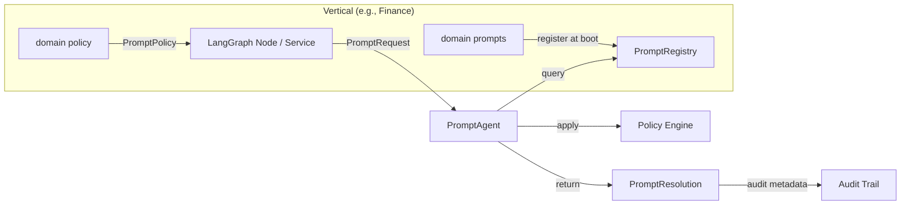

# Prompt Governance (PromptAgent)

> **Last updated**: Mar 10, 2026 19:00 UTC

<p class="kb-subtitle">Canonical gateway for prompt resolution, policy enforcement, and audit — separating prompt content (owned by verticals) from prompt infrastructure (owned by core).</p>

## What it does

- Provides a **single entry point** for prompt resolution: `get_prompt_agent()` → `PromptAgent`.
- Enforces the principle: **core = capability, vertical = policy**.
  - The core owns: registry, resolution, policy application, audit metadata.
  - Verticals own: identity text, scenario prompts, disclaimers, domain-specific constraints.
- Produces a `PromptResolution` with full audit trail (hash, version, token estimate) for every prompt used in the system.

## Architecture



## Core contracts

All types are defined in `contracts/prompting.py`:

### `PromptRequest`

Input for prompt resolution. Describes **what** is needed:

| Field | Type | Default | Purpose |
|-------|------|---------|---------|
| `domain` | `str` | `"generic"` | Which domain's prompts to query |
| `scenario` | `str` | `""` | Scenario key (e.g., `"analysis"`, `"greeting"`) |
| `language` | `str` | `"en"` | ISO language code |
| `assistant_name` | `str` | `"Vitruvyan"` | Name to inject into identity template |
| `template_vars` | `Dict[str, str]` | `{}` | Additional template variables |
| `policy` | `PromptPolicy` | no constraints | Policy constraints to apply |

### `PromptResolution`

Output of resolution. Contains the prompt text **plus** everything needed for audit:

| Field | Type | Purpose |
|-------|------|---------|
| `system_prompt` | `str` | The fully composed prompt text |
| `prompt_id` | `str` | Deterministic ID: `prompt.<domain>.<scenario>.v<version>` |
| `prompt_hash` | `str` | SHA-256 hash (first 12 chars) for change detection |
| `estimated_tokens` | `int` | Token estimate (~1.3× word count) |
| `policy_applied` | `bool` | Whether policy modified the prompt |
| `fallback_used` | `bool` | Whether a fallback domain/scenario was used |

The `.to_audit_dict()` method produces a structured dict for logging/observability.

### `PromptPolicy`

Opt-in constraints. All flags default to `False`:

| Flag | Effect |
|------|--------|
| `must_declare_limitations` | Appends a language-aware limitation declaration |
| `must_cite_evidence` | Appends an evidence-citing instruction |
| `must_stay_in_domain` | Appends a domain-boundary constraint |
| `required_disclaimers` | Dict of language → disclaimer text |
| `forbidden_claims` | List of claim patterns to filter |

## PromptRegistry

The `PromptRegistry` (`core/llm/prompts/registry.py`) is the domain-aware prompt store:

- **`register_domain(domain, identity, scenarios)`** — register a domain's prompts at boot time.
- **`resolve(domain, scenario, language, **vars)`** — look up and compose a prompt.
- The `"generic"` domain is auto-registered at import time with OS-agnostic defaults.

### Adding a new domain

```python
# domains/my_domain/prompts/__init__.py
from core.llm.prompts.registry import PromptRegistry

def register_my_domain_prompts():
    PromptRegistry.register_domain(
        domain="my_domain",
        identity="You are a {assistant_name} assistant specialized in {domain_description}.",
        scenarios={
            "analysis": "Provide a detailed analysis of the following: {query}",
            "summary": "Summarize the following content concisely: {query}",
        },
    )
```

## Usage

### Basic resolution

```python
from core.agents.prompt_agent import get_prompt_agent
from contracts.prompting import PromptRequest

agent = get_prompt_agent()
resolution = agent.resolve(PromptRequest(
    domain="generic",
    scenario="analysis",
    language="it",
))

# resolution.system_prompt  → the prompt text
# resolution.prompt_id      → "prompt.generic.analysis.v1.0"
# resolution.prompt_hash    → "a3f8b2c1d4e5"
```

### With policy constraints

```python
from contracts.prompting import PromptRequest, PromptPolicy

resolution = agent.resolve(PromptRequest(
    domain="finance",
    scenario="market_analysis",
    policy=PromptPolicy(
        must_declare_limitations=True,
        must_cite_evidence=True,
        must_stay_in_domain=True,
        required_disclaimers={"en": "This is not investment advice."},
    ),
))
```

### Audit trail integration

```python
# In a LangGraph node or service:
resolution = agent.resolve(request)
state["prompt_audit"] = resolution.to_audit_dict()
# → {"prompt_id": "prompt.finance.market_analysis.v1.0",
#     "prompt_hash": "c4a7b1e2f3d6", "estimated_tokens": 340, ...}
```

## Relationship with LLMAgent

- `PromptAgent` resolves **what** prompt text to use (content governance).
- `LLMAgent` handles **how** to call the LLM (transport, rate limiting, caching).
- They are **independent gateways** — neither imports the other.
- Typical flow: `PromptAgent.resolve()` → `LLMAgent.complete(prompt=resolution.system_prompt)`.

## Policy engine

Policy is applied as post-processing on the resolved prompt text (`core/llm/prompts/policy.py`):

1. If `must_declare_limitations`: appends a language-aware fragment (en/it/es/fr).
2. If `must_cite_evidence`: appends an evidence-citation instruction.
3. If `must_stay_in_domain`: appends a domain-boundary constraint.
4. If `required_disclaimers`: appends the disclaimer for the requested language.
5. Hash and token estimate are recomputed after policy application.

## References

- Contract types: `vitruvyan_core/contracts/prompting.py`
- PromptAgent: `vitruvyan_core/core/agents/prompt_agent.py`
- PromptRegistry: `vitruvyan_core/core/llm/prompts/registry.py`
- Policy engine: `vitruvyan_core/core/llm/prompts/policy.py`
- LLM / AI Layer: `docs/internal/platform/LLM_LAYER.md`
