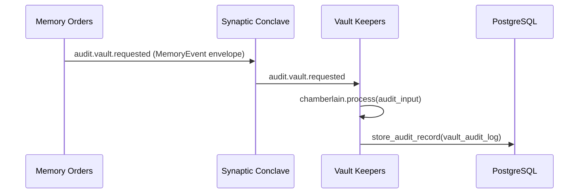

# Memory Orders

Memory Orders is the governance order responsible for coherence detection and reconciliation planning between canonical PostgreSQL state and derived Qdrant state.

## Responsibilities

- Detect drift and classify inconsistencies
- Produce deterministic synchronization/reconciliation plans
- Emit governance and audit events
- Delegate persistent audit storage to Vault Keepers

### Interoperability: Memory Orders ↔ Vault Keepers

- Memory Orders detects and classifies drift.
- Memory Orders emits audit requests as events (`audit.vault.requested`) using `MemoryEvent` envelope structure.
- Vault Keepers is the sole audit persistence authority.
- Memory Orders does not write to `memory_audit_log`; duplicated local audit persistence is removed.
- Audit persistence is centralized in `vault_audit_log`.

### Audit Idempotency Guarantee

- Memory Orders does not implement audit deduplication in application code.
- Idempotency is enforced downstream in Vault Keepers at DB level via unique `correlation_id`.
- Replay of the same audit event (same `correlation_id`) is conflict-safe and does not create extra persisted rows.
- This guarantees deterministic audit semantics across service retries and listener restarts.

