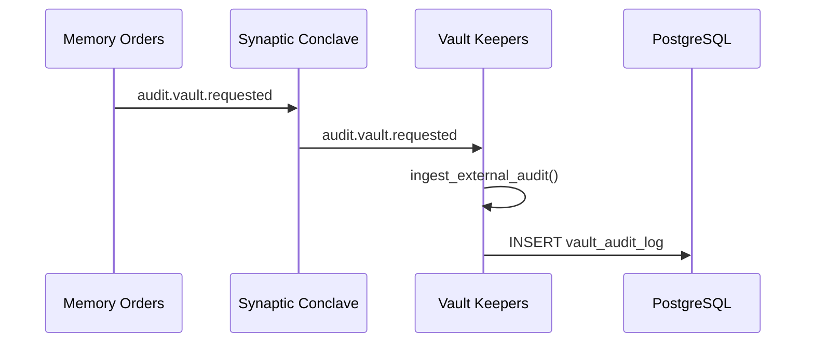

# Vault Keepers

Vault Keepers is the governance order responsible for durable archival, custody operations, and authoritative audit persistence.

## Responsibilities

- Persist immutable audit records in `vault_audit_log`
- Persist archive artifacts and snapshot metadata
- Execute backup/restore custody workflows
- Ingest cross-order archival and audit requests through Synaptic Conclave streams

### Interoperability: Memory Orders ↔ Vault Keepers

- Memory Orders performs drift detection/classification and emits audit events.
- Vault Keepers ingests `audit.vault.requested` and maps incoming payloads to `AuditRecord`.
- Vault Keepers persists those records via `store_audit_record()` as the single audit authority.
- No duplicated Memory Orders local audit table writes remain.

### Audit Idempotency Guarantee

- `vault_audit_log` is protected by a DB-level unique constraint on `correlation_id`.
- Inserts use `ON CONFLICT (correlation_id) DO NOTHING` in persistence, so retries/replays do not create duplicate rows.
- Existing duplicates are compacted deterministically by migration (keep latest row by `created_at`, then `timestamp`, then `record_id`).
- Result: for each `correlation_id`, at most one persisted audit row exists across all cross-order retries.

