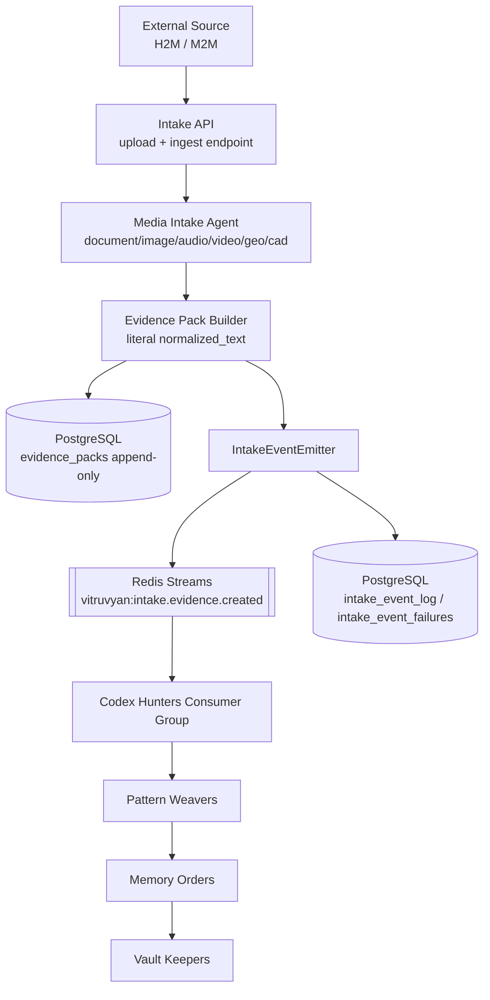
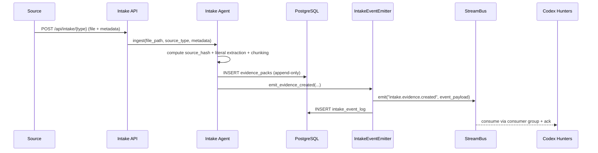

# Intake Flow Graph (Streams-Native)

> **Updated**: February 16, 2026  
> **Context**: Vitruvyan Core intake refactor baseline  
> **Scope**: Pre-epistemic acquisition only (no semantic enrichment in intake)

---

## Purpose

This document describes the canonical intake flow after migration to Redis Streams.

Key constraints:
1. Intake performs acquisition, normalization, and immutable persistence.
2. Intake emits `intake.evidence.created` via StreamBus.
3. Semantic enrichment starts downstream (Codex Hunters and beyond).

---

## End-to-End Flow

---

## Runtime Sequence

---

## Event Contract (Operational View)

Channel name:
- `intake.evidence.created` (stored as stream `vitruvyan:intake.evidence.created`)

Required event keys:
1. `event_id`
2. `event_version`
3. `schema_ref`
4. `timestamp_utc`
5. `evidence_id`
6. `chunk_id`
7. `idempotency_key`
8. `payload`

Idempotency:
- `idempotency_key = sha256(evidence_id + chunk_id + source_hash)`

---

## Responsibility Boundary

Intake MUST:
1. Create immutable Evidence Packs.
2. Emit stream events and audit logs.
3. Stay media-agnostic and domain-agnostic in acquisition behavior.

Intake MUST NOT:
1. Run NER, embeddings, ontology mapping.
2. Decide semantic relevance.
3. Call downstream cognitive services directly.

---

## Control Plane Note (MCP)

MCP is not part of this data-plane flow.

Allowed MCP usage:
1. Device registration
2. Policy deployment
3. Link/buffer diagnostics

MCP is control-plane only; intake evidence ingestion remains on dedicated intake/edge path.
