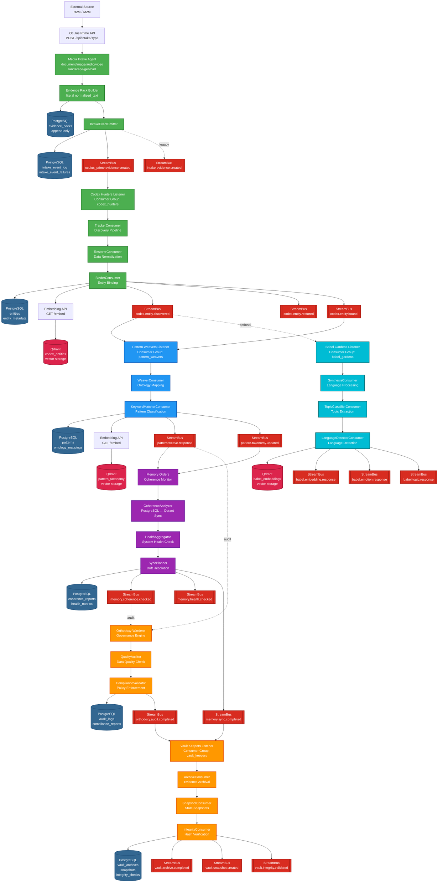

# 🌐 Oculus Prime Flow Graph (Streams-Native)

> **Updated**: February 20, 2026  
> **Context**: Complete end-to-end pipeline with all Sacred Orders  
> **Scope**: Full epistemic flow from acquisition to archival

## 🎯 Purpose

This document describes the canonical Oculus Prime flow after migration to Redis Streams.

Key constraints:
1. Oculus Prime is the single edge gateway for H2M/M2M ingestion.
2. Oculus Prime performs acquisition, normalization, and immutable persistence.
3. Oculus Prime emits `oculus_prime.evidence.created` via StreamBus (legacy alias supported).
4. Semantic enrichment starts downstream (Codex Hunters and beyond).

## 🔄 End-to-End Flow

<div class="mermaid-controls" style="margin-bottom: 1em; padding: 0.5em; background: #f5f5f5; border-radius: 4px; display: flex; gap: 0.5em; align-items: center; flex-wrap: wrap;">
  <strong>Zoom:</strong>
  <button onclick="zoomMermaid(1.2)" style="padding: 0.3em 0.8em; cursor: pointer;">🔍 +</button>
  <button onclick="zoomMermaid(0.8)" style="padding: 0.3em 0.8em; cursor: pointer;">🔍 -</button>
  <button onclick="resetMermaid()" style="padding: 0.3em 0.8em; cursor: pointer;">↺ Reset</button>
  <button onclick="fitMermaid()" style="padding: 0.3em 0.8em; cursor: pointer;">⛶ Fit</button>
  <button onclick="openFullscreen()" style="padding: 0.3em 0.8em; cursor: pointer; background: #2196F3; color: white; border: none; font-weight: bold;">⛶ Fullscreen</button>
  <span style="margin-left: auto; font-size: 0.85em; color: #666;">💡 Tip: Use mouse wheel + Ctrl to zoom</span>
</div>

<div id="mermaid-container" style="overflow: auto; border: 1px solid #ddd; border-radius: 4px; max-height: 80vh; background: white; position: relative; cursor: grab;">
<div id="mermaid-wrapper" style="transform-origin: top left; transition: transform 0.2s ease;">



</div>
</div>

<script>
let currentScale = 1;
let isDragging = false;
let startX, startY, scrollLeft, scrollTop;

// Fullscreen specific variables
let fullscreenScale = 2.5;
let fullscreenDragging = false;
let fullscreenStartX, fullscreenStartY, fullscreenScrollLeft, fullscreenScrollTop;

const container = document.getElementById('mermaid-container');
const wrapper = document.getElementById('mermaid-wrapper');

function zoomMermaid(factor) {
    currentScale *= factor;
    currentScale = Math.max(0.3, Math.min(currentScale, 3)); // Limit between 30% and 300%
    wrapper.style.transform = `scale(${currentScale})`;
}

function resetMermaid() {
    currentScale = 1;
    wrapper.style.transform = `scale(1)`;
    container.scrollLeft = 0;
    container.scrollTop = 0;
}

function fitMermaid() {
    const containerWidth = container.clientWidth;
    const wrapperWidth = wrapper.scrollWidth;
    currentScale = containerWidth / wrapperWidth * 0.95; // 95% to add padding
    currentScale = Math.max(0.3, Math.min(currentScale, 3));
    wrapper.style.transform = `scale(${currentScale})`;
}

function openFullscreen() {
    const overlay = document.getElementById('fullscreen-overlay');
    const fullscreenContainer = document.getElementById('fullscreen-mermaid');
    const mermaidContent = document.querySelector('.mermaid');
    
    if (overlay && fullscreenContainer && mermaidContent) {
        // Clone the mermaid diagram
        fullscreenContainer.innerHTML = mermaidContent.outerHTML;
        overlay.style.display = 'flex';
        document.body.style.overflow = 'hidden';
        
        // Re-initialize mermaid for the cloned diagram if needed
        if (typeof mermaid !== 'undefined') {
            mermaid.init(undefined, fullscreenContainer.querySelector('.mermaid'));
        }
        
        // Auto-scale the diagram to fill the screen
        setTimeout(() => {
            const clonedMermaid = fullscreenContainer.querySelector('.mermaid');
            if (clonedMermaid) {
                // Apply scale to make it larger
                fullscreenScale = 2.5;
                clonedMermaid.style.transform = `scale(${fullscreenScale})`;
                clonedMermaid.style.transformOrigin = 'center center';
                clonedMermaid.style.transition = 'transform 0.2s ease';
            }
            
            // Add zoom controls
            setupFullscreenControls();
        }, 100);
    }
}

function setupFullscreenControls() {
    const fullscreenContainer = document.getElementById('fullscreen-mermaid');
    if (!fullscreenContainer) return;
    
    // Mouse wheel zoom
    fullscreenContainer.addEventListener('wheel', (e) => {
        if (e.ctrlKey || e.metaKey) {
            e.preventDefault();
            const delta = e.deltaY > 0 ? 0.9 : 1.1;
            zoomFullscreen(delta);
        }
    }, { passive: false });
    
    // Drag to pan
    fullscreenContainer.addEventListener('mousedown', (e) => {
        if (e.button === 0 && e.target.closest('.mermaid')) {
            fullscreenDragging = true;
            fullscreenContainer.style.cursor = 'grabbing';
            fullscreenStartX = e.pageX - fullscreenContainer.offsetLeft;
            fullscreenStartY = e.pageY - fullscreenContainer.offsetTop;
            fullscreenScrollLeft = fullscreenContainer.scrollLeft;
            fullscreenScrollTop = fullscreenContainer.scrollTop;
        }
    });
    
    fullscreenContainer.addEventListener('mousemove', (e) => {
        if (!fullscreenDragging) return;
        e.preventDefault();
        const x = e.pageX - fullscreenContainer.offsetLeft;
        const y = e.pageY - fullscreenContainer.offsetTop;
        const walkX = (x - fullscreenStartX) * 2;
        const walkY = (y - fullscreenStartY) * 2;
        fullscreenContainer.scrollLeft = fullscreenScrollLeft - walkX;
        fullscreenContainer.scrollTop = fullscreenScrollTop - walkY;
    });
    
    fullscreenContainer.addEventListener('mouseup', () => {
        fullscreenDragging = false;
        fullscreenContainer.style.cursor = 'grab';
    });
    
    fullscreenContainer.addEventListener('mouseleave', () => {
        fullscreenDragging = false;
        fullscreenContainer.style.cursor = 'grab';
    });
}

function zoomFullscreen(factor) {
    const clonedMermaid = document.querySelector('#fullscreen-mermaid .mermaid');
    if (clonedMermaid) {
        fullscreenScale *= factor;
        fullscreenScale = Math.max(0.5, Math.min(fullscreenScale, 5)); // Limit 50% to 500%
        clonedMermaid.style.transform = `scale(${fullscreenScale})`;
    }
}

function resetFullscreen() {
    const clonedMermaid = document.querySelector('#fullscreen-mermaid .mermaid');
    const fullscreenContainer = document.getElementById('fullscreen-mermaid');
    if (clonedMermaid) {
        fullscreenScale = 2.5;
        clonedMermaid.style.transform = `scale(${fullscreenScale})`;
    }
    if (fullscreenContainer) {
        fullscreenContainer.scrollLeft = 0;
        fullscreenContainer.scrollTop = 0;
    }
}

function fitFullscreen() {
    const fullscreenContainer = document.getElementById('fullscreen-mermaid');
    const clonedMermaid = document.querySelector('#fullscreen-mermaid .mermaid');
    if (fullscreenContainer && clonedMermaid) {
        const containerWidth = fullscreenContainer.clientWidth;
        const mermaidWidth = clonedMermaid.scrollWidth;
        fullscreenScale = containerWidth / mermaidWidth * 0.9;
        fullscreenScale = Math.max(0.5, Math.min(fullscreenScale, 5));
        clonedMermaid.style.transform = `scale(${fullscreenScale})`;
    }
}

function closeFullscreen() {
    const overlay = document.getElementById('fullscreen-overlay');
    overlay.style.display = 'none';
    document.body.style.overflow = 'auto';
    fullscreenScale = 2.5; // Reset for next open
}

// Close fullscreen on ESC key
document.addEventListener('keydown', (e) => {
    if (e.key === 'Escape') {
        closeFullscreen();
    }
});

// Mouse wheel zoom (with Ctrl key)
if (container) {
    container.addEventListener('wheel', (e) => {
        if (e.ctrlKey || e.metaKey) {
            e.preventDefault();
            const delta = e.deltaY > 0 ? 0.9 : 1.1;
            zoomMermaid(delta);
        }
    }, { passive: false });

    // Drag to pan
    container.addEventListener('mousedown', (e) => {
        if (e.button === 0) { // Left click
            isDragging = true;
            container.style.cursor = 'grabbing';
            startX = e.pageX - container.offsetLeft;
            startY = e.pageY - container.offsetTop;
            scrollLeft = container.scrollLeft;
            scrollTop = container.scrollTop;
        }
    });

    container.addEventListener('mousemove', (e) => {
        if (!isDragging) return;
        e.preventDefault();
        const x = e.pageX - container.offsetLeft;
        const y = e.pageY - container.offsetTop;
        const walkX = (x - startX) * 2;
        const walkY = (y - startY) * 2;
        container.scrollLeft = scrollLeft - walkX;
        container.scrollTop = scrollTop - walkY;
    });

    container.addEventListener('mouseup', () => {
        isDragging = false;
        container.style.cursor = 'grab';
    });

    container.addEventListener('mouseleave', () => {
        isDragging = false;
        container.style.cursor = 'grab';
    });
}
</script>

<style>
#mermaid-container::-webkit-scrollbar {
    width: 10px;
    height: 10px;
}
#mermaid-container::-webkit-scrollbar-track {
    background: #f1f1f1;
}
#mermaid-container::-webkit-scrollbar-thumb {
    background: #888;
    border-radius: 5px;
}
#mermaid-container::-webkit-scrollbar-thumb:hover {
    background: #555;
}
.mermaid-controls button {
    background: white;
    border: 1px solid #ccc;
    border-radius: 3px;
    font-size: 0.9em;
    transition: all 0.2s;
}
.mermaid-controls button:hover {
    background: #e8e8e8;
    border-color: #999;
    transform: translateY(-1px);
}
.mermaid-controls button:active {
    transform: translateY(0);
}

/* Fullscreen overlay styles */
#fullscreen-overlay {
    display: none;
    position: fixed;
    top: 0;
    left: 0;
    width: 100%;
    height: 100%;
    background: rgba(0, 0, 0, 0.95);
    z-index: 9999;
    justify-content: center;
    align-items: center;
    animation: fadeIn 0.3s ease;
}

@keyframes fadeIn {
    from { opacity: 0; }
    to { opacity: 1; }
}

#fullscreen-mermaid {
    width: 98vw;
    height: 95vh;
    overflow: auto;
    background: white;
    padding: 1em;
    border-radius: 8px;
    position: relative;
    display: flex;
    justify-content: center;
    align-items: center;
    cursor: grab;
}

.fullscreen-controls {
    position: absolute;
    top: 20px;
    left: 50%;
    transform: translateX(-50%);
    background: rgba(255, 255, 255, 0.95);
    padding: 0.5em 1em;
    border-radius: 8px;
    display: flex;
    gap: 0.5em;
    align-items: center;
    z-index: 10001;
    box-shadow: 0 4px 12px rgba(0,0,0,0.4);
}

.fullscreen-controls button {
    background: white;
    border: 1px solid #ccc;
    border-radius: 4px;
    padding: 0.4em 0.9em;
    cursor: pointer;
    font-size: 0.95em;
    transition: all 0.2s;
}

.fullscreen-controls button:hover {
    background: #e8e8e8;
    border-color: #999;
    transform: translateY(-1px);
}

#fullscreen-close {
    position: absolute;
    top: 20px;
    right: 20px;
    background: #f44336;
    color: white;
    border: none;
    padding: 0.8em 1.5em;
    font-size: 1.1em;
    font-weight: bold;
    border-radius: 4px;
    cursor: pointer;
    z-index: 10002;
    box-shadow: 0 4px 6px rgba(0,0,0,0.3);
    transition: all 0.2s;
}

#fullscreen-close:hover {
    background: #d32f2f;
    transform: scale(1.05);
}

#fullscreen-close:active {
    transform: scale(0.95);
}

#fullscreen-mermaid::-webkit-scrollbar {
    width: 12px;
    height: 12px;
}

#fullscreen-mermaid::-webkit-scrollbar-track {
    background: #f1f1f1;
}

#fullscreen-mermaid::-webkit-scrollbar-thumb {
    background: #888;
    border-radius: 6px;
}

#fullscreen-mermaid::-webkit-scrollbar-thumb:hover {
    background: #555;
}
</style>

<!-- Fullscreen overlay -->
<div id="fullscreen-overlay" onclick="if(event.target.id === 'fullscreen-overlay') closeFullscreen()">
    <div class="fullscreen-controls">
        <strong>Zoom:</strong>
        <button onclick="zoomFullscreen(1.2)">🔍 +</button>
        <button onclick="zoomFullscreen(0.8)">🔍 -</button>
        <button onclick="resetFullscreen()">↺ Reset</button>
        <button onclick="fitFullscreen()">⛶ Fit</button>
        <span style="font-size: 0.85em; color: #666; margin-left: 0.5em;">💡 Ctrl + Wheel to zoom | Drag to pan</span>
    </div>
    <button id="fullscreen-close" onclick="closeFullscreen()">✕ Chiudi</button>
    <div id="fullscreen-mermaid"></div>
</div>

## Responsibility Boundary

Oculus Prime MUST:
1. Create immutable Evidence Packs.
2. Emit stream events and audit logs.
3. Stay media-agnostic and domain-agnostic in acquisition behavior.

Oculus Prime MUST NOT:
1. Run NER, embeddings, ontology mapping.
2. Decide semantic relevance.
3. Call downstream cognitive services directly.
4. Read downstream cognitive tables.

---

## 📊 Pipeline Legend

### Color Coding by Sacred Order
- 🟢 **Green (Perception)**: Oculus Prime + Codex Hunters — Acquisition & Discovery
- 🔵 **Blue (Reason)**: Pattern Weavers — Ontology & Classification
- 🟣 **Purple (Memory)**: Memory Orders — Coherence & Sync
- 🟠 **Orange (Truth)**: Orthodoxy Wardens + Vault Keepers — Governance & Archival
- 🔵 **Cyan (Discourse)**: Babel Gardens — Language Processing (parallel)

### Component Types
- 🗄️ **Dark Blue Cylinders**: PostgreSQL (structured storage)
- 🔴 **Red Cylinders**: Qdrant (vector embeddings)
- 🔴 **Red Boxes**: Redis Streams (StreamBus event channels)

---

## 🎯 Detailed Pipeline Flow

### 1️⃣ PERCEPTION Layer: Oculus Prime (Intake)

**Responsibilities**:
- Accept file uploads from external sources (documents, images, audio, video, geo, CAD)
- Extract **literal text** (NO semantic interpretation)
- Create immutable Evidence Packs
- Emit standardized events

**PostgreSQL Tables**:
- `evidence_packs` — Append-only evidence storage
- `intake_event_log` — Audit trail of all emitted events
- `intake_event_failures` — Failed emission diagnostics

**StreamBus Events Emitted**:
- `oculus_prime.evidence.created` (v2 canonical)
- `intake.evidence.created` (v1 legacy alias, dual-write mode)

**Event Payload**:
```json
{
  "event_id": "EVT-{UUID}",
  "evidence_id": "EVD-{UUID}",
  "chunk_id": "CHK-{N}",
  "source_type": "document|image|audio|video|stream|sensor",
  "source_uri": "/uploads/file.ext",
  "source_hash": "sha256:...",
  "byte_size": 1024000,
  "language_detected": "en",
  "sampling_policy_ref": "SAMPPOL-DOC-DEFAULT-V1"
}
```

---

### 2️⃣ PERCEPTION → MEMORY: Codex Hunters (Discovery & Enrichment)

**Responsibilities**:
- Consume evidence created events
- Perform discovery (entity recognition)
- Restore data (normalization)
- Bind entities (relationship linking)
- Generate embeddings for semantic search

**Consumer Group**: `codex_hunters`

**Consumed Events**:
- `oculus_prime.evidence.created` (primary)
- `intake.evidence.created` (legacy fallback)

**Processing Pipeline**:
1. **TrackerConsumer** — Discovery pipeline (entity detection)
2. **RestorerConsumer** — Data normalization & quality assessment
3. **BinderConsumer** — Entity relationship binding

**PostgreSQL Tables**:
- `entities` — Discovered entities with metadata
- `entity_metadata` — Additional entity attributes

**Qdrant Collections**:
- `codex_entities` — Vector embeddings for entities (via Embedding API)

**StreamBus Events Emitted**:
- `codex.entity.discovered` — New entity found
- `codex.entity.restored` — Data normalized
- `codex.entity.bound` — Relationships established

---

### 3️⃣ REASON Layer: Pattern Weavers (Ontology Mapping)

**Responsibilities**:
- Map entities to domain ontologies
- Extract concepts and relationships
- Classify entities into taxonomies
- Enable semantic pattern matching

**Consumer Group**: `pattern_weavers`

**Consumed Events**:
- `codex.entity.discovered`
- `codex.entity.bound`

**Processing Pipeline**:
1. **WeaverConsumer** — Ontology mapping & concept extraction
2. **KeywordMatcherConsumer** — Pattern classification & keyword matching

**PostgreSQL Tables**:
- `patterns` — Detected patterns and relationships
- `ontology_mappings` — Entity-to-ontology bindings

**Qdrant Collections**:
- `pattern_taxonomy` — Vector embeddings for patterns (via Embedding API)

**StreamBus Events Emitted**:
- `pattern.weave.response` — Pattern weaving completed
- `pattern.taxonomy.updated` — Taxonomy changes

---

### 4️⃣ DISCOURSE Layer: Babel Gardens (Language Processing — Parallel)

**Responsibilities**:
- Language detection and translation
- Emotion and sentiment analysis
- Topic classification
- Linguistic synthesis

**Consumer Group**: `babel_gardens`

**Consumed Events** (optional, parallel to Pattern Weavers):
- `codex.entity.discovered`

**Processing Pipeline**:
1. **SynthesisConsumer** — Language processing & synthesis
2. **TopicClassifierConsumer** — Topic extraction
3. **LanguageDetectorConsumer** — Language identification

**Qdrant Collections**:
- `babel_embeddings` — Linguistic embeddings for multilingual semantic search

**StreamBus Events Emitted**:
- `babel.embedding.response` — Embedding generation completed
- `babel.emotion.response` — Emotion analysis result
- `babel.topic.response` — Topic classification result

---

### 5️⃣ MEMORY Layer: Memory Orders (Coherence Monitor)

**Responsibilities**:
- Monitor dual-memory coherence (PostgreSQL ↔ Qdrant)
- Detect drift and synchronization issues
- Aggregate system health metrics
- Plan and execute sync operations

**Processing Pipeline**:
1. **CoherenceAnalyzer** — Compare PostgreSQL vs Qdrant counts
2. **HealthAggregator** — Collect health metrics from all components
3. **SyncPlanner** — Generate drift resolution plans

**PostgreSQL Tables**:
- `coherence_reports` — Coherence check audit trail
- `health_metrics` — System health snapshots

**StreamBus Events Emitted**:
- `memory.coherence.checked` — Coherence check completed
- `memory.health.checked` — System health report
- `memory.sync.completed` — Sync operation finished

**Event Payload Example**:
```json
{
  "status": "healthy|warning|critical",
  "pg_count": 10000,
  "qdrant_count": 9950,
  "drift_percentage": 0.5,
  "drift_absolute": 50,
  "table": "entities",
  "collection": "codex_entities"
}
```

---

### 6️⃣ TRUTH Layer: Orthodoxy Wardens (Governance)

**Responsibilities**:
- Data quality auditing
- Policy compliance validation
- Schema validation
- Integrity enforcement

**Processing Pipeline**:
1. **QualityAuditor** — Assess data quality metrics
2. **ComplianceValidator** — Enforce governance policies

**PostgreSQL Tables**:
- `audit_logs` — Comprehensive audit trail
- `compliance_reports` — Policy violation tracking

**StreamBus Events Emitted**:
- `orthodoxy.audit.completed` — Audit finished (consumed by Vault Keepers)

---

### 7️⃣ TRUTH Layer: Vault Keepers (Archival & Persistence)

**Responsibilities**:
- Archive evidence and enriched metadata
- Create state snapshots
- Verify data integrity (hash validation)
- Manage backup and recovery

**Consumer Group**: `vault_keepers`

**Consumed Events**:
- `orthodoxy.audit.completed` — Audit events for archival
- `memory.sync.completed` — Sync events for snapshot triggers

**Processing Pipeline**:
1. **ArchiveConsumer** — Evidence archival
2. **SnapshotConsumer** — State snapshot creation
3. **IntegrityConsumer** — Hash verification & integrity checks

**PostgreSQL Tables**:
- `vault_archives` — Archived evidence and metadata
- `snapshots` — Point-in-time state snapshots
- `integrity_checks` — Hash validation records

**StreamBus Events Emitted**:
- `vault.archive.completed` — Archival finished
- `vault.snapshot.created` — Snapshot saved
- `vault.integrity.validated` — Integrity check passed

---

## 🔑 Key Integration Points

### Who Embeds to Qdrant?
1. **Codex Hunters** → `codex_entities` collection (via Embedding API)
2. **Pattern Weavers** → `pattern_taxonomy` collection (via Embedding API)
3. **Babel Gardens** → `babel_embeddings` collection (direct QdrantAgent)

### Who Logs to PostgreSQL?
1. **Oculus Prime** → `evidence_packs`, `intake_event_log`, `intake_event_failures`
2. **Codex Hunters** → `entities`, `entity_metadata`
3. **Pattern Weavers** → `patterns`, `ontology_mappings`
4. **Memory Orders** → `coherence_reports`, `health_metrics`
5. **Orthodoxy Wardens** → `audit_logs`, `compliance_reports`
6. **Vault Keepers** → `vault_archives`, `snapshots`, `integrity_checks`

### Event Flow Summary
```
oculus_prime.evidence.created
  ↓
codex.entity.discovered → codex.entity.restored → codex.entity.bound
  ↓                                                    ↓
pattern.weave.response ← pattern.taxonomy.updated     babel.embedding.response
  ↓                                                    ↓
memory.coherence.checked → memory.health.checked → memory.sync.completed
  ↓                                                    ↓
orthodoxy.audit.completed ────────────────────────→ vault.archive.completed
                                                       ↓
                                            vault.snapshot.created
                                                       ↓
                                            vault.integrity.validated
```

---

## 🚀 Migration & Compatibility

### Event Naming Migration (v1 → v2)
- **v1 Legacy**: `intake.evidence.created`
- **v2 Canonical**: `oculus_prime.evidence.created`
- **Migration Mode**: Controlled by `OCULUS_PRIME_EVENT_MIGRATION_MODE` env var
  - `v1_only` — Emit only legacy channel
  - `v2_only` — Emit only canonical channel
  - `dual_write` — Emit both (default for gradual rollout)

### Consumer Configuration
Codex Hunters listeners support:
- `OCULUS_PRIME_EVENT_MIGRATION_MODE` — Which channel(s) Oculus Prime emits
- `CODEX_OCULUS_CONSUME_LEGACY_ALIAS` — Whether to consume legacy `intake.*` channel

---

## 📚 References

- **Oculus Prime Implementation**: `/vitruvyan_edge/oculus_prime/`
- **Event Emitter**: `/vitruvyan_edge/oculus_prime/core/event_emitter.py`
- **Codex Hunters Consumer**: `/services/api_codex_hunters/streams_listener.py`
- **Pattern Weavers Consumer**: `/services/api_pattern_weavers/adapters/bus_adapter.py`
- **Memory Orders Coherence**: `/services/api_memory_orders/adapters/bus_adapter.py`
- **Vault Keepers Archival**: `/services/api_vault_keepers/adapters/bus_adapter.py`
- **StreamBus Transport**: `/vitruvyan_core/core/synaptic_conclave/transport/streams.py`

