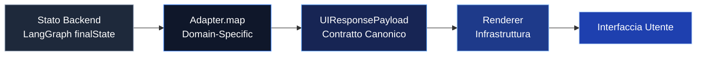

# Web UI — Panoramica

> **Ultimo aggiornamento**: 20 Feb 2026 21:00 UTC  
> **Stato**: ✅ Fondazione Completa  
> **Posizione**: `vitruvyan-core/ui/`

---

## Introduzione

La Web UI di Vitruvyan è un **framework di interfaccia domain-agnostic** costruito sul principio della **UX basata su adapter**. Ispirata all'architettura costituzionale di Mercator UI, separa lo stato cognitivo del backend dalla rappresentazione visuale attraverso un rigoroso sistema di contratti.

---

## Filosofia

La UI segue **17 principi costituzionali** stabiliti nella [Costituzione UI](../../ui/docs/COSTITUZIONE_UI.md):

1. **Separazione di Pensiero e Visualizzazione** — Il backend computa, la UI visualizza
2. **Adapter come Unità di UX** — Ogni tipo di conversazione ha un adapter dedicato
3. **Stabilità del Renderer** — I componenti infrastrutturali sono feature-blind
4. **Componenti come Strumenti** — Nessuna logica di business nelle primitive visuali
5. **Explainability come Dominio** — VEE (Vitruvyan Explainability Engine) è di prima classe

!!! quote "Articolo II — L'Adapter è l'Unità di UX"
    *"Ogni tipo di conversazione (classificazione dell'intent) deve corrispondere a un adapter dedicato che sa come trasformare lo stato cognitivo del backend in narrativa, evidenze ed explainability."*

Vedi [Filosofia](philosophy.it.md) per il testo costituzionale completo.

---

## Pattern Architetturale



### Sistema di Contratti a Tre Livelli

| Livello | Scopo | Contratto |
|---------|-------|-----------|
| **UIContract** | Struttura del payload canonico | Interfaccia `UIResponsePayload` |
| **AdapterContract** | Trasformazione stato backend → UI | Classe astratta `BaseAdapter` |
| **DomainPluginContract** | Meccanismo di estensione per domini | `DomainPluginRegistry` |

Vedi [Contratti](contracts.it.md) per la documentazione dettagliata delle interfacce.

---

## Stack & Tecnologia

| Categoria | Tecnologia | Versione |
|-----------|------------|----------|
| **Framework** | Next.js (App Router) | 15.1.7 |
| **Libreria UI** | React | 18.3.1 |
| **Libreria Componenti** | Radix UI | Latest |
| **Styling** | Tailwind CSS | 3.4.x |
| **Sistema Tipi** | TypeScript | 5.x |
| **Icone** | lucide-react | Latest |

Vedi [Stack](stack.it.md) per l'analisi completa delle tecnologie.

---

## Componenti Core

### Modulo Chat
Orchestrazione chat domain-agnostic:
- **Chat.jsx** (183 LOC) — Orchestratore principale
- **ChatMessage.jsx** (145 LOC) — Renderer messaggi
- **ChatInput.jsx** — Input con validazione
- **ThinkingSteps.jsx** — Visualizzazione ragionamento backend

### Infrastruttura Response
Layer di rendering canonico:
- **VitruvyanResponseRenderer.jsx** (336 LOC) — Renderer principale
- **EvidenceSectionRenderer.jsx** — Builder accordion evidenze
- Flusso render fisso: Narrativa → Follow-up → Accordion → VEE

### Composites
Blocchi narrativi riusabili:
- **NarrativeBlock** — Markdown + annotazioni VEE
- **EvidenceAccordion** — Sezioni evidenze richiudibili
- **FollowUpChips** — Suggerimenti follow-up interattivi
- **IntentBadge** — Visualizzazione classificazione intent

### Explainability (VEE)
Stratificazione a tre livelli:
- **Technical** — Per ingegneri (5-15s lettura)
- **Detailed** — Per analisti (30-60s lettura)
- **Contextualized** — Per esperti di dominio (120-180s lettura)

---

## Sistema Adapter

Gli adapter trasformano lo stato del backend in payload compatibili con la UI.

### Base Adapter

Tutti gli adapter estendono `BaseAdapter` da `contracts/AdapterContract.ts`:

```typescript
class MyAdapter extends BaseAdapter {
  match(conversation: ConversationType): boolean {
    return conversation.intent === "my_intent";
  }

  map(state: LangGraphFinalState): UIResponsePayload {
    return {
      narrative: this.buildNarrative("Testo riepilogo", "vee_summary_key"),
      followUps: this.buildFollowUps(["Domanda 1?", "Domanda 2?"]),
      evidence: this.buildEvidenceSection("titolo", cards),
      vee_explanations: this.buildVEE("key", technical, detailed, contextualized),
      context: this.buildContext(state)
    };
  }
}
```

### Registro Adapter

```typescript
import { adapterRegistry } from '@/contracts/AdapterContract';

// Registra adapter
adapterRegistry.register(new MyAdapter());

// Seleziona adapter
const adapter = adapterRegistry.selectAdapter(conversation);
const payload = adapter.map(state);
```

---

## Sistema Plugin di Dominio

I domini estendono la UI senza modificare il codice core:

```typescript
import { domainPluginRegistry } from '@/contracts/DomainPluginContract';

const financePlugin: DomainPlugin = {
  metadata: {
    id: 'finance-ui',
    domain: 'finance',
    version: '1.0.0'
  },
  adapters: [new FinanceSingleTickerAdapter()],
  vee_content: { /* Registro VEE */ },
  hooks: { useTradingOrder, usePortfolioCanvas },
  theme_overrides: { colors: { primary: '#10b981' } }
};

domainPluginRegistry.register(financePlugin);
```

Vedi [Contratti](contracts.it.md) per i dettagli dell'interfaccia plugin.

---

## Quick Start

### 1. Installa Dipendenze

```bash
cd ui/
npm install
# oppure
pnpm install
```

### 2. Configura Ambiente

```bash
cp .env.example .env.local
```

Variabili richieste:
```env
NEXT_PUBLIC_API_GRAPH_URL=http://localhost:8420
NEXT_PUBLIC_API_CONCLAVE_URL=http://localhost:8200
```

### 3. Avvia Server di Sviluppo

```bash
npm run dev
# oppure
pnpm dev
```

Apri [http://localhost:3000](http://localhost:3000).

### 4. Crea un Adapter

```typescript
// ui/components/adapters/MyAdapter.ts
import { BaseAdapter, UIResponsePayload } from '@/contracts';

export class MyAdapter extends BaseAdapter {
  conversationType = "my_conversation_type";
  
  match(conversation) {
    return conversation.intent === "my_intent";
  }

  map(state) {
    return {
      narrative: this.buildNarrative(
        "La tua richiesta è stata processata con successo.",
        "vee_my_summary"
      ),
      followUps: this.buildFollowUps([
        "Puoi fornire maggiori dettagli?",
        "Quali sono i prossimi passi?"
      ]),
      evidence: null,
      vee_explanations: this.buildVEE(
        "vee_my_summary",
        "Spiegazione tecnica...",
        "Spiegazione dettagliata...",
        "Spiegazione contestualizzata..."
      ),
      context: this.buildContext(state)
    };
  }
}
```

### 5. Registra Adapter

```typescript
// ui/app/layout.tsx o ui/lib/adapters/index.ts
import { adapterRegistry } from '@/contracts/AdapterContract';
import { MyAdapter } from '@/components/adapters/MyAdapter';

adapterRegistry.register(new MyAdapter());
```

---

## Design System

### Token
Token di design centralizzati in `components/theme/tokens.js`:

```javascript
export const tokens = {
  colors: {
    vitruvyan: {
      primary: '#000000',
      accent: '#3b82f6'
    }
  },
  spacing: {
    card: { gap: 16, padding: 20 },
    section: { gap: 20 }
  },
  radius: {
    card: 12,
    metric: 8
  }
};
```

### Tipografia
- **Font**: Inconsolata (monospace)
- **Pesi**: 400 (regular), 600 (semi-bold), 700 (bold)

### Componenti
Costruiti su primitive **Radix UI**:
- Accordion
- Dialog
- Tooltip
- Tabs

---

## Struttura File

```
ui/
├── contracts/              # Contratti interfaccia TypeScript
│   ├── UIContract.ts       # Struttura payload canonico
│   ├── AdapterContract.ts  # Interfaccia adapter + BaseAdapter
│   └── DomainPluginContract.ts  # Sistema plugin dominio
├── components/
│   ├── adapters/           # Layer trasformazione UX
│   ├── chat/               # Modulo chat (domain-agnostic)
│   ├── response/           # Infrastruttura rendering
│   ├── composites/         # Blocchi riusabili
│   ├── explainability/     # Componenti VEE
│   ├── cards/              # Componenti atomici
│   └── theme/              # Token design
├── hooks/                  # Hook React (_core, _domain)
├── lib/                    # Utility, tipi, client API
├── app/                    # Router app Next.js
├── docs/                   # Documentazione
│   └── COSTITUZIONE_UI.md  # Costituzione UI (17 articoli)
└── README.md               # Documentazione completa
```

---

## Stato Attuale

| Componente | Stato | Righe |
|------------|-------|-------|
| **Contratti** | ✅ Completo | 820 |
| **Modulo Chat** | ✅ Completo | ~500 |
| **Renderer** | ✅ Completo | ~600 |
| **Composites** | ✅ Completo | ~400 |
| **Explainability** | ✅ Completo | ~300 |
| **Adapter (esempi)** | ✅ Completo | 290 |
| **Documentazione** | ✅ Completo | 1.040 |

**Totale**: 42 file, ~5.650 righe di codice

---

## Prossimi Passi

### Settimana 1
1. Creare plugin dominio finance (`vitruvyan_core/domains/finance/ui/`)
2. Testare modulo chat con adapter conversazionale
3. Aggiungere primitive shadcn/ui (Button, Input, Accordion)

### Mese 1
4. Creare plugin dominio energy
5. Configurazione TypeScript (tsconfig.json)
6. Suite di test (Jest + React Testing Library)

### Trimestre 1
7. Costruire UI verticale facility
8. Ottimizzazione performance (virtualizzazione, lazy loading)
9. Audit accessibilità (WCAG 2.1 AA)
10. Documentazione componenti Storybook

---

## Riferimenti

- [Filosofia UI](philosophy.it.md) — Principi costituzionali
- [Contratti](contracts.it.md) — Documentazione interfacce TypeScript
- [Stack](stack.it.md) — Analisi tecnologie
- [README UI](../../ui/README.md) — Guida tecnica completa
- [Costituzione UI](../../ui/docs/COSTITUZIONE_UI.md) — 17 articoli
- [Report Setup](../../ui/docs/SETUP_COMPLETION_REPORT_FEB20_2026.md) — Dettagli implementazione

---

## Contribuire

Quando si lavora sulla UI:

1. **Leggi la Costituzione** — Comprendi i 17 principi immutabili
2. **Usa adapter** — Mai aggiungere logica di business ai componenti
3. **Rispetta i contratti** — Tutti i payload devono corrispondere a `UIResponsePayload`
4. **Testa gli adapter** — Unit test per ogni funzione `map()` degli adapter
5. **Documenta VEE** — Ogni funzionalità ha bisogno di explainability a 3 livelli

---

**Ultimo aggiornamento**: 20 Feb 2026 21:00 UTC
