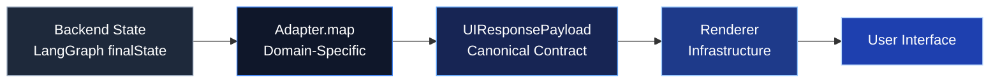

---
tags:
  - web-ui
  - overview
  - architecture
---

# Web UI — Overview

> **Last updated**: Mar 11, 2026 11:30 UTC  
> **Status**: ✅ Foundation Complete  
> **Location**: `vitruvyan-core/ui/`

---

## Introduction

The Vitruvyan Web UI is a **domain-agnostic interface framework** built on the principle of **adapter-driven UX**. Inspired by the Mercator UI Constitutional architecture, it separates cognitive backend state from visual representation through a strict contract system.

---

## Philosophy

The UI follows **17 constitutional principles** established in the [Costituzione UI](../../ui/docs/COSTITUZIONE_UI.md):

1. **Separation of Thought and Visualization** — Backend computes, UI visualizes
2. **Adapter as UX Unit** — Each conversation type has a dedicated adapter
3. **Renderer Stability** — Infrastructure components are feature-blind
4. **Components as Tools** — No business logic in visual primitives
5. **Explainability as Domain** — VEE (Vitruvyan Explainability Engine) is first-class

!!! quote "Article II — The Adapter is the UX Unit"
    *"Each conversation type (intent classification) must correspond to a dedicated adapter that knows how to transform backend cognitive state into narrative, evidence, and explainability."*

See [Philosophy](philosophy.md) for complete constitutional text.

---

## Architecture Pattern



### Three-Layer Contract System

| Layer | Purpose | Contract |
|-------|---------|----------|
| **UIContract** | Canonical payload structure | `UIResponsePayload` interface |
| **AdapterContract** | Backend state → UI transformation | `BaseAdapter` abstract class |
| **DomainPluginContract** | Domain extension mechanism | `DomainPluginRegistry` |

See [Contracts](contracts.md) for detailed interface documentation.

---

## Stack & Technology

| Category | Technology | Version |
|----------|------------|---------|
| **Framework** | Next.js (App Router) | 15.1.7 |
| **UI Library** | React | 18.3.1 |
| **Component Library** | Radix UI | Latest |
| **Styling** | Tailwind CSS | 3.4.x |
| **Type System** | TypeScript | 5.x |
| **Icons** | lucide-react | Latest |

See [Stack](stack.md) for complete technology breakdown.

---

## Core Components

### Chat Module
Domain-agnostic chat orchestration:
- **Chat.jsx** (183 LOC) — Main orchestrator
- **ChatMessage.jsx** (145 LOC) — Message renderer
- **ChatInput.jsx** — Input with validation
- **DocumentUpload.jsx** — Attach documents to messages (see [Long Context](long_context.md))
- **MessageFeedback.jsx** — Thumbs up/down (see [Plasticity](plasticity.md))
- **ThinkingSteps.jsx** — Backend reasoning display

### Response Infrastructure
Canonical rendering layer:
- **VitruvyanResponseRenderer.jsx** (336 LOC) — Main renderer
- **EvidenceSectionRenderer.jsx** — Evidence accordion builder
- Fixed render flow: Narrative → Follow-ups → Accordions → VEE

### Composites
Reusable narrative blocks:
- **NarrativeBlock** — Markdown + VEE annotations
- **EvidenceAccordion** — Collapsible evidence sections
- **FollowUpChips** — Interactive follow-up suggestions
- **IntentBadge** — Intent classification display

### Explainability (VEE)
Three-level stratification:
- **Technical** — For engineers (5-15s read)
- **Detailed** — For analysts (30-60s read)
- **Contextualized** — For domain experts (120-180s read)

---

## Adapter System

Adapters transform backend state into UI-compatible payloads.

### Base Adapter

All adapters extend `BaseAdapter` from `contracts/AdapterContract.ts`:

```typescript
class MyAdapter extends BaseAdapter {
  match(conversation: ConversationType): boolean {
    return conversation.intent === "my_intent";
  }

  map(state: LangGraphFinalState): UIResponsePayload {
    return {
      narrative: this.buildNarrative("Summary text", "vee_summary_key"),
      followUps: this.buildFollowUps(["Question 1?", "Question 2?"]),
      evidence: this.buildEvidenceSection("title", cards),
      vee_explanations: this.buildVEE("key", technical, detailed, contextualized),
      context: this.buildContext(state)
    };
  }
}
```

### Adapter Registry

```typescript
import { adapterRegistry } from '@/contracts/AdapterContract';

// Register adapter
adapterRegistry.register(new MyAdapter());

// Select adapter
const adapter = adapterRegistry.selectAdapter(conversation);
const payload = adapter.map(state);
```

---

## Domain Plugin System

Domains extend the UI without modifying core code:

```typescript
import { domainPluginRegistry } from '@/contracts/DomainPluginContract';

const financePlugin: DomainPlugin = {
  metadata: {
    id: 'finance-ui',
    domain: 'finance',
    version: '1.0.0'
  },
  adapters: [new FinanceSingleTickerAdapter()],
  vee_content: { /* VEE registry */ },
  hooks: { useTradingOrder, usePortfolioCanvas },
  theme_overrides: { colors: { primary: '#10b981' } }
};

domainPluginRegistry.register(financePlugin);
```

See [Contracts](contracts.md) for plugin interface details.

---

## Quick Start

### 1. Install Dependencies

```bash
cd ui/
npm install
# or
pnpm install
```

### 2. Configure Environment

```bash
cp .env.example .env.local
```

Required variables:
```env
NEXT_PUBLIC_API_GRAPH_URL=http://localhost:8420
NEXT_PUBLIC_API_CONCLAVE_URL=http://localhost:8200
```

### 3. Run Development Server

```bash
npm run dev
# or
pnpm dev
```

Open [http://localhost:3000](http://localhost:3000).

### 4. Create an Adapter

```typescript
// ui/components/adapters/MyAdapter.ts
import { BaseAdapter, UIResponsePayload } from '@/contracts';

export class MyAdapter extends BaseAdapter {
  conversationType = "my_conversation_type";
  
  match(conversation) {
    return conversation.intent === "my_intent";
  }

  map(state) {
    return {
      narrative: this.buildNarrative(
        "Your query was processed successfully.",
        "vee_my_summary"
      ),
      followUps: this.buildFollowUps([
        "Can you provide more details?",
        "What are the next steps?"
      ]),
      evidence: null,
      vee_explanations: this.buildVEE(
        "vee_my_summary",
        "Technical explanation...",
        "Detailed explanation...",
        "Contextualized explanation..."
      ),
      context: this.buildContext(state)
    };
  }
}
```

### 5. Register Adapter

```typescript
// ui/app/layout.tsx or ui/lib/adapters/index.ts
import { adapterRegistry } from '@/contracts/AdapterContract';
import { MyAdapter } from '@/components/adapters/MyAdapter';

adapterRegistry.register(new MyAdapter());
```

---

## Design System

### Tokens
Centralized design tokens in `components/theme/tokens.js`:

```javascript
export const tokens = {
  colors: {
    vitruvyan: {
      primary: '#000000',
      accent: '#3b82f6'
    }
  },
  spacing: {
    card: { gap: 16, padding: 20 },
    section: { gap: 20 }
  },
  radius: {
    card: 12,
    metric: 8
  }
};
```

### Typography
- **Font**: Inconsolata (monospace)
- **Weights**: 400 (regular), 600 (semi-bold), 700 (bold)

### Components
Built on **Radix UI** primitives:
- Accordion
- Dialog
- Tooltip
- Tabs

---

## File Structure

```
ui/
├── contracts/              # TypeScript interface contracts
│   ├── UIContract.ts       # Canonical payload structure
│   ├── AdapterContract.ts  # Adapter interface + BaseAdapter
│   └── DomainPluginContract.ts  # Domain plugin system
├── components/
│   ├── adapters/           # UX transformation layer
│   ├── chat/               # Chat module (domain-agnostic)
│   ├── response/           # Rendering infrastructure
│   ├── composites/         # Reusable blocks
│   ├── explainability/     # VEE components
│   ├── cards/              # Atomic components
│   └── theme/              # Design tokens
├── hooks/                  # React hooks (_core, _domain)
├── lib/                    # Utilities, types, API clients
├── app/                    # Next.js app router
├── docs/                   # Documentation
│   └── COSTITUZIONE_UI.md  # UI Constitution (17 articles)
└── README.md               # Complete documentation
```

---

## Current Status

| Component | Status | Lines |
|-----------|--------|-------|
| **Contracts** | ✅ Complete | 820 |
| **Chat Module** | ✅ Complete | ~500 |
| **Document Upload** | ✅ Complete | ~100 |
| **Plasticity Feedback** | ✅ Complete | ~150 |
| **Renderer** | ✅ Complete | ~600 |
| **Composites** | ✅ Complete | ~400 |
| **Explainability** | ✅ Complete | ~300 |
| **Adapters (examples)** | ✅ Complete | 290 |
| **Documentation** | ✅ Complete | 1,040 |

**Total**: 42 files, ~5,650 lines of code

---

## Next Steps

### Week 1
1. Create finance domain plugin (`vitruvyan_core/domains/finance/ui/`)
2. Test chat module with conversational adapter
3. Add shadcn/ui primitives (Button, Input, Accordion)

### Month 1
4. Create energy domain plugin
5. TypeScript configuration (tsconfig.json)
6. Test suite (Jest + React Testing Library)

### Quarter 1
7. Build facility vertical UI
8. Performance optimization (virtualization, lazy loading)
9. Accessibility audit (WCAG 2.1 AA)
10. Storybook component documentation

---

## References

- [UI Philosophy](philosophy.md) — Constitutional principles
- [Contracts](contracts.md) — TypeScript interface documentation
- [Stack](stack.md) — Technology breakdown
- [UI README](../../ui/README.md) — Complete technical guide
- [Costituzione UI](../../ui/docs/COSTITUZIONE_UI.md) — 17 articles (Italian)
- [Setup Report](../../ui/docs/SETUP_COMPLETION_REPORT_FEB20_2026.md) — Implementation details

---

## Contributing

When working on the UI:

1. **Read the Constitution** — Understand the 17 immutable principles
2. **Use adapters** — Never add business logic to components
3. **Respect contracts** — All payloads must match `UIResponsePayload`
4. **Test adapters** — Unit test every adapter's `map()` function
5. **Document VEE** — Every feature needs 3-level explainability

---

**Last updated**: Feb 20, 2026 21:00 UTC
