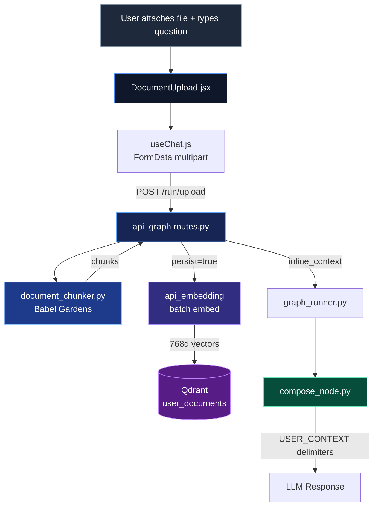

---
tags:
  - web-ui
  - rag
  - long-context
  - document-upload
  - system-core
---

# Long Context — Document Upload

> **Last updated**: Mar 11, 2026 11:30 UTC  
> **Status**: ✅ Active  
> **Location**: UI `ui/components/chat/DocumentUpload.jsx` · Backend `services/api_graph/api/routes.py` · Chunker `vitruvyan_core/core/cognitive/babel_gardens/consumers/document_chunker.py`

---

## What is Long Context?

Long Context allows users to **attach documents to their chat messages**. The document content is chunked, optionally persisted in Qdrant for future RAG retrieval, and injected as inline context for the current conversation.

This bridges two modes of knowledge:

- **Ephemeral** — document chunks are injected only for the current query (default)
- **Persistent** — chunks are embedded and stored in the `user_documents` Qdrant collection for future semantic retrieval

!!! tip "How it works for the user"
    Click the 📎 paperclip button → select a file → optionally check "Save to memory" → type your question → send. The AI responds with awareness of the document content.

---

## User-Facing Feature

### Upload Widget

The `DocumentUpload` component provides:

- **Paperclip button** (📎) next to the chat input
- **File preview pill** showing filename, size, and a clear button
- **"Save to memory" checkbox** — enables Qdrant persistence for future RAG

### Supported Formats

| MIME Type | Extension | Notes |
|-----------|-----------|-------|
| `text/plain` | `.txt` | UTF-8 with latin-1 fallback |
| `text/markdown` | `.md` | Full Markdown content |
| `text/csv` | `.csv` | Tabular data as text |
| `application/pdf` | `.pdf` | PDF text extraction |
| `application/json` | `.json` | Structured data |

**Maximum file size**: 5 MB

---

## Architecture



### Data Flow

1. **UI Layer**: `DocumentUpload.jsx` validates file type/size → `useChat.js` sends as `FormData` to `POST /run/upload`
2. **API Layer**: `routes.py` validates MIME type + size → decodes text (UTF-8/latin-1)
3. **Chunking** (Babel Gardens): `chunk_text()` splits document with sliding window, paragraph-boundary snapping, configurable overlap
4. **Persistence** (optional): If "Save to memory" is checked, chunks are batch-embedded via `api_embedding` and stored in `user_documents` collection
5. **Context Injection**: All chunks are joined and passed as `inline_context` through `graph_runner` → `compose_node`
6. **LLM Processing**: `compose_node` wraps the context with `[USER_CONTEXT_START]...[USER_CONTEXT_END]` delimiters for the LLM

---

## UI Components

| Component | File | Purpose |
|-----------|------|---------|
| `DocumentUpload.jsx` | `ui/components/chat/DocumentUpload.jsx` | Upload button, file preview pill, persist checkbox |
| `ChatInput.jsx` | `ui/components/chat/ChatInput.jsx` | Integrates DocumentUpload next to textarea |
| `useChat.js` | `ui/components/chat/hooks/useChat.js` | Manages file state, switches to FormData when file attached |
| `ChatContract.ts` | `ui/contracts/ChatContract.ts` | `DocumentAttachment` interface, allowed types, max size |

### TypeScript Contract

```typescript
interface DocumentAttachment {
  name: string       // Original filename
  size: number       // File size in bytes
  type: string       // MIME type
  persist: boolean   // Whether to store in Qdrant
}
```

---

## Backend Components

### Upload Endpoint

**`POST /run/upload`** — multipart/form-data

| Field | Type | Required | Description |
|-------|------|----------|-------------|
| `file` | File | ✅ | Document file (max 5 MB) |
| `query` | string | ✅ | User's question about the document |
| `user_id` | string | ❌ | User identifier (default: "anonymous") |
| `persist_document` | bool | ❌ | Store chunks in Qdrant (default: false) |
| `language` | string | ❌ | Language hint |

### Document Chunker (Babel Gardens — LIVELLO 1)

Located at `vitruvyan_core/core/cognitive/babel_gardens/consumers/document_chunker.py`.

Pure Python chunker with zero I/O dependencies (Sacred Order: Perception).

```python
from core.cognitive.babel_gardens.consumers.document_chunker import chunk_text, ChunkerConfig

chunks = chunk_text(text, filename="report.md", config=ChunkerConfig(
    chunk_size=1500,      # Target characters per chunk
    chunk_overlap=200,    # Overlap between consecutive chunks
    min_chunk_size=100,   # Discard chunks below this threshold
))
```

**Chunking strategy**: Sliding window with paragraph-boundary snapping in the last 20% of the window — avoids splitting mid-sentence.

### Qdrant Collection

| Property | Value |
|----------|-------|
| **Collection** | `user_documents` |
| **Dimension** | 768 (nomic-embed-text-v1.5) |
| **Distance** | Cosine |
| **Tenant isolation** | Filtered by `user_id` in payload |

---

## RAG Integration

When "Save to memory" is enabled, document chunks become part of the persistent RAG layer. The `qdrant_node` includes `user_documents` as **tier 0** in the search cascade:

| Tier | Collection | Priority | Source |
|------|------------|----------|--------|
| **0** | `user_documents` | Highest | User-uploaded documents (filtered by user_id) |
| 1 | `conversations_embeddings` | High | Conversational memory |
| 2 | `phrases_embeddings` | Medium | NLP seed phrases |
| 3 | `weave_embeddings` | Low | Ontological patterns (Pattern Weavers) |

The cascade is early-exit: if tier 0 produces hits, lower tiers are skipped. This means user-uploaded documents take priority when semantically relevant.

!!! note "Ephemeral vs Persistent"
    Without the checkbox, document context is **ephemeral** — injected via `inline_context` for the current request only. With the checkbox, chunks are **also** embedded and stored for future RAG retrieval across sessions.

---

## Configuration

| Variable | Default | Description |
|----------|---------|-------------|
| `EMBEDDING_API_URL` | `http://embedding:8010/v1/embeddings/batch` | Embedding service endpoint for chunk persistence |
