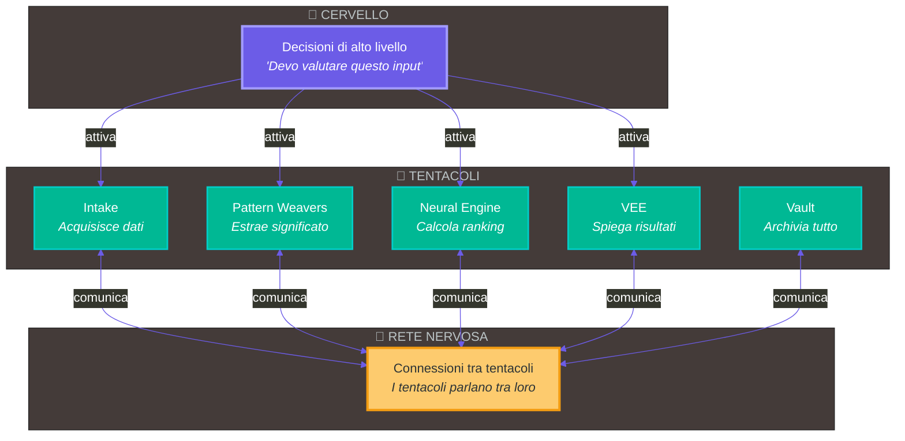
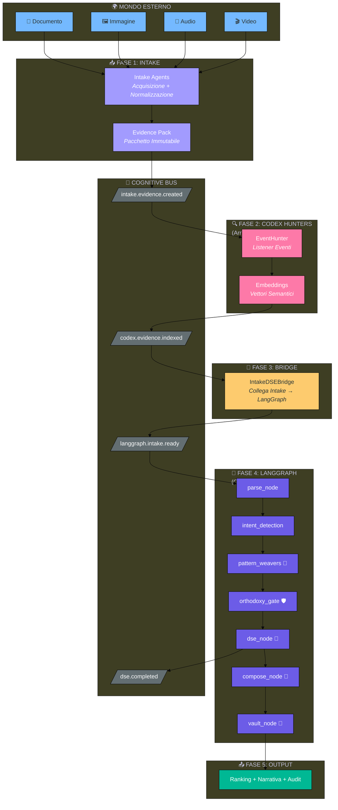
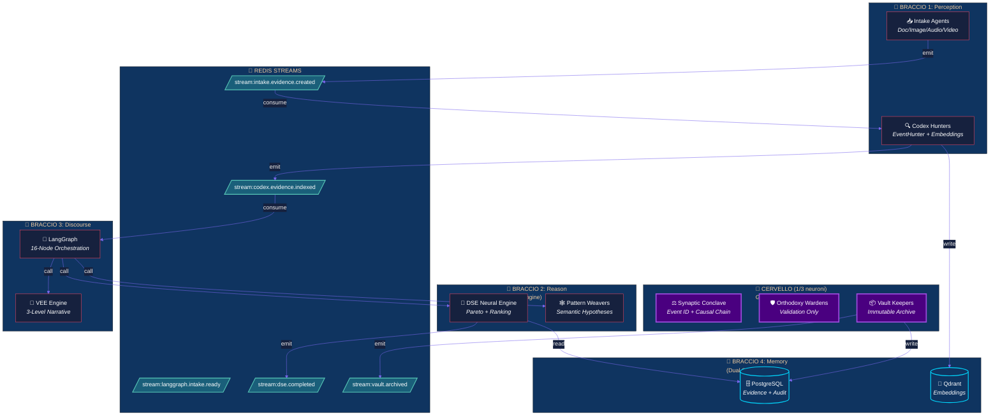

# 🐙 Vitruvyan: Architettura Cognitiva Bio-Ispirata

**Documento per Stakeholder Tecnici e Istituzionali**

*Versione 1.0 — 27 Gennaio 2026*

---

## 📖 Sommario Esecutivo

Vitruvyan è un **sistema operativo cognitivo** (Epistemic Operating System) progettato per prendere decisioni complesse in modo trasparente, auditabile e resiliente.

La sua architettura è ispirata a due organismi biologici:
- 🐙 **Il Polipo**: Intelligenza distribuita (2/3 dei neuroni nelle braccia)
- 🍄 **I Funghi**: Rete miceliare decentralizzata (nessun nodo centrale)

**Risultato**: Un sistema che non ha single point of failure, dove ogni componente può operare autonomamente e la comunicazione è auto-riparante.

---

## 🧬 Parte 1: Il Sistema Generale (Vitruvyan come OS)

### 1.1 I Tre Componenti Fondamentali

```
┌─────────────────────────────────────────────────────────────────────┐
│                                                                     │
│  🧠 CERVELLO (LangGraph)                                            │
│  ─────────────────────                                              │
│  • Riceve la richiesta                                              │
│  • Capisce cosa bisogna fare                                        │
│  • Decide QUALI tentacoli attivare e in che ORDINE                  │
│  • NON esegue il lavoro, solo coordina                              │
│                                                                     │
├─────────────────────────────────────────────────────────────────────┤
│                                                                     │
│  🦑 TENTACOLI (Consumers/Servizi)                                   │
│  ────────────────────────────────                                   │
│  • Ogni tentacolo è SPECIALIZZATO in un compito                     │
│  • Lavorano AUTONOMAMENTE quando attivati                           │
│  • Possono comunicare TRA LORO senza passare dal cervello           │
│  • Se un tentacolo muore, gli altri continuano                      │
│                                                                     │
├─────────────────────────────────────────────────────────────────────┤
│                                                                     │
│  🍄 RETE NERVOSA (Cognitive Bus / Redis Streams)                    │
│  ──────────────────────────────────────────────                     │
│  • Connette i tentacoli tra loro                                    │
│  • Trasporta messaggi/eventi                                        │
│  • NON ha un nodo centrale (come i miceli di un fungo)              │
│  • Se un canale muore, la rete si auto-ripara                       │
│                                                                     │
└─────────────────────────────────────────────────────────────────────┘
```

### 1.2 Schema Visivo Semplificato



### 1.3 Perché Questa Architettura?

#### Il Vantaggio del Polipo

| Sistema Tradizionale | Sistema Polipo (Vitruvyan) |
|---------------------|---------------------------|
| Tutto passa dal cervello | I tentacoli pensano da soli |
| Se il cervello muore, tutto muore | Se un tentacolo muore, gli altri continuano |
| Collo di bottiglia centrale | Elaborazione parallela |
| Difficile da scalare | Scala aggiungendo tentacoli |

#### I 4 Benefici Chiave

1. **🛡️ Resilienza**: Nessun single point of failure
2. **📈 Scalabilità**: Aggiungi tentacoli senza modificare il cervello
3. **🔍 Auditabilità**: Ogni evento è tracciato
4. **🧠 Autonomia**: Ogni tentacolo può decidere localmente

---

## 🏛️ Parte 2: Vitruvyan — Un Esempio di Sistema di Dominio

### 2.1 Cos'è Vitruvyan?

**Vitruvyan** (Advanced Exploration of Generative Infrastructure Solutions) è un **vertical** di Vitruvyan specializzato in **Design Space Exploration** — la valutazione di configurazioni architetturali complesse.

Mentre Vitruvyan è il "sistema operativo", Vitruvyan è un'"applicazione" che gira su di esso.

### 2.2 Il Percorso Cognitivo Completo in Vitruvyan

Quando un **frammento di informazione** entra nel sistema Vitruvyan, attraversa un percorso preciso. Ecco il flusso reale, basato sul codice sorgente:

```
┌─────────────────────────────────────────────────────────────────────┐
│                                                                     │
│  FASE 1: ACQUISIZIONE (Intake Layer)                                │
│  ═══════════════════════════════════                                │
│                                                                     │
│  📥 Un documento/immagine/audio/video entra nel sistema             │
│       ↓                                                             │
│  📦 Intake Agent (Document/Image/Audio/Video) lo processa           │
│       ↓                                                             │
│  📋 Crea un "Evidence Pack" (pacchetto di evidenza immutabile)      │
│       ↓                                                             │
│  💾 Salva in PostgreSQL (append-only, mai modificato)               │
│       ↓                                                             │
│  📡 Emette evento: "intake.evidence.created"                        │
│                                                                     │
│  ⚠️  IMPORTANTE: L'Intake NON interpreta il contenuto.              │
│      Acquisisce e normalizza. Basta.                                │
│                                                                     │
└─────────────────────────────────────────────────────────────────────┘
                              │
                              │ 🍄 (via Cognitive Bus)
                              ▼
┌─────────────────────────────────────────────────────────────────────┐
│                                                                     │
│  FASE 2: ARRICCHIMENTO (Codex Hunters)                              │
│  ═════════════════════════════════════                              │
│                                                                     │
│  🎧 EventHunter ascolta "intake.evidence.created"                   │
│       ↓                                                             │
│  🔍 Recupera Evidence Pack da PostgreSQL                            │
│       ↓                                                             │
│  🧮 Genera embeddings vettoriali (per ricerca semantica)            │
│       ↓                                                             │
│  💾 Salva embeddings in Qdrant (memoria vettoriale)                 │
│       ↓                                                             │
│  📡 Emette evento: "codex.evidence.indexed"                         │
│                                                                     │
│  ⚠️  IMPORTANTE: Codex Hunters arricchisce ma NON decide.           │
│      Prepara i dati per l'elaborazione successiva.                  │
│                                                                     │
└─────────────────────────────────────────────────────────────────────┘
                              │
                              │ 🍄 (via Cognitive Bus)
                              ▼
┌─────────────────────────────────────────────────────────────────────┐
│                                                                     │
│  FASE 3: PONTE (Intake-DSE Bridge)                                  │
│  ═════════════════════════════════                                  │
│                                                                     │
│  🌉 IntakeDSEBridge ascolta "codex.evidence.indexed"                │
│       ↓                                                             │
│  📋 Crea record in dse_intake_evidence (tracciabile)                │
│       ↓                                                             │
│  📡 Emette evento: "langgraph.intake.ready"                         │
│                                                                     │
│  ⚠️  IMPORTANTE: Il Bridge collega il mondo pre-epistemico          │
│      (Intake/Codex) al mondo epistemico (LangGraph/DSE).            │
│                                                                     │
└─────────────────────────────────────────────────────────────────────┘
                              │
                              │ 🍄 (via Cognitive Bus)
                              ▼
┌─────────────────────────────────────────────────────────────────────┐
│                                                                     │
│  FASE 4: ELABORAZIONE COGNITIVA (LangGraph - Il Cervello)           │
│  ════════════════════════════════════════════════════════           │
│                                                                     │
│  🧠 LangGraph riceve "langgraph.intake.ready" e ATTIVA i nodi:      │
│                                                                     │
│     ┌─────────────────────────────────────────────────────────┐     │
│     │  Nodo 1: parse_node                                     │     │
│     │  → Estrae entità base (design_point_ids, parametri)     │     │
│     └─────────────────────────────────────────────────────────┘     │
│                              ↓                                      │
│     ┌─────────────────────────────────────────────────────────┐     │
│     │  Nodo 2: intent_detection_node                          │     │
│     │  → Classifica l'intento (evaluate, optimize, compare)   │     │
│     └─────────────────────────────────────────────────────────┘     │
│                              ↓                                      │
│     ┌─────────────────────────────────────────────────────────┐     │
│     │  Nodo 3: pattern_weavers_node  🦑 TENTACOLO             │     │
│     │  → Estrae ipotesi semantiche (concetti, vincoli)        │     │
│     │  → Output: SemanticHypothesis (NON VINCOLANTE)          │     │
│     └─────────────────────────────────────────────────────────┘     │
│                              ↓                                      │
│     ┌─────────────────────────────────────────────────────────┐     │
│     │  Nodo 4: orthodoxy_gate_node  🛡️ VALIDAZIONE            │     │
│     │  → Valida ipotesi contro contratti sacri (dogma)        │     │
│     │  → Se valido: ApprovedKernelInput (VINCOLANTE)          │     │
│     │  → Se invalido: RejectionReport (richiede correzione)   │     │
│     └─────────────────────────────────────────────────────────┘     │
│                              ↓                                      │
│     ┌─────────────────────────────────────────────────────────┐     │
│     │  Nodo 5: dse_node  🦑 TENTACOLO (Neural Engine)         │     │
│     │  → Esegue Design Space Exploration                      │     │
│     │  → Calcola Pareto frontier + ranking                    │     │
│     │  → Output: DSE Artifact (risultati computazionali)      │     │
│     └─────────────────────────────────────────────────────────┘     │
│                              ↓                                      │
│     ┌─────────────────────────────────────────────────────────┐     │
│     │  Nodo 6: compose_node  🦑 TENTACOLO (VEE Engine)        │     │
│     │  → Genera narrativa esplicativa (3 livelli)             │     │
│     │  → Summary (semplice) → Detailed → Technical            │     │
│     └─────────────────────────────────────────────────────────┘     │
│                              ↓                                      │
│     ┌─────────────────────────────────────────────────────────┐     │
│     │  Nodo 7: vault_node  🦑 TENTACOLO (Archiviazione)       │     │
│     │  → Archivia tutto per audit trail                       │     │
│     │  → Immutabile, con hash crittografico                   │     │
│     └─────────────────────────────────────────────────────────┘     │
│                                                                     │
└─────────────────────────────────────────────────────────────────────┘
                              │
                              ▼
┌─────────────────────────────────────────────────────────────────────┐
│                                                                     │
│  FASE 5: OUTPUT                                                     │
│  ══════════════                                                     │
│                                                                     │
│  📊 Risposta strutturata:                                           │
│     • Ranking dei design points                                     │
│     • Pareto frontier (trade-offs ottimali)                         │
│     • Narrativa esplicativa (perché questa decisione)               │
│     • Audit trail completo (per compliance)                         │
│                                                                     │
└─────────────────────────────────────────────────────────────────────┘
```

### 2.3 Schema Mermaid del Flusso Vitruvyan



### 2.4 La Catena Epistemica di Vitruvyan

Vitruvyan implementa una **catena epistemica** rigida che trasforma informazioni grezze in decisioni vincolanti:

```
INTAKE → CODEX → PATTERN_WEAVERS → CONTRACT → KERNEL → EXPLAINABILITY
  │        │           │              │          │            │
  │        │           │              │          │            │
  ▼        ▼           ▼              ▼          ▼            ▼
Grezzo → Arricchito → Ipotesi → Validato → Calcolato → Spiegato
         (embeddings)  (non      (binding)  (ranking)  (narrativa)
                      binding)
```

| Fase | Componente | Input | Output | Vincolante? |
|------|------------|-------|--------|-------------|
| 1 | Intake | File raw | Evidence Pack | ❌ No |
| 2 | Codex Hunters | Evidence Pack | Embeddings | ❌ No |
| 3 | Pattern Weavers | Evidence | SemanticHypothesis | ❌ No |
| 4 | Orthodoxy Gate | Hypothesis | ApprovedKernelInput | ✅ SÌ |
| 5 | DSE Kernel | Approved Input | Ranking + Pareto | ✅ SÌ |
| 6 | VEE | Ranking | Narrativa | ✅ SÌ |

**Principio chiave**: Solo dopo la validazione Orthodoxy Gate le decisioni diventano vincolanti.

---

## 🔄 Parte 3: Come i Componenti Comunicano

### 3.1 La Rete Miceliare (Cognitive Bus)

```
┌─────────────────────────────────────────────────────────────────────┐
│                                                                     │
│  Nei funghi, i miceli sono filamenti che:                           │
│  • Connettono alberi diversi nella foresta                          │
│  • Trasportano nutrienti e segnali chimici                          │
│  • Non hanno un nodo centrale                                       │
│  • Se un filamento muore, la rete si auto-ripara                   │
│                                                                     │
│  Il Cognitive Bus funziona esattamente così:                       │
│  • Connette i tentacoli (servizi)                                  │
│  • Trasporta eventi (messaggi strutturati)                         │
│  • Non ha un nodo centrale                                         │
│  • Se un canale muore, gli altri continuano                        │
│                                                                     │
│  🦑────🍄────🦑────🍄────🦑                                         │
│   │         │         │                                            │
│   🍄────────🍄────────🍄                                            │
│   │         │         │                                            │
│  🦑────🍄────🦑────🍄────🦑                                         │
│                                                                     │
│  (Ogni 🍄 è un canale Redis Stream, ogni 🦑 è un tentacolo)        │
│                                                                     │
└─────────────────────────────────────────────────────────────────────┘
```

### 3.2 Gli Eventi Principali in Vitruvyan

| Evento | Emesso da | Consumato da | Significato |
|--------|-----------|--------------|-------------|
| `intake.evidence.created` | Intake Agent | Codex Hunters | "Ho acquisito un nuovo frammento" |
| `codex.evidence.indexed` | Codex Hunters | IntakeDSEBridge | "Ho arricchito l'evidenza con embeddings" |
| `langgraph.intake.ready` | IntakeDSEBridge | LangGraph | "L'evidenza è pronta per elaborazione" |
| `dse.completed` | DSE Node | Vault, Monitoring | "Ho completato l'esplorazione" |
| `vault.archived` | Vault Keepers | Audit System | "Ho archiviato l'evento per compliance" |

### 3.3 Perché Event-Driven?

**Domanda**: Perché usare eventi invece di chiamate dirette?

**Risposta**:

```
CHIAMATA DIRETTA (accoppiamento stretto):
─────────────────────────────────────────
Intake --chiama--> Codex --chiama--> Bridge --chiama--> LangGraph

❌ Se Codex è giù, Intake si blocca
❌ Se Bridge è lento, tutto rallenta
❌ Difficile aggiungere nuovi consumatori

───────────────────────────────────────────────────────────────────

EVENT-DRIVEN (accoppiamento lasco):
───────────────────────────────────
Intake --emette evento--> [Bus] <--ascolta-- Codex
                               <--ascolta-- Monitoring
                               <--ascolta-- Backup System

✅ Se Codex è giù, gli eventi restano in coda
✅ Posso aggiungere consumatori senza modificare Intake
✅ Ogni componente lavora al suo ritmo
```

---

## 🎯 Parte 4: Riepilogo per Stakeholder

### 4.1 Per il CTO/CIO

> *"Vitruvyan è un sistema senza single point of failure. Ogni componente opera autonomamente, comunicando attraverso una rete distribuita auto-riparante. Se un servizio cade, gli altri continuano a funzionare."*

### 4.2 Per il Compliance Officer

> *"Ogni decisione è tracciata con catena causale completa. L'Orthodoxy Gate valida ogni input prima che diventi vincolante. Il Vault Keepers archivia tutto in modo immutabile con hash crittografico."*

### 4.3 Per il Board

> *"Il sistema scala linearmente: aggiungiamo capacità senza riscrivere l'architettura. L'ispirazione biologica (polipo + funghi) non è marketing — è un principio ingegneristico che garantisce resilienza."*

### 4.4 Script per Presentazione (2 minuti)

> *"Vitruvyan funziona come un polipo.*
>
> *Il **cervello** (LangGraph) riceve la richiesta e decide cosa fare — ma non fa il lavoro.*
>
> *I **tentacoli** (Intake, Codex, Neural Engine, VEE) sono specializzati: uno acquisisce dati, uno li arricchisce, uno calcola, uno spiega. Ognuno sa fare bene una cosa sola.*
>
> *La **rete nervosa** (Cognitive Bus) permette ai tentacoli di parlare tra loro direttamente, senza passare dal cervello.*
>
> *In Vitruvyan, un documento entra come 'frammento grezzo', viene arricchito, interpretato, validato contro contratti sacri, elaborato matematicamente, e infine spiegato in linguaggio naturale.*
>
> *Ogni passaggio è tracciato. Ogni decisione è auditabile. Se un componente fallisce, gli altri continuano."*

---

## 📊 Appendice A: Schema Architetturale Completo



